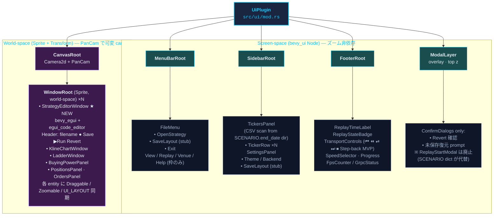

# Phase 7: Replay UI Integration — Implementation Plan

[Tranceparent Headless Replay](./Tranceparent%20Headless%20Replay.md) Phase 6 で構築した headless replay engine（Replay State Machine + Snapshot Reducer + 制御 API）を、Bevy UI から可視化・制御できる状態にする。`e-station` (Iced ベース) の UI を、本プロジェクトの **Infinite Canvas + Floating Windows** アーキテクチャ（[Infinite Canvas with Bevy Engine](./Infinite%20Canvas%20with%20Bevy%20Engine.md) / [Floating Window on Canvas](./Floating%20Window%20on%20Canvas.md)）に合わせて移植する。

## Goals

1. リプレイの進行（時刻・状態・速度）を UI に常時同期する。
2. メニュー → ファイル選択（`*.py` 戦略ファイル）→ **戦略コードエディタ（monaco 相当）で編集** → リプレイ開始 → エンジン稼働、までの一連の UX を実装する。戦略ファイルは `SCENARIO` dict に instrument / start / end / granularity / initial_cash を内包する想定（`python/tests/data/test_strategy_daily.py` 等を参照）。
3. ローソク足 / Ladder / Buying Power / Positions / Orders の 5 パネル＋ **StrategyEditorWindow** を Bevy の floating window として動作させる。
4. Sidebar（銘柄一覧・設定）と Footer（時刻・トランスポート・FPS）を screen-space UI として常時表示する。Footer の Transport には **⏪ Step-back** を MVP として含める。
5. UI 側のロジックを **Subscription Agnostic** に保ち、backend が Unary polling のままでも streaming に切り替えても動くようにする。

## Non-Goals

- 実取引（Live Venue）との接続は Phase 8 / 9 で扱う。本フェーズはあくまで replay モード。
- バックエンドのインジケータ計算は本フェーズでは導入しない（UI 表示用の簡易 MA のみ Bevy 側で算出）。
- 高度なテーマエディタ / レイアウト保存は Optional とし、骨格のみ提供。

---

## Handoff Log / Phase 7 Replay UI Integration

この節は 2026-05-14 時点の引き継ぎ用メモです。上の本文に文字化けが残っているため、作業者がクラッシュ後に復帰できるよう、最新状況・設計判断・次の一手をここへ逐次追記する方針にします。

### START HERE for New Worker

何も知らない新しい作業者は、まずここだけ読めば復帰できます。

**現在地**:

- 最新コミット: `14284fc Add Strategy Run Event Shell: StrategyRunRequested event and Run button`
- `cargo check` は成功済み。
- `Open Strategy...` から `.py` を選ぶと、元ファイルを直接触らず OS cache 配下に作業コピーを作る。
- `StrategyBuffer` resource が、元 path / cache path / editor source / dirty 状態を保持する。
- `bevy_egui` の Strategy Editor window で `StrategyBuffer.source` を表示・編集できる。
- 編集すると MenuBar に `*` が出る。
- `Save Cache` で cache file にだけ保存し、成功すると `dirty = false` になって `*` が消える。
- `Run` ボタンは `cache_path.is_some() && !dirty` のときのみ有効。押すと `StrategyRunRequested { cache_path }` event が発火し、ログに出る。
- 元 `.py` ファイルへの保存はまだ実装していない。今の不変条件は「元ファイルには書かない」。
- backend RPC への接続はまだ実装していない。

**動作確認コマンド**:

```powershell
$env:BACKEND_ENABLED="false"
cargo run
```

**手動確認手順**:

1. 起動直後、上部 MenuBar 右端が `strategy: none`。
2. `Open Strategy...` で `python/tests/data/*.py` を選ぶ。
3. MenuBar が `strategy: foo.py cached` になる。
4. Strategy Editor window が開き、source が表示される。
5. editor で文字を編集すると MenuBar が `strategy: foo.py cached *` になる。
6. `Save Cache` を押すとログに `strategy cache saved: ...` が出て、`*` が消える。
7. 元 `.py` は変化しない。

**重要ファイル**:

- `src/ui/components.rs`: `OpenStrategyRequested`, `StrategyBuffer`, `StrategyStatusLabel`, `StrategyRunRequested`
- `src/ui/menu_bar.rs`: File open dialog、cache path 生成、cache copy、MenuBar status label 更新、`log_strategy_run_requested_system`
- `src/ui/strategy_editor.rs`: egui editor、`Save Cache`、`Run` ボタン
- `src/ui/mod.rs`: `EguiPlugin` と各 system 登録
- `Cargo.toml`: `rfd`, `dirs`, `sha2`, `bevy_egui = "0.31"`
- `python/proto/engine.proto`: `EngineStartConfig.strategy_file = 7` (optional string) ← 次接続に使う
- `src/main.rs`: Tokio loop で transport command を処理 ← `StartEngine` arm を次に追加
- `python/engine/server_grpc.py`: `StartEngine` handler ← `strategy_file` ログを次に追加

**次にやること**:

次は **TransportCommand::StartEngine Signal Shell**。`StrategyRunRequested` → `TransportCommand::StartEngine { strategy_file }` → Tokio loop の信号経路を作る。Python は `strategy_file` ログのみ追加。詳細は下の `ADR 2026-05-14: Strategy Run Backend Contract Recon` の「次の小タスク」を参照。

### Current Progress

| Commit | 内容 | 状態 |
|---|---|---|
| `d35c9e1` | `replay_state` を Python `GetState` JSON から Rust `TradingData` まで通す | ✅ |
| `5f435f8` | screen-space Footer の最小表示を追加 | ✅ |
| `b16830d` | Footer Transport ボタン shell (`|<`, `<`, `||`, `>`, `>>`) を追加 | ✅ |
| `a922b39` | Pause / Resume / StepForward を Footer から gRPC へ接続 | ✅ |
| `207b60c` | Bevy setup 内で Tokio runtime context が無い問題を `TokioHandle` resource で修正 | ✅ |
| `3af5f3e` | MenuBar shell と `Open Strategy...` ボタンを追加 | ✅ |
| `fecdb9a` | `rfd` file dialog と `OpenStrategyRequested` event を接続 | ✅ |
| `af262f9` | `StrategyBuffer` resource と `open_strategy_buffer_system` を追加 | ✅ |
| `fb95326` | `.py` strategy を OS cache 配下へコピーし `StrategyBuffer.cache_path` に保持 | ✅ |
| `d903a58` | MenuBar に `StrategyStatusLabel` を追加し、読み込み済み strategy 名と cache 状態を表示 | ✅ |
| `74e90de` | `bevy_egui` の Strategy Editor Window shell を追加し、`StrategyBuffer.source` を編集可能にした | ✅ |
| `e900cde` | Strategy Editor に `Save Cache` ボタンを追加し、cache file へ editor 内容を保存可能にした | ✅ |
| `14284fc` | `StrategyRunRequested` event + `Run` ボタン shell を追加 | ✅ |
| (next) | `TransportCommand::StartEngine` 信号経路 shell + Python strategy_file ログ | 🔲 |

### Verified State

- ✅ `cargo check` は `3af5f3e` 時点で成功。
- ✅ `src/ui/footer.rs` は Footer 表示、replay time/state/grpc badge 更新、transport button interaction を持つ。
- ✅ `src/main.rs` は `TransportCommand::Pause` / `Resume` / `StepForward` を gRPC (`PauseReplay`, `ResumeReplay`, `StepReplay`) に送る。
- ✅ `src/ui/menu_bar.rs` は `top: 0` の 24px screen-space menu bar を spawn する。
- ✅ `MenuButton::OpenStrategy` 押下時は `info!("menu: open strategy requested")` を出すだけの shell。
- ✅ File dialog (`rfd`) で `.py` を選択できる。
- ✅ 選択 path は `OpenStrategyRequested { path }` event として Bevy 内に流れる。
- ✅ 選択 path の `.py` source を `StrategyBuffer` resource に読み込める。
- ✅ 元 `.py` を直接編集せず、OS cache 配下へ作業コピーを作れる。
- ✅ MenuBar 右端に現在の strategy filename と cache 状態を表示できる。
- ✅ `bevy_egui` window で `StrategyBuffer.source` を表示・編集できる。
- ✅ 編集時に `StrategyBuffer.dirty = true` になり、MenuBar に `*` が表示される。
- ✅ `Save Cache` で editor 内容を cache file にだけ保存できる。
- ✅ cache 保存成功時に `StrategyBuffer.dirty = false` へ戻る。
- ✅ `StrategyRunRequested` event 発火と log shell まで完了。
- 未実装: `TransportCommand::StartEngine` → gRPC `StartEngine` RPC 接続。
- 未実装: `LoadReplayData` RPC 接続 (Run フルフロー前に必要)。
- 未実装: Strategy cache metadata。
- 未実装: `StepBack` / `JumpToStart` の実 RPC 接続。

### ADR 2026-05-14: MenuBar は Bevy UI の thin shell から始める

**Decision**: MenuBar は最初から本格的な dropdown menu にせず、`bevy_ui` の固定バー + ボタンとして実装する。

**理由**:
- Phase 7 の目的は大きいので、最初の到達点を「画面上部にバーが出る」「Open を押せる」「ログが出る」に限定して、壊れた時の復帰点を小さくする。
- `File -> Open Strategy... -> StrategyEditorWindow` の本命フローは後続で段階的に接続する。
- `bevy_ui` の screen-space UI は Footer と同じ方式なので、既存コードの形に合わせられる。

**Consequences**:
- 現在の `File` はラベルであり、dropdown ではない。
- `Open Strategy...` は常時見えているボタン。
- 後で dropdown 化する場合も `MenuButton` enum と `menu_button_system` を拡張すればよい。

### ADR 2026-05-14: File Open はまず event 境界を作ってから StrategyEditor へ渡す

**Decision**: 次の段階では `rfd::AsyncFileDialog` で直接エディタを開かず、まず `OpenStrategyRequested { path: PathBuf }` のような Bevy event/resource 境界を作る。

**理由**:
- File dialog、cache copy、StrategyEditorWindow、LoadStrategy RPC を一度に結合するとデバッグが難しい。
- Open の結果を event として残すと、後で cache layer や restore prompt を挟みやすい。
- StrategyEditorWindow はまだ存在しないため、選択パスをログ出力または `SelectedStrategyPath` resource に入れるだけで次の検証ができる。

**推奨の最小 API**:

```rust
#[derive(Event, Debug, Clone)]
pub struct OpenStrategyRequested {
    pub path: std::path::PathBuf,
}
```

または、より shell 段階では:

```rust
#[derive(Resource, Default)]
pub struct SelectedStrategyPath(pub Option<std::path::PathBuf>);
```

### Completed Task: File Open Dialog Shell

`fecdb9a` で完了。

- ✅ `Cargo.toml` に `rfd = "0.17.2"` を追加。
- ✅ `src/ui/components.rs` に `OpenStrategyRequested { path: PathBuf }` event を追加。
- ✅ `UiPlugin` で `.add_event::<OpenStrategyRequested>()` を登録。
- ✅ `menu_button_system` で `MenuButton::OpenStrategy` 押下時に `.py` file dialog を開く。
- ✅ 選択された path を `OpenStrategyRequested` として送る。
- ✅ `log_open_strategy_requested_system` で path をログ出力する。

検証:

```powershell
$env:BACKEND_ENABLED="false"
cargo run
```

合格条件:

- ✅ `Open Strategy...` 押下で `.py` file dialog が開く。
- ✅ `.py` を選ぶと `open strategy selected: "..."` が出る。
- ✅ cancel 時に落ちず、`menu: open strategy canceled` が出る。

Known tradeoff:

- `rfd::FileDialog::pick_file()` は同期 API のため、dialog 表示中は Bevy の画面更新が止まる。MVP shell として許容し、cache copy / StrategyEditor 実装時に必要なら非同期化を検討する。

### Next Task: Strategy Buffer Shell

`af262f9` で完了。

- ✅ `src/ui/components.rs` に `StrategyBuffer { original_path, cache_path, source, dirty }` resource を追加。
- ✅ `src/ui/menu_bar.rs` に `open_strategy_buffer_system` を追加。
- ✅ `OpenStrategyRequested` を受けて `std::fs::read_to_string` し、`StrategyBuffer.source` に保持する。
- ✅ 読み込み成功時は `strategy buffer loaded: ..., bytes=...` を出す。
- ✅ 読み込み失敗時は `error!` で path と error を出す。
- ✅ `UiPlugin` で `.init_resource::<StrategyBuffer>()` と `open_strategy_buffer_system` を登録。

ADR / Note:

- `log_open_strategy_requested_system` と `open_strategy_buffer_system` は同じ `OpenStrategyRequested` event を読むが、Bevy の `EventReader` は reader ごとに独立した cursor を持つため問題ない。
- この段階では元ファイルへは書き込まない。`StrategyBuffer` は read-only load の受け皿。
- `cache_path` はまだ `None`。次の cache copy 実装で埋める。

検証:

```powershell
$env:BACKEND_ENABLED="false"
cargo run
```

合格条件:

- ✅ `Open Strategy...` で `.py` を選ぶ。
- ✅ `StrategyBuffer` に `original_path` と `source` が入る。
- ✅ ログに path と bytes が出る。
- ✅ 元ファイルには一切書き込まない。
- ✅ `cargo check` が通る。

### Next Task: Strategy Cache Copy Shell

`fb95326` で完了。

- ✅ `Cargo.toml` に `dirs = "6.0.0"` と `sha2 = "0.11.0"` を追加。
- ✅ `strategy_cache_path(original)` helper を追加。
- ✅ `canonicalize()` した original path を SHA-256 し、先頭 16 hex + `__filename` で cache filename を作る。
- ✅ cache directory は `dirs::cache_dir()/the-trader-was-replaced/strategy_buffers/`。
- ✅ `open_strategy_buffer_system` で `create_dir_all` → `write` → `buffer.cache_path = Some(cache_path)` まで接続。
- ✅ read / cache path compute / mkdir / write の各失敗箇所で `error!` を出す。
- ✅ 元ファイルには書き込まない。

Implementation note:

- `sha2 v0.11` の `finalize()` が返す array は `LowerHex` 非実装だったため、`hash_bytes.iter().map(|b| format!("{:02x}", b)).collect::<String>()` で hex 化している。
- `cache_path.parent().unwrap()` は helper が必ず directory + filename の path を返す設計なので現状は成立する。将来 `strategy_cache_path` を `Result<PathBuf, Error>` にして、cache dir も一緒に返すとより堅い。

検証:

```powershell
$env:BACKEND_ENABLED="false"
cargo run
```

合格条件:

- ✅ `Open Strategy...` で `.py` を選ぶ。
- ✅ 元ファイル内容が `StrategyBuffer.source` に入る。
- ✅ cache file が OS cache 配下に作られる。
- ✅ `StrategyBuffer.cache_path` が `Some(...)` になる。
- ✅ ログに original path / cache path / bytes が出る。
- ✅ 元ファイルには一切書き込まない。
- ✅ `cargo check` が通る。

### Next Task: Strategy Buffer Status UI Shell

`d903a58` で完了。

- ✅ `src/ui/components.rs` に `StrategyStatusLabel` component を追加。
- ✅ `spawn_menu_bar` に spacer と `strategy: none` label を追加。
- ✅ `update_strategy_status_label_system` を追加。
- ✅ `StrategyBuffer.original_path` から filename を表示する。
- ✅ `StrategyBuffer.cache_path.is_some()` なら `cached` を表示する。
- ✅ `StrategyBuffer.dirty` が true なら `*` を表示する。
- ✅ `UiPlugin` の Update に `update_strategy_status_label_system` を登録。

検証:

```powershell
$env:BACKEND_ENABLED="false"
cargo run
```

合格条件:

- ✅ 起動直後は MenuBar 右端に `strategy: none`。
- ✅ `Open Strategy...` で `.py` を選ぶと `strategy: foo.py cached` に変わる。
- ✅ `cargo check` が通る。

Implementation note:

- `update_strategy_status_label_system` は `buffer.is_changed()` で早期 return するため、`StrategyBuffer` が変わった frame だけ label を更新する。
- 現在 `open_strategy_buffer_system` と `update_strategy_status_label_system` は同じ Update tuple に登録されている。Bevy scheduler は `StrategyBuffer` の read/write conflict を見て同時実行はしないが、表示更新の順序を厳密にしたくなったら、後で `(open_strategy_buffer_system, update_strategy_status_label_system).chain()` のように順序を明示する。

### Next Task: Strategy Editor Window Shell

`74e90de` で完了。

- ✅ `Cargo.toml` に `bevy_egui = "0.31"` を追加。
- ✅ `src/ui/strategy_editor.rs` を新規作成。
- ✅ `egui::Window` + `egui::TextEdit::multiline` で `StrategyBuffer.source` を表示する。
- ✅ editor で変更があれば `StrategyBuffer.dirty = true` にする。
- ✅ `UiPlugin` に `EguiPlugin` を追加。
- ✅ `strategy_editor_window_system` を Update に登録。

Version note:

- この repo は `bevy = "0.15"`。
- `bevy_egui = "0.31"` が Bevy 0.15.1 と一致する。
- `bevy_egui = "0.30"` は Bevy 0.14 系、`bevy_egui = "0.39.1"` は Bevy 0.18 系で依存が合わない。
- `cargo add bevy_egui` は最新を入れがちなので、Phase 7 中は `bevy_egui = "0.31"` を固定する。

検証:

```powershell
$env:BACKEND_ENABLED="false"
cargo run
```

合格条件:

- ✅ `.py` を Open すると Strategy Editor shell window が出る。
- ✅ source text が multiline editor に表示される。
- ✅ 文字を編集できる。
- ✅ 編集後に MenuBar が `strategy: foo.py cached *` になる。
- ✅ 元ファイルにも cache file にもまだ書き込まない。
- ✅ `cargo check` が通る。

Implementation note:

- 現在の editor は egui の即席 window。Phase 7 の最終形である world-space floating window ではまだない。
- ここでは data flow の確認を優先する。`Save` / `Run` / syntax highlight / line numbers は未実装。
- `TextEdit::multiline` が直接 `buffer.source` を編集するため、変更検知は `response.changed()` で十分。

### Completed Task: Strategy Editor Save Cache Shell

`e900cde` で完了。

- ✅ Strategy Editor window 上部に toolbar 行を追加。
- ✅ `Save Cache` ボタンは `cache_path.is_some() && dirty` のときだけ有効。
- ✅ `std::fs::write(cache_path, &buffer.source)` で cache file にだけ保存する。
- ✅ 保存成功時は `buffer.dirty = false`。
- ✅ 保存失敗時は `error!` を出し、`dirty` は true のままにする。
- ✅ cache filename label を toolbar 右側に表示。
- ✅ `ui.separator()` で toolbar と `TextEdit` を分離。
- ✅ 元ファイル (`original_path`) には書き込まない。

Implementation note:

- `&buffer.cache_path` を借りたまま `buffer.dirty = false` を行うと borrow conflict になるため、`buffer.cache_path.clone()` で path を取り出してから保存する。
- `Save Cache` は cache file だけを更新する。元ファイルへの保存や restore prompt は未実装。

検証:

```powershell
$env:BACKEND_ENABLED="false"
cargo run
```

合格条件:

- ✅ editor で文字を編集すると MenuBar に `*` が出る。
- ✅ `Save Cache` が有効になる。
- ✅ `Save Cache` を押すと cache file にだけ書き込まれる。
- ✅ 保存成功後、MenuBar の `*` が消える。
- ✅ 元ファイルは変化しない。
- ✅ `cargo check` が通る。

ADR:

- 先に cache save を作る。理由は、後続の `[Run]` は cache path を backend に渡す設計なので、実行前に「cache に現在の editor 内容がある」状態を保証したいから。
- `Save Original` はまだ作らない。元ファイル保護を Phase 7 前半の不変条件として維持する。

### ADR 2026-05-14: Strategy Run Backend Contract Recon

#### 調査結果

| 層 | 状態 | キーポイント |
|---|---|---|
| Proto | `EngineStartConfig.strategy_file = 7` (optional string) が存在 | 新 RPC 不要 |
| Rust client (`main.rs`) | `StartEngineRequest` は `tonic::include_proto!` で生成済みだが **未使用** — 現状は legacy `StartRequest` しか呼んでいない | call site なし |
| Python `StartEngine` handler (`server_grpc.py:102`) | `request.config.strategy_file` を **完全無視** し `engine.start_engine()` を素通し | ログすら出ない |
| `DataEngine.start_engine()` (`core.py:183`) | `LOADED → RUNNING` 状態遷移のみ、strategy load なし | gap: 戦略を読まない |
| State machine | `StartEngine` は `LOADED` 状態でしか有効でない。`StrategyRunRequested` から直接呼ぶには `LoadReplayData` で先に `LOADED` にする必要がある | 2-step 接続が必要 |

#### 判断: cache path 起動は現状では不可能 → 最小接続路を先に作る

`StrategyRunRequested.cache_path` をそのまま `StartEngine.config.strategy_file` に渡しても Python 側が無視するため、現時点で UI から engine を起動できない。また `StartEngine` は `LOADED` 状態からのみ有効なので、Run だけ接続しても `IDLE → RUNNING` にはなれない。

**完全な Run フローに必要なステップ**:

1. `SCENARIO` dict を `.py` から読んで `instrument_ids`, `start_date`, `end_date`, `granularity` を取得 (Rust 側か Python 側)
2. `LoadReplayData` RPC で `IDLE → LOADED`
3. `StartEngine` RPC (with `strategy_file = cache_path`) で `LOADED → RUNNING`

Python 側では `StartEngine` handler が `config.strategy_file` を見て strategy を import / instantiate する実装が必要（現在は未実装）。

#### 次の小タスク: TransportCommand::StartEngine Signal Shell

目的: Rust side の信号経路だけ作り、Python は変更しない。`BACKEND_ENABLED=false` でも動く。

1. `TransportCommand` に `StartEngine { strategy_file: std::path::PathBuf }` を追加
2. `handle_strategy_run_system` を追加 — `StrategyRunRequested` を読んで `TransportCommand::StartEngine` を送る
3. Tokio loop に `StartEngine` arm を追加し、`StartEngineRequest { config: EngineStartConfig { strategy_file: ... } }` を呼ぶ (import, not yet wired)
4. Python 側の `StartEngine` handler に `strategy_file` の `info!` logging だけ追加
5. `LoadReplayData` + sequence は次フェーズ

**この段階での合格条件**:
- `Run` 押下で `TransportCommand::StartEngine { strategy_file: cache_path }` がログに出る
- `BACKEND_ENABLED=false` で落ちない
- Python handler は `strategy_file` をログするだけ
- `cargo check` が通る
- 元ファイル保護の不変条件を維持

### Next Task: Strategy Run Event Shell

次の作業者はここから始める。目的は `Run` ボタンの UI と event 境界だけを作ること。**まだ backend RPC は呼ばない**。

実装方針:

1. `src/ui/components.rs` に event を追加する。

```rust
#[derive(Event, Debug, Clone)]
pub struct StrategyRunRequested {
    pub cache_path: std::path::PathBuf,
}
```

2. `UiPlugin` で `.add_event::<StrategyRunRequested>()` を登録する。
3. `strategy_editor_window_system` に `EventWriter<StrategyRunRequested>` を追加する。
4. `Save Cache` の隣に `Run` ボタンを追加する。
5. `Run` は `buffer.cache_path.is_some() && !buffer.dirty` のときだけ有効にする。
6. `Run` 押下時は `StrategyRunRequested { cache_path }` を送る。
7. `log_strategy_run_requested_system` を追加し、`info!("strategy run requested: {:?}", cache_path)` を出す。
8. dirty な状態で Run したい場合は、まず `Save Cache` してから Run、という UX にする。
9. `cargo check`。

推奨 UI:

```text
[Save Cache] [Run]  cache: <cache filename or none>
```

Acceptance Criteria:

- `.py` を開くと `Run` ボタンが見える。
- dirty でない cache 済み状態では `Run` が有効。
- editor を編集すると `Run` が無効になり、`Save Cache` が有効になる。
- `Save Cache` 後に `Run` が再び有効になる。
- `Run` 押下で `strategy run requested: <cache_path>` がログに出る。
- backend RPC はまだ呼ばない。
- 元ファイルは変化しない。
- `cargo check` が通る。

ADR:

- `Run` を直接 backend に接続しない。まず `StrategyRunRequested` event を作り、UI と backend 接続を分離する。
- `Run` は dirty な buffer では無効にする。理由は、backend に渡す cache file と editor 上の source が食い違う状態を避けるため。
- 次の次の step で、この event を `StartEngineRequest.config.strategy_file = cache_path` などの既存 proto 契約へ接続するか、新 RPC を追加するかを判断する。

### Previous Task: Strategy Editor Window Shell Design

次の作業者はここから始める。目的は、cache copy 済み strategy source を「編集可能な UI の入口」に乗せること。ただし、まだ高度な syntax highlight や Save/Run は不要。

推奨方針:

1. まずは `bevy_egui` を導入する。
2. `StrategyBuffer.original_path.is_some()` のときだけ egui window を表示する。
3. window title は `Strategy: foo.py`。
4. 中身は `egui::TextEdit::multiline(&mut buffer.source)`。
5. `TextEdit` が changed なら `buffer.dirty = true`。
6. まだ disk write はしない。cache file への autosave/save は次 step。
7. MenuBar の label が `*` を表示することを確認する。
8. `cargo check`。

Acceptance Criteria:

- `.py` を Open すると Strategy Editor shell window が出る。
- source text が multiline editor に表示される。
- 文字を編集すると `StrategyBuffer.dirty = true` になる。
- MenuBar の表示が `strategy: foo.py cached *` になる。
- 元ファイルにも cache file にもまだ書き込まない。
- `cargo check` が通る。

ADR:

- 本格的な floating world-space window に入る前に、`bevy_egui` の window で StrategyEditor MVP を作る。理由は、まず `StrategyBuffer` と editable text の data flow を確認したいから。
- `Save` / `Run` / syntax highlight / line numbers は次以降。ここで混ぜると、UI・I/O・RPC が同時に壊れる。

### Previous Task: Strategy Buffer Status UI Shell Design

次の作業者はここから始める。目的は「Open した strategy が UI 上でも見える」状態にすること。まだ本格的な code editor は作らない。

1. screen-space の小さな status label を MenuBar 右側に追加する。
2. `StrategyBuffer.original_path` が `Some` なら filename を表示する。
3. `StrategyBuffer.cache_path` が `Some` なら `cached` などの短い状態を表示する。
4. `dirty` はまだ常に false でよい。
5. 既存の MenuBar 高さ 24px に収まるよう、文字は 11-12px 程度にする。
6. `cargo check`。

推奨 component:

```rust
#[derive(Component)]
pub struct StrategyStatusLabel;
```

推奨表示:

```text
strategy: test_strategy_daily.py cached
```

Acceptance Criteria:

- 起動直後は `strategy: none` のような表示。
- `Open Strategy...` で `.py` を選ぶと filename が MenuBar に出る。
- cache copy 成功後は cached 状態が分かる。
- `cargo check` が通る。

### Previous Task: Strategy Cache Copy Shell Design

次の作業者はここから始める。目的は「StrategyEditor が編集する作業ファイル」を OS cache 配下に作ること。まだ本格的な editor UI は作らない。

1. `dirs` と `sha2` を `Cargo.toml` に追加する。
2. cache directory を作る helper を追加する。
3. `OpenStrategyRequested` で元ファイルを読んだあと、cache file にコピーする。
4. `StrategyBuffer.cache_path` に cache file path を入れる。
5. sidecar metadata は次 step でもよい。まずは cache file ができるところまで。
6. 元ファイルは絶対に書き換えない。
7. `cargo check`。

推奨 cache path:

```text
dirs::cache_dir()/the-trader-was-replaced/strategy_buffers/{sha256(original_abs_path)[..16]}__{original_filename}
```

推奨 helper の責務:

```text
strategy_cache_dir() -> PathBuf
strategy_cache_path(original_path: &Path) -> PathBuf
copy_strategy_to_cache(original_path: &Path) -> Result<(PathBuf, String), Error>
```

Acceptance Criteria:

- `Open Strategy...` で `.py` を選ぶ。
- 元ファイル内容が `StrategyBuffer.source` に入る。
- cache file が OS cache 配下に作られる。
- `StrategyBuffer.cache_path` が `Some(...)` になる。
- ログに original path / cache path / bytes が出る。
- 元ファイルには一切書き込まない。
- `cargo check` が通る。

### Previous Task: Strategy Buffer Shell Design

次の作業者はここから始める。目的は「元の `.py` ファイルを直接編集しない」ための buffer/cache 境界を作ること。まだ本格的な code editor は作らない。

1. `StrategyBuffer` resource を追加する。
2. `OpenStrategyRequested` を受けて、選択 path の内容を読む。
3. 読み込んだ内容を `StrategyBuffer` に保持する。
4. まずは cache file へコピーせず、resource のみでよい。
5. `info!` で original path、文字数、先頭数行などを出して確認する。
6. `cargo check`。

推奨の最小 struct:

```rust
#[derive(Resource, Default, Debug, Clone)]
pub struct StrategyBuffer {
    pub original_path: Option<std::path::PathBuf>,
    pub cache_path: Option<std::path::PathBuf>,
    pub source: String,
    pub dirty: bool,
}
```

推奨 system:

```rust
pub fn open_strategy_buffer_system(
    mut events: EventReader<OpenStrategyRequested>,
    mut buffer: ResMut<StrategyBuffer>,
) {
    for event in events.read() {
        match std::fs::read_to_string(&event.path) {
            Ok(source) => {
                buffer.original_path = Some(event.path.clone());
                buffer.cache_path = None;
                buffer.source = source;
                buffer.dirty = false;
                info!(
                    "strategy buffer loaded: {:?}, bytes={}",
                    event.path,
                    buffer.source.len()
                );
            }
            Err(err) => {
                error!("failed to read strategy file {:?}: {}", event.path, err);
            }
        }
    }
}
```

Acceptance Criteria:

- `Open Strategy...` で `.py` を選ぶ。
- `StrategyBuffer` に `original_path` と `source` が入る。
- ログに path と bytes が出る。
- 元ファイルには一切書き込まない。
- `cargo check` が通る。

### Implementation Tips

- Bevy 0.15 の UI ボタンは既存 Footer と同じく `Interaction::Pressed` を見る。
- `menu_button_system` の query は `(Changed<Interaction>, With<Button>)` なので、Footer の transport button と同じフレームで動く。Button 全体を拾うため、component enum で対象を分ける設計が重要。
- `rfd::AsyncFileDialog` を使う場合、async の結果を Bevy main thread へ戻す設計が必要。まずは synchronous `FileDialog::new().pick_file()` を検討してもよいが、UI freeze が気になる場合は既存の Tokio handle/channel 方式に寄せる。
- 既存の `TokioHandle` は `main.rs` 内 private resource。UI module から使いたい場合は public な場所へ移すか、File dialog だけ同期版で MVP を作る。
- 既存の Footer コメントに一部文字化けがある。機能には影響していないが、新規追記は UTF-8 の日本語または ASCII コメントに寄せる。
- 計画書は既存本文が文字化けしているので、進捗・ADR・復帰メモはこの Handoff Log に追記する。

### Design Background

Phase 7 は「一気に巨大な IDE を作る」のではなく、Replay UI の骨格を screen-space と world-space に分けて育てる。

- screen-space: MenuBar / Sidebar / Footer / Modal。カメラ pan/zoom の影響を受けない常設 UI。
- world-space: Chart / Ladder / BuyingPower / Positions / Orders / StrategyEditor。PanCam 上で移動・リサイズ・z-order 管理される floating window。

今回の MenuBar は screen-space 層の最初の上端 UI。Footer と対になる固定 UI として扱う。StrategyEditorWindow はまだ作らず、Open の入力経路だけを先に確定する。

### Next Acceptance Criteria

- ✅ `cargo check` が通る。
- ✅ 上部に 24px の黒い MenuBar が表示される。
- ✅ `Open Strategy...` が押せる。
- ✅ 押下時にログが出る。
- ✅ `.py` file dialog が開く。
- ✅ 選択 path が event として Bevy 内に流れる。
- ✅ 選択 path をログ表示できる。
- 次: `StrategyBuffer` に `original_path` と `source` を保持する。
- 次: 元ファイルには書き込まない buffer/cache 境界を作る。

## 0. UI 機能一覧 / UI Feature Inventory

Phase 7 の UI が担う役割を網羅的に列挙する。各項目は §3 以降の詳細設計に対応する。

### 0.1 戦略ファイル編集（`StrategyEditorWindow` 経由）

対象ファイル: `python/tests/data/test_strategy_daily.py` / `test_strategy_minute.py` / `pair_trade_minute.py`

- **`SCENARIO` dict の編集**
  - 銘柄の追加 / 削除（`instruments` リスト）
  - `start_date` / `end_date` の変更
  - `granularity` の切替（Daily / Minute）
  - `initial_cash` の変更
- **戦略ソースコード本体の編集**（Python シンタックスハイライト / 行番号 / Undo-Redo / Find & Replace / オートインデント）
- **ファイル操作**
  - `[Save]` — キャッシュ → 元ファイルへ反映
  - `[Revert]` — 編集破棄してディスクから再読込（確認ダイアログあり）
  - `[▶ Run]` — キャッシュをフラッシュして `LoadStrategy` + `StartEngine` を発火（実装上は load+start の合成だが、UI 表記は IDE 標準の "Run" に統一）
  - 自動保存（キャッシュへ、変更イベント駆動）

### 0.2 リプレイ制御（Footer の Transport）

- ▶ **Run**（エディタの `[▶ Run]` 経由 / IDLE→LOADED→RUNNING）
- ⏯ **Pause / Resume**（トグル）
- ⏪ **Step-back**（1 step 巻き戻し、ring buffer 512 件まで）
- ⏭ **Step+1**（1 step 進める）
- ⏮ **Jump-to-start**（先頭へ。PAUSED のまま時刻=start に戻る ≒ `LOADED` 相当）
- **Speed 変更**（0.5x / 1x / 2x / 5x / 10x / 50x）

> ⏹ Stop は採用しない。理由: `Pause + Jump-to-start` と機能が重複するため。戦略を完全にアンロードしたい場合は **File → New**（または別ファイルを Open）で `IDLE` に戻る。専用の Unload ボタンは設けない。

### 0.3 アプリ / レイアウト操作

- **File メニュー**: New / Open Strategy... / Save Layout (stub) / Exit
  - **New** は空の戦略バッファを開き、`IDLE` 状態へ遷移させる（実質的な Unload を兼ねる）
- **Floating Window 操作**: ドラッグ移動 / リサイズ / 前面化 (z-order) / 表示・非表示トグル
- **Infinite Canvas 操作**: パン / ズーム（視点変更）
- **Sidebar からの銘柄選択**（`SelectedSymbol` 更新 → Kline / Ladder の対象銘柄が連動）
- **UI_LAYOUT の永続化** — floating window の位置・サイズ・z-order・可視性、canvas の pan/zoom、選択銘柄を戦略 `.py` 末尾の `UI_LAYOUT` センチネルブロックに保存（§3.4）
- **Settings**（Sidebar 下半分、stub OK）: Theme dropdown / Backend address field / Save Layout button

### 0.4 状態表示（Read-only）

- **Footer**: 現在時刻 / ReplayState バッジ（IDLE/LOADED/RUNNING/PAUSED/STOPPING）/ Progress bar + パーセント / FPS / gRPC 接続状態（OK / RECONNECTING / ERROR）
- **Sidebar**: Tickers リスト（`SCENARIO.end_date` ディレクトリの CSV から自動導出）+ 最新価格
- **KlineChartWindow**: ローソク足（簡易 MA は UI 側で算出）
- **LadderWindow**: bid/ask × 10 行 + LAST
- **BuyingPowerPanel**: 現金 / 評価額 / 建余力
- **PositionsPanel**: Sym / Qty / Avg / P&L
- **OrdersPanel**: Time / Sym / Side / Qty / Price / Status

> Note: 発注は戦略ソースコード（`SCENARIO` の `on_bar` 等）が行う。Kline / Ladder は read-only の可視化に徹し、BUY/SELL ボタンや手動クリック発注 UI は設けない。

---

## 1. Screen Design / 画面設計

詳細な解説図は [assets/phase7-screen-layout.drawio.svg](../assets/phase7-screen-layout.drawio.svg) を参照。

#### Figure 1: Dashboard Screen Layout


#### Figure 2: Bevy ECS Component Hierarchy / コンポーネント階層

screen-space (bevy_ui) と world-space (Sprite/Transform) の区分、Resources / Systems / Events / gRPC マッピング。



**Resources (shared state) / 共有リソース**

```text
ReplayTimeRes      { timestamp_ms: i64 }
ReplayStateRes     { phase: IDLE/LOADED/RUNNING/PAUSED/STOPPING }
ReplaySpeedRes     { multiplier: f32 }  // 0.5/1/2/5/10/50
TradingState       { price, history, timestamp, replay_state }
PortfolioStateRes  { buying_power, positions[], orders[] }
SelectedSymbol(Option<TickerId>)
Tickers(Vec<TickerId>)                  // CSV scan の結果
StrategyBuffer     { cache_path, dirty, original_path }
UiLayoutCache      { windows, viewport, selected_symbol }
WindowManager      { max_z: f32 }
GrpcClientHandle   { tonic channel }
```

**Systems / 更新ループ**

```text
poll_engine_state_system     // 60 Hz GetState polling
poll_portfolio_system        // 60 Hz GetPortfolio polling
replay_time_sync_system      // ReplayTime → footer label
transport_button_system      // ⏮⏪⏯⏭⏹ → RPC
menu_open_strategy_system    // File→Open → rfd → cache copy
strategy_editor_system       // bevy_egui code editor
strategy_autosave_system     // changed() → async write to cache
strategy_run_button_system   // [▶Run] → LoadStrategy + StartEngine
ui_layout_persist_system     // window/viewport → UI_LAYOUT block
kline_chart_render_system    // history → candle mesh
ladder_render_system         // depth snapshot → ladder rows
positions/orders/bp_render_system
window_drag_system / window_focus_z_system   (existing)
```

**Events / イベント**

```text
OpenStrategyRequested / StrategyLoaded / ReplayStarted / ReplayStopped
```

**gRPC ↔ UI Mapping / Phase 6 API への接続**

```text
// Polling (60 Hz)
GetState()           → ReplayTime, TradingState, ReplayStateRes
GetPortfolio()       → PortfolioStateRes  (新規 DTO)

// Strategy editor flow / エディタ起点
LoadStrategy(cache_path, source: str)
                     → IDLE → LOADED
                       SCENARIO dict をパースして
                       replay window 確定 + import
StartEngine()        → LOADED → RUNNING
[▶ Run] が LoadStrategy + StartEngine を順次発火

// Transport buttons / トランスポート制御
PauseReplay()        → RUNNING → PAUSED
ResumeReplay()       → PAUSED → RUNNING
StepReplay(n)        → PAUSED でのみ
StepBackward(n)      → snapshot ring buffer (512)
                       ★ MVP 必須 (positions/orders/buying_power も巻き戻し)
JumpToStart()        → seek to begin
SetReplaySpeed(x)    → 0.5/1/2/5/10/50
StopReplay()         → * → STOPPING → IDLE
```

**Streaming 評価 (Phase 6 で決定)** — A. 現状の Unary GetState 60Hz polling 継続 / B. SubscribeReplayEvents (server stream)。UI 層は SubscriptionAgnostic で両対応。

**UI_LAYOUT 永続化** — 戦略 `.py` 末尾の `UI_LAYOUT` センチネルブロックに保存。window 位置/size/z/可視性, viewport pan/zoom, selected_symbol。

### 1.1 Space の分割（重要な設計判断）

`e-station` は全画面が Iced の widget tree だが、本プロジェクトは「canvas をズーム/パンできる無限空間」を中心に据える。そのため UI を 2 層に分ける:

- **Screen-space (bevy_ui Node)** — ズームの影響を受けない固定 UI:
  - MenuBar（上端）
  - Sidebar（左端）
  - Footer（下端、リプレイトランスポート含む）
  - ModalLayer（ReplayStartModal などのオーバーレイ）
- **World-space (Sprite + Transform)** — `PanCam` で動かせる無限キャンバスに浮かぶウィンドウ:
  - KlineChartWindow / LadderWindow / BuyingPowerPanel / PositionsPanel / OrdersPanel

世界座標側は既存の `WindowRoot` 機構（[src/ui/window.rs](../../src/ui/window.rs)）を拡張して再利用する。

### 1.2 Visual Style Reference（/frontend-design 連携）

実装に着手する直前に `/frontend-design` で **HTML/CSS ピクセル単位ビジュアルリファレンス**を 1 枚生成し、`assets/phase7-visual-reference.html` に保存する。drawio はワイヤフレーム、frontend-design はガラスモーフィズム・タイポグラフィ・色味・ホバー状態などの **見た目の基準**として扱う。Bevy 実装はこのリファレンスを目視で参照しながら近似する。

カラートークン（drawio と統一）:

| トークン | Hex | 用途 |
|---|---|---|
| `bg.canvas` | `#05080f` | 無限キャンバス背景 |
| `bg.window` | `#141a2e` → `#0f1628` gradient | フローティングウィンドウ |
| `border.cyan` | `#00CFFF` | アクセント・選択状態 |
| `accent.green` | `#00FF7F` | BUY / +P&L / FILLED |
| `accent.red` | `#FF3366` | SELL / -P&L |
| `text.primary` | `#e0e8f0` | 通常文字 |
| `text.muted` | `#9fb0c8` | 補助文字 |
| `text.subtle` | `#5a7090` | 補注 |

---

## 2. e-station からの移植マトリクス

| e-station ソース | Phase 7 移植先 | 移植方針 |
|---|---|---|
| `src/menu.rs`, `src/native_menu.rs`, `src/widget_menu_bar.rs` | `src/ui/menu_bar.rs` (新規) | bevy_ui Node の Flexbox で再構築。File → "Open Replay Data..." だけは Phase 7 で必須、他は枠のみ |
| `src/modal/replay_form.rs` (720 行) | (採用しない) | 起動パラメータは戦略ファイル内 `SCENARIO` dict から読み取るため、別モーダルでの入力は不要。File→Open 直後に `StrategyEditorWindow` が開く |
| — (新規) | `src/ui/floating/strategy_editor.rs` (新規) | monaco-editor 相当のコードエディタを載せた floating window。Python シンタックスハイライト + 行番号 + 折りたたみ + `[Load & Start]` ボタン |
| `src/screen/dashboard/sidebar.rs` | `src/ui/sidebar.rs` (新規) | bevy_ui 左固定パネル。Tickers list と Settings の二段 |
| `src/screen/dashboard/panel/buying_power.rs` | `src/ui/floating/buying_power.rs` | world-space floating window |
| `src/screen/dashboard/panel/positions.rs` | `src/ui/floating/positions.rs` | 同上。Text2d でテーブルを描画 |
| `src/screen/dashboard/panel/orders.rs` | `src/ui/floating/orders.rs` | 同上 |
| `src/screen/dashboard/panel/ladder.rs` (1382 行) | `src/ui/floating/ladder.rs` | 同上。MVP は bid/ask × 10 行 + LAST のみ（read-only、クリック発注 UI なし） |
| `src/chart/kline.rs` (2052 行) | 既存 `src/ui/chart.rs` を拡張 | ろうそく足モードを追加（現在は line chart のみ）|
| `src/handlers/replay.rs`, `src/handlers/engine.rs` | `src/trading.rs` 内に gRPC クライアント拡張 | 制御 RPC 群を Tonic で叩く Bevy system に |
| `src/widget/multi_split.rs`, `src/widget/decorate.rs` | (採用しない) | infinite canvas が代替する |

---

## 3. Tasks

### 3.1 Backend 側補強 (Phase 6 の延長)

- **`TradingState` に `replay_state` を追加** — 既存の `GetState` JSON に `replay_state: str`（`"IDLE"` / `"LOADED"` / `"RUNNING"` / `"PAUSED"` / `"STOPPING"`）フィールドを追加し、Rust 側 `BackendTradingState` で受け取れるようにする。これが Footer の状態バッジの唯一のソース。
- **`GetPortfolio` RPC の追加** — `TradingState` から `BuyingPower / Position[] / Order[]` を別 DTO で返す。`GetState` を肥大化させないため分離する。Phase 6.5 の `strategy_runtime` で発行された注文・約定をここに集約する。
- **`LoadStrategy` RPC の追加** — UI から戦略ファイルのパスと**編集後のソース文字列**を受け取り、`SCENARIO` dict を解析して replay window を確定 → in-process で戦略を import / instantiate する。`schema_version` をチェックし不一致なら明示的に reject。
- **`StepBackward(n)` RPC を MVP に含める** — Phase 6 の snapshot ring buffer（既定 512 件）と組み合わせて、`PortfolioStateRes`/`positions`/`orders` を含む完全な状態を巻き戻す。Optional ではなく必須。
- **`SubscribeReplayEvents` (Optional)** — server-streaming で `ReplayTime / Trades / KlineUpdate / OrderEvent / PositionEvent` を push。実装するかは Phase 6 末の判断に従う。実装しない場合は UI は 60 Hz polling のみで動かす。
- **`Step / Pause / Resume / SetSpeed / StepBackward / JumpToStart / Unload` の冪等化確認** — UI からの連打耐性。`Unload` は `IDLE` への明示的な遷移（戦略破棄）で、UI からは **File → New** または別ファイル Open で発火する。

### 3.2 Bevy UI 共通基盤

- `UiPlugin` を screen-space / world-space / modal の 3 層に分割。
- `Resources`:
  - `ReplayTimeRes { timestamp_ms: i64 }`
  - `ReplayStateRes { phase: ReplayPhase }`（enum: IDLE/LOADED/RUNNING/PAUSED/STOPPING）
  - `ReplaySpeedRes { multiplier: f32 }`
  - `PortfolioStateRes { buying_power, positions, orders }`
  - `SelectedSymbol(Option<TickerId>)`
- `Events`:
  - `OpenReplayRequested` / `ReplayLoaded` / `ReplayStarted` / `ReplayStopped`
- `Systems`:
  - `poll_engine_state_system` — 60 Hz で `GetState` / `GetPortfolio` を叩き Resource を更新
  - `transport_button_system` — フッターの ⏮⏯⏭/Speed を RPC に変換
  - `replay_modal_lifecycle_system` — Open Replay → Modal 表示 → Load → Start
- 既存の `WindowManager`/z-order/drag システムは流用。

### 3.3 Screen-space UI

- **MenuBar** ([src/ui/menu_bar.rs])
  - Flexbox Row, height 36px, 黒紺背景
  - File ドロップダウンに「New」「Open Strategy...」「Save Layout (stub)」「Exit」
  - **New**: 空テンプレート（`SCENARIO` 雛形のみ）の戦略バッファを開き、`Unload` RPC を発火して `IDLE` に戻す
  - File→Open で `rfd::AsyncFileDialog` を起動して `*.py` のみフィルタ、`OpenStrategyRequested(path)` を発火
  - 既定ディレクトリは `python/tests/data/`（`test_strategy_daily.py` / `test_strategy_minute.py` / `pair_trade_minute.py` がある場所）
- **Sidebar** ([src/ui/sidebar.rs])
  - 幅 200px, 左固定
  - 上半分: Tickers リスト（`PortfolioStateRes` と `ReplayTime` 由来の最新価格を表示、クリックで `SelectedSymbol` 更新）
    - **銘柄マスタの導出**: `SCENARIO.end_date` のディレクトリ配下（例: `S:/j-quants/2024/04/15/`）の CSV ファイル名からシンボルを列挙する。スキャンは `LoadStrategy` RPC の完了後、バックエンドが `LOADED` に遷移したタイミングで行う。スキャン結果は `Tickers` Resource として保持。
  - 下半分: Settings（Theme dropdown / Backend address field / Save Layout button — 各 stub OK）
- **Footer** ([src/ui/footer.rs])
  - 高さ 60px, 下固定
  - `ReplayTimeLabel`（monospace 16px）
  - `ReplayStateBadge`（色付きピル: RUNNING=green / PAUSED=yellow / IDLE=gray / STOPPING=red）
  - `TransportControls`（⏪ Step-back / ⏮ Jump-to-start / ⏯ Pause-Resume トグル / ⏭ Step+1）
  - `SpeedSelector`（dropdown: 0.5x / 1x / 2x / 5x / 10x / 50x）
  - `ProgressBar`（cyan）+ パーセント
  - `FpsCounter` + `GrpcStatus`（OK / RECONNECTING / ERROR）
- **（ReplayStartModal は廃止）** — 起動パラメータは戦略ファイルの `SCENARIO` dict に集約されたので、別モーダルは設けない。File→Open 直後に `StrategyEditorWindow`（§3.4）が world-space に出現し、そこの `[Load & Start]` ボタンで `LoadStrategy` → `StartEngine` を一気に走らせる。

### 3.4 World-space Floating Windows

各 floating window は既存の `spawn_trader_window` パターン（`WindowRoot`/`TitleBar`/`Draggable`/`bring-to-front`）を踏襲して `src/ui/floating/{name}.rs` に分離する。共通化のため `spawn_floating_window(commands, title, size, content_builder)` ヘルパーを切り出す。

- **StrategyEditorWindow** ([src/ui/floating/strategy_editor.rs]) — monaco-editor 相当のコードエディタ。File→Open でファイルパスを受け取り、ファイル内容を読み込んで表示・編集。
  - 機能: Python シンタックスハイライト / 行番号 / 行折りたたみ / Find & Replace / Undo-Redo / オートインデント
  - ヘッダ: ファイル名表示、`[Save]` / `[▶ Run]` / `[Revert]`、ダーティマーク（`●` 印）
  - **UI 状態の保存場所（採用方針）**: floating window の位置・サイズ・z-order・可視性、infinite canvas の pan / zoom、選択銘柄などの **UI 状態は戦略 `.py` ファイル自体に埋め込む**（`SCENARIO` / `LIVE_SCENARIO` と同じ「戦略ファイル＝単一ソース」ポリシー）。
    - 埋め込み形式: ファイル末尾に **センチネルブロック**を置く。Rust から安全に書き換えるため、AST 解析や dict literal の rewrite ではなく、行ベースで全置換できる単純なフォーマットにする。
      ```python
      # === UI_LAYOUT_BEGIN (auto-generated; do not edit by hand) ===
      UI_LAYOUT = {
          "schema_version": 1,
          "viewport": {"pan_x": 0.0, "pan_y": 0.0, "zoom": 1.0},
          "windows": {
              "kline":         {"x": 100, "y": 80,  "w": 800, "h": 500, "z": 0, "visible": True},
              "ladder":        {"x": 920, "y": 80,  "w": 320, "h": 500, "z": 1, "visible": True},
              "buying_power":  {"x": 100, "y": 600, "w": 300, "h": 120, "z": 2, "visible": True},
              "positions":     {"x": 420, "y": 600, "w": 500, "h": 200, "z": 3, "visible": True},
              "orders":        {"x": 940, "y": 600, "w": 500, "h": 200, "z": 4, "visible": True},
              "strategy_editor": {"x": 50, "y": 50, "w": 900, "h": 700, "z": 5, "visible": True},
          },
          "selected_symbol": "1301.TSE",
      }
      # === UI_LAYOUT_END ===
      ```
    - 書き換え戦略: `# === UI_LAYOUT_BEGIN ` 行から `# === UI_LAYOUT_END ===` 行までを Rust 側で正規表現マッチして丸ごと差し替える（中身は Rust struct → `serde_json` → Python literal 風 pretty-print）。AST は触らない。
    - ブロックが存在しない戦略ファイル（既存サンプル等）を開いたときは、**ファイル末尾に新規追加**する形で初回書き込み。Python としては未使用の module-level dict なので副作用ゼロ。
    - 読み込み: アプリは Python AST を持たないので、同じ正規表現でブロックを抽出 → ブロック内の `UI_LAYOUT = {...}` を **JSON5 互換パーサ**（`json5` crate 等）で読む。Python の `True`/`False`/`None` は JSON5 が扱えないので、書き出し時に `true`/`false`/`null` に正規化しておく（Python 側はこの dict を実行しないので問題なし）。
      実装簡略化のため、書き出しを Python 風（`True`/`False`/`None`）ではなく **JSON 風**（`true`/`false`/`null`）に統一する案も可。表示上は Python ファイル内に JSON が埋まる形になるが、`UI_LAYOUT = json.loads("""...""")` のラッパで Python からも読めるようにする手もある。**MVP は JSON 風で統一**。
  - **キャッシュフォルダ運用（採用方針）**: 編集中の状態は OS 標準のキャッシュディレクトリにミラーリングして運用する。元ファイルは `[Save]` するまで触らない。UI 状態の自動保存先も**キャッシュ内のコピー**（同じ `UI_LAYOUT` ブロック）。
    - キャッシュ位置: `dirs::cache_dir()` 配下に `the-trader-was-replaced/strategy_buffers/` を作る（Windows: `%LOCALAPPDATA%\the-trader-was-replaced\cache\strategy_buffers\`、Linux: `~/.cache/the-trader-was-replaced/strategy_buffers/`、macOS: `~/Library/Caches/the-trader-was-replaced/strategy_buffers/`）
    - キャッシュファイル名: `{sha256(original_abs_path)[..16]}__{original_filename}` ＋ サイドカー JSON `{...}.meta.json` に `original_path` / `last_modified_ms` / `dirty: bool` を保存
    - File→Open のフロー: ① 元ファイルを開く → ② キャッシュにコピー → ③ エディタはキャッシュファイルを「作業ファイル」として読み書き → ④ 元ファイルには触らない
    - 自動保存: **値の変更イベント駆動**（タイマーは使わない）。`egui::TextEdit` の `response.changed()` が立った時だけキャッシュへ書き出す。書き込みは `bevy_tokio_tasks` 経由の非同期 I/O で UI フレームをブロックしない。タイピング中は変更があるフレームでのみ I/O が走るため、無編集時はゼロコスト。
    - `[Load & Start]`: キャッシュをフラッシュ（同期書き込み）→ **キャッシュのパス**を `LoadStrategy` RPC へ送る（元ファイルは送らない／編集中の内容で実行される）
    - `[Save]`: キャッシュ → 元ファイル へコピー（`dirty: false` に更新）
    - `[Revert]`: 元ファイルで キャッシュを上書き（編集内容は破棄、確認ダイアログあり）
    - 起動時の復元: 同じ元ファイルを再度開いたとき、キャッシュの `last_modified_ms` が元ファイルより新しい & `dirty: true` ならモーダル「未保存の変更があります。復元しますか？ [復元] [破棄]」
    - クリーンアップ: `[Save]` 直後やユーザが明示的に閉じたタブのキャッシュは即削除しない（=次回も復元できる）。`.meta.json` の `dirty: false` で 30 日経過したものを起動時に GC。
  - **実装方針（確定）**: `bevy_egui` + `egui_code_editor` (v0.2.23) を採用。`egui::Window` 内にウィジェットを1行で配置できるターンキー構成。Python syntax は `Syntax` struct にキーワードセットを手動定義（~30 行）。精度向上が必要になったときのみ `egui_extras` の `syntect` feature を差し込む（差し替え不要、レイヤー追加のみ）。Undo/Redo は `TextEdit` 標準 undo + Bevy `Resource` の `Vec<String>` スナップショットスタックで対応。`wry`/`tao` WebView 路線は採用しない。
- **KlineChartWindow** — 既存 `chart.rs` をろうそく足対応に拡張。`PortfolioStateRes` ではなく `TradingState.history` を入力とする。read-only（発注は戦略ソースコードが担う）。
- **LadderWindow** — bid/ask × 10 行 + LAST 行のみ。read-only（数量入力・BUY/SELL ボタンは設けない）。
- **BuyingPowerPanel** — 3 行（現金 / 評価額 / 建余力）。`PortfolioStateRes.buying_power` を購読。
- **PositionsPanel** — Sym/Qty/Avg/P&L のテーブル。各行 `Text2d` で描画。
- **OrdersPanel** — Time/Sym/Side/Qty/Price/Status のテーブル。Status の色だけ状態に応じて変える。

### 3.5 Replay Time Sync

- 60 Hz の `poll_engine_state_system` が `GetState` を呼び、結果から `ReplayTimeRes` / `ReplayStateRes` / `TradingState` を更新。
- Footer / KlineChart は Resource の `Changed<>` で再描画。
- streaming 採用時は `tonic` の async stream を `bevy_tokio_tasks` 越しに polling channel に流し込み、同じ Resource を埋めるだけで切り替え可能にする。

### 3.6 Step-back (MVP / 必須)

- バックエンドに `StepBackward(n)` を追加し、Phase 6 の snapshot を ring buffer（既定 512 件）で保持。
- `PortfolioStateRes` も snapshot に含めて巻き戻す（positions/orders の整合性のため）。
- Footer に ⏪ ボタンを追加。連打した場合は ring buffer の最古を超えないようクランプ、超えたら no-op。
- streaming 採用時は巻き戻し直後に `ReplayStateRes` を強制再同期して UI の整合性を保つ。

### 3.7 Visual Reference (`/frontend-design`)

実装着手前に `/frontend-design` で `assets/phase7-visual-reference.html` を生成。Bevy 実装中はこの HTML をブラウザで開いて目視リファレンスとする。

---

## 4. File Layout（追加・変更）

```
src/ui/
├── mod.rs                       # plugin 構成を screen/world/modal 3 層に
├── components.rs                # 既存 + ReplayPhase, PortfolioStateRes など
├── window.rs                    # 既存。spawn_floating_window ヘルパー切り出し
├── chart.rs                     # 既存。ろうそく足モード追加
├── button.rs                    # 既存
├── menu_bar.rs        [NEW]
├── sidebar.rs         [NEW]
├── footer.rs          [NEW]
└── floating/
    ├── mod.rs         [NEW]
    ├── strategy_editor.rs [NEW]   # monaco 相当のコードエディタ floating window
    ├── kline.rs       [NEW]   # KlineChartWindow ラッパ（chart.rs を組む）
    ├── ladder.rs      [NEW]
    ├── buying_power.rs [NEW]
    ├── positions.rs   [NEW]
    └── orders.rs      [NEW]

src/trading.rs                   # gRPC: GetPortfolio / Pause/Resume/Step/SetSpeed 追加
python/engine/models.py          # TradingState に replay_state: Optional[str] 追加
python/engine/core.py            # get_current_state() に replay_state を含める
python/engine/server_grpc.py     # GetPortfolio RPC, LoadStrategy RPC 追加
python/engine/portfolio.py       [NEW]  # PortfolioState DTO + GetPortfolio 集約ロジック
docs/plan/assets/
├── phase7-screen-layout.drawio.svg  [DONE]  ← drawio 出力済
└── phase7-visual-reference.html     [TODO]  ← /frontend-design で生成（Step 6 着手時）
```

---

## 5. Implementation Order / 実装順

各ステップで `cargo run` できる状態を維持する。

1. **Step 1 — Footer & Time Sync**:
   - **Backend**: `TradingState` に `replay_state: Optional[str]` を追加 → `get_current_state()` に含める（後方互換: デフォルト `None`）。
   - **Rust**: `BackendTradingState` / `TradingData` に `replay_state` フィールドを追加。`ReplayPhase` enum + `ReplayTimeRes` / `ReplayStateRes` Resource を定義。
   - **Bevy UI**: bevy_ui Node ベースの Footer を実装（`src/ui/footer.rs`）。`ReplayTimeLabel` / `ReplayStateBadge` / Transport ボタン（⏪⏮⏯⏭ / Speed — この Step ではログのみ） / FPS カウンタ / gRPC ステータスを表示。
   - **合格基準**: backend RUNNING 時にフッターの時刻が更新され、状態バッジが色付きで切り替わる。
2. **Step 2 — MenuBar & File→Open**: File→Open → `*.py` ファイル選択 → `OpenStrategyRequested` 発火。この時点ではログ出力だけで OK。
3. **Step 3 — StrategyEditorWindow (MVP)**: `bevy_egui` + `egui_code_editor` を導入し、File→Open で受け取ったパスのファイル内容を表示・編集。`[Load & Start]` で `LoadStrategy` + `StartEngine` を呼ぶ。
4. **Step 4 — Transport Controls (Step-back 含む)**: Footer の ⏪⏮⏯⏭ / Speed を RPC に接続。Pause→Step→Resume→Step-back が動く。
5. **Step 5 — Sidebar**: Tickers リストと Settings の枠。`SelectedSymbol` に応じてチャートのタイトルが切り替わる。
6. **Step 6 — Visual Reference**: `/frontend-design` で `phase7-visual-reference.html` を生成。以降の floating window 実装の見た目基準にする。
7. **Step 7 — Floating Windows (簡単な順)**: BuyingPower → Positions → Orders → Ladder → Kline（既存 chart の拡張）。
8. **Step 8 — Backend: `GetPortfolio` / `LoadStrategy` / `StepBackward` RPC**: Python 側に DTO と RPC を追加し、UI と接続。
9. **Step 9 — Polish**: glassmorphism / rim light / hover / focus z-order。

---

## 6. Success Criteria

- File → Open（`*.py`） → `StrategyEditorWindow` 表示 → コード編集 → `[Load & Start]` で IDLE→LOADED→RUNNING の遷移がフッターに反映される。
- 上記が `python/tests/data/test_strategy_daily.py` / `test_strategy_minute.py` / `pair_trade_minute.py` の **3 ファイルすべて**で動く（`SCENARIO` の granularity が `Daily` / `Minute` 双方で機能する）。
- リプレイ中、Footer の時刻が連続的に進み、Kline / Ladder / Positions / Orders / BuyingPower がすべて同期する。
- ⏯ Pause / ⏭ Step / **⏪ Step-back** / Speed 変更が即座に反映される。Step-back は positions / orders / buying_power も含めて正しく巻き戻る。
- 6 つの floating window（StrategyEditor + 5 panel）をドラッグ・ズーム・前面化できる。
- Sidebar から銘柄を切り替えると Kline と Ladder の対象銘柄が変わる（リプレイは同一セッションを維持）。
- gRPC が `Unary polling` でも `Server streaming` でも UI 側の system を切り替えるだけで動作する。

---

## 7. Open Questions

---

## Latest Handoff Update 2026-05-14: Strategy Run Event Shell complete

New latest implementation commit:

- `14284fc Add Strategy Run Event Shell: StrategyRunRequested event and Run button`

Verification performed by Codex after user implementation:

- `git status --short`: clean
- `git log --oneline -12`: confirms `14284fc` is the latest implementation commit
- Relevant code reviewed: `src/ui/components.rs`, `src/ui/mod.rs`, `src/ui/strategy_editor.rs`, `src/ui/menu_bar.rs`
- `cargo check`: passed

Completed Task: Strategy Run Event Shell

- ✅ Added `StrategyRunRequested { cache_path: PathBuf }` event.
- ✅ Registered `.add_event::<StrategyRunRequested>()` in `UiPlugin`.
- ✅ Added `Run` button to the Strategy Editor toolbar next to `Save Cache`.
- ✅ `Run` is enabled only when `buffer.cache_path.is_some() && !buffer.dirty`.
- ✅ Editing the buffer marks it dirty, disables `Run`, and enables `Save Cache`.
- ✅ Saving writes only to the cache file and restores `dirty = false`, which re-enables `Run`.
- ✅ Pressing `Run` sends `StrategyRunRequested` with the cache path.
- ✅ `log_strategy_run_requested_system` logs `strategy run requested: <cache_path>`.
- ✅ No backend RPC is called yet.
- ✅ Original `.py` strategy files are still not written by this flow.

Implementation notes / Tips:

- `EventReader` cursor independence still makes it safe to add small logging/observer systems without consuming the event for future backend wiring.
- Keep `StrategyRunRequested` intentionally narrow for now. The event carries only the cache path, because the cache file is the current source of truth for edited strategy content.
- The current UI uses a simple egui toolbar line: `[Save Cache] [Run] cache: <filename>`. This is enough for the shell phase and keeps backend connection concerns separate.
- `Run` must remain disabled while `dirty = true`; otherwise the backend could later run stale cache content that differs from the editor buffer.

ADR 2026-05-14: Run starts as an event shell, not a backend call

Decision:

- The Strategy Editor `Run` button emits `StrategyRunRequested` and logs it only.
- Backend RPC wiring is deliberately deferred.

Rationale:

- This preserves the Phase 7 policy of small, independently verifiable UI slices.
- It avoids inventing a new backend contract before checking the existing proto/server path.
- It keeps the edited cache file as the only candidate input for future execution while protecting the original `.py` file.

Next Task: Strategy Run Backend Contract Recon

Before connecting `StrategyRunRequested` to backend startup, inspect the existing backend contract:

1. Check proto definitions for `StartEngineRequest`, `EngineStartConfig`, and any `strategy_file` field.
2. Check Rust client code that starts the engine today.
3. Check Python gRPC server handling for start/load behavior.
4. Decide whether the existing `strategy_file` path can point at `StrategyBuffer.cache_path`.
5. Do not add a new `LoadStrategy` RPC unless the existing contract cannot support the cache-path flow.

Candidate acceptance criteria for the recon step:

- Document the exact proto/server/client path for starting an engine with a strategy file.
- Confirm whether `StrategyRunRequested.cache_path` can be passed through unchanged.
- Identify the smallest next implementation step, likely a Rust-side event consumer that calls the existing start path.
- Keep original `.py` files untouched.

### 確定済み

1. ✅ **`GetPortfolio` RPC** → Phase 7 で新設。`GetState` との分離理由: 更新頻度が異なる（約定時のみ変化）ため将来 `SubscribePortfolio` として独立させやすい。in-process gRPC なので 2 本叩くコストは無視できる。
2. ✅ **ファイル選択ダイアログ** → `rfd::AsyncFileDialog` 採用。`*.py` フィルタ、既定ディレクトリ `python/tests/data/`。
3. ✅ **メニューバー** → `bevy_ui` 自前 Flexbox。ネイティブメニューは使わない。
4. ✅ **銘柄マスタ** → **end-date CSV からスキャンして導出**。`SCENARIO.end_date` のディレクトリ配下の CSV ファイル名から symbol を列挙し `Tickers` リストを構築する。サーバから取らない・固定リストも使わない。
5. ✅ **Step-back** → MVP 必須（§3.6）。

6. ✅ **コードエディタの実装方式** → `bevy_egui` + `egui_code_editor` (v0.2.23) 確定。Python syntax は `Syntax` struct でキーワードセット手動定義。精度向上時のみ `egui_extras/syntect` を追加。`wry`/`tao` WebView 路線は採用しない。`bevy_ui` と `bevy_egui` の同居・focus 競合・IME は実装時に確認。
7. ✅ **編集バッファとディスクファイルの関係** → **キャッシュフォルダ方式**で確定（§3.4 StrategyEditorWindow 詳細参照）。File→Open で元ファイルを `dirs::cache_dir()/the-trader-was-replaced/strategy_buffers/` にコピーし、エディタはキャッシュ側を読み書き。元ファイルは `[Save]` するまで触らない。`[Load & Start]` はキャッシュをフラッシュしてキャッシュパスを RPC に送る。クラッシュ復元・差分の汚染回避を同時に達成。
8. ✅ **UI 状態（floating window 位置・viewport・選択銘柄）の保存場所** → **戦略 `.py` ファイル内に `UI_LAYOUT` センチネルブロックとして埋め込む**（§3.4 参照）。`SCENARIO` / `LIVE_SCENARIO` と同じ「戦略ファイル＝単一ソース」ポリシーに揃える。書き換えは末尾ブロックの正規表現置換のみ（AST 不触）、書式は JSON 風で統一。
