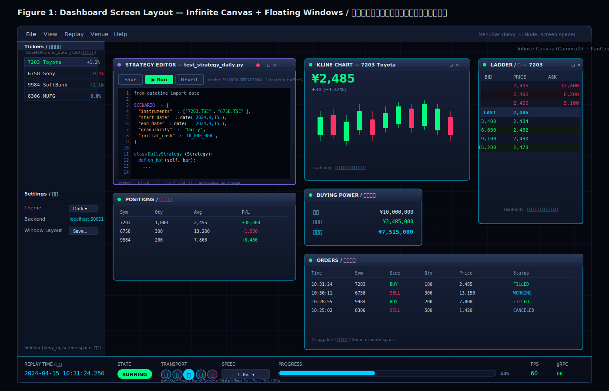

# Phase 7: Replay UI Integration — Implementation Plan

[Tranceparent Headless Replay](./Tranceparent%20Headless%20Replay.md) Phase 6 で構築した headless replay engine（Replay State Machine + Snapshot Reducer + 制御 API）を、Bevy UI から可視化・制御できる状態にする。`e-station` (Iced ベース) の UI を、本プロジェクトの **Infinite Canvas + Floating Windows** アーキテクチャ（[Infinite Canvas with Bevy Engine](./Infinite%20Canvas%20with%20Bevy%20Engine.md) / [Floating Window on Canvas](./Floating%20Window%20on%20Canvas.md)）に合わせて移植する。

## Goals

1. リプレイの進行（時刻・状態・速度）を UI に常時同期する。
2. メニュー → ファイル選択（`*.py` 戦略ファイル）→ **戦略コードエディタ（monaco 相当）で編集** → リプレイ開始 → エンジン稼働、までの一連の UX を実装する。戦略ファイルは `SCENARIO` dict に instrument / start / end / granularity / initial_cash を内包する想定（`python/tests/data/test_strategy_daily.py` 等を参照）。
3. ローソク足 / Buying Power / Positions / Orders の 4 パネル＋ **StrategyEditorWindow** を Bevy の floating window として動作させる。**Ladder は Phase 8 へ延期**（リプレイデータ (J-Quants Daily/Minute バー) には板情報が含まれないため、Phase 7 で実装してもデータソースが無い）。
4. Sidebar（銘柄一覧・設定）と Footer（時刻・トランスポート・FPS）を screen-space UI として常時表示する。Footer の Transport には **⏪ Step-back** を MVP として含める。
5. UI 側のロジックを **Subscription Agnostic** に保ち、backend が Unary polling のままでも streaming に切り替えても動くようにする。

## Non-Goals

- 実取引（Live Venue）との接続は Phase 8 / 9 で扱う。本フェーズはあくまで replay モード。
- バックエンドのインジケータ計算は本フェーズでは導入しない（UI 表示用の簡易 MA のみ Bevy 側で算出）。
- 高度なテーマエディタ / レイアウト保存は Optional とし、骨格のみ提供。
- **Ladder (板情報) ウィンドウは Phase 8 へ延期**。リプレイデータ (J-Quants Daily/Minute バー) には bid/ask depth が含まれず、Phase 7 ではガワだけ作っても空のままになる。Live マーケットデータ (Tachibana EventWebSocket / kabu PUSH) が入る Phase 8 で初めて意味を持つ。

---

## 0. UI 機能一覧 / UI Feature Inventory

Phase 7 の UI が担う役割を網羅的に列挙する。各項目は §3 以降の詳細設計に対応する。

### 0.1 戦略ファイル編集（`StrategyEditorWindow` 経由）

対象ファイル: `python/tests/data/test_strategy_daily.py` / `test_strategy_minute.py` / `pair_trade_minute.py`

- **`SCENARIO` dict の編集**
  - 銘柄の追加 / 削除（`instruments` リスト）
  - `start_date` / `end_date` の変更
  - `granularity` の切替（Daily / Minute）
  - `initial_cash` の変更
- **戦略ソースコード本体の編集**（Python シンタックスハイライト / 行番号 / Undo-Redo / Find & Replace / オートインデント）
- **ファイル操作**
  - `[Save]` — キャッシュ → 元ファイルへ反映
  - `[Revert]` — 編集破棄してディスクから再読込（確認ダイアログあり）
  - `[▶ Run]` — キャッシュをフラッシュして `LoadStrategy` + `StartEngine` を発火（実装上は load+start の合成だが、UI 表記は IDE 標準の "Run" に統一）
  - 自動保存（キャッシュへ、変更イベント駆動）

### 0.2 リプレイ制御（Footer の Transport）

- ▶ **Run**（エディタの `[▶ Run]` 経由 / IDLE→LOADED→RUNNING）
- ⏯ **Pause / Resume**（トグル）
- ⏪ **Step-back**（1 step 巻き戻し、ring buffer 512 件まで）
- ⏭ **Step+1**（1 step 進める）
- ⏮ **Jump-to-start**（先頭へ。PAUSED のまま時刻=start に戻る ≒ `LOADED` 相当）
- **Speed 変更**（0.5x / 1x / 2x / 5x / 10x / 50x）

> ⏹ Stop は採用しない。理由: `Pause + Jump-to-start` と機能が重複するため。戦略を完全にアンロードしたい場合は **File → New**（または別ファイルを Open）で `IDLE` に戻る。専用の Unload ボタンは設けない。

### 0.3 アプリ / レイアウト操作

- **File メニュー**: New / Open Strategy... / Save Layout (stub) / Exit
  - **New** は現在の戦略をアンロードして **Live Manual モードへ戻る**（Phase 8 以降の既定動作）。Phase 7 は Replay 専用フェーズのため、IDLE 遷移として実装し、Phase 8 で Live Manual へ挙動を更新する
  - **Open Strategy...** は `.py` ファイルを選択する。**現在の ExecutionMode によって遷移先が変わる**（Phase 8 で確立）:
    - Replay モードのとき → Replay バックテストとしてロード（本フェーズの設計）
    - Live モード（Manual / Auto）のとき → **Live Auto モードに切替え**（Phase 8 で実装）
- **Floating Window 操作**: ドラッグ移動 / リサイズ / 前面化 (z-order) / 表示・非表示トグル
- **Infinite Canvas 操作**: パン / ズーム（視点変更）
- **Sidebar からの銘柄選択**（`SelectedSymbol` 更新 → Kline の対象銘柄が連動。Ladder は Phase 8 で連動）
- **UI_LAYOUT の永続化** — floating window の位置・サイズ・z-order・可視性、canvas の pan/zoom、選択銘柄を戦略 `.py` と **同名の `.json` ファイル**（サイドカー）に保存（§3.4）。`.py` + `.json` を 1 組の入力ファイルとして扱う。Live Auto モード（Phase 10）も同様。Live Manual モードは `.py` が無いため例外設計（Phase 8 で定義）
- **Settings**（Sidebar 下半分、stub OK）: Theme dropdown / Backend address field / Save Layout button

### 0.4 状態表示（Read-only）

- **Footer**: 現在時刻 / ReplayState バッジ（IDLE/LOADED/RUNNING/PAUSED/STOPPING）/ Progress bar + パーセント / FPS / gRPC 接続状態（OK / RECONNECTING / ERROR）
- **Sidebar**: Tickers リスト（backend RPC `ListInstruments(source="replay")` 経由で取得。Rust 側 catalog 直叩きは行わない）+ 最新価格
- **KlineChartWindow**: ローソク足（簡易 MA は UI 側で算出）
- **BuyingPowerPanel**: 現金 / 評価額 / 建余力
- **PositionsPanel**: Sym / Qty / Avg / P&L
- **OrdersPanel**: Time / Sym / Side / Qty / Price / Status
- ~~**LadderWindow**~~ — **Phase 8 へ延期**（リプレイ Daily/Minute バーに板情報が無い）

> Note: 発注は戦略ソースコード（`SCENARIO` の `on_bar` 等）が行う。Kline は read-only の可視化に徹し、BUY/SELL ボタンや手動クリック発注 UI は設けない。

---

## 1. Screen Design / 画面設計

詳細な解説図は [assets/phase7-screen-layout.drawio.svg](../assets/phase7-screen-layout.drawio.svg) を参照。

#### Figure 1: Dashboard Screen Layout



#### Figure 2: Bevy ECS Component Hierarchy / コンポーネント階層

screen-space (bevy_ui) と world-space (Sprite/Transform) の区分、Resources / Systems / Events / gRPC マッピング。


**Resources (shared state) / 共有リソース**

```text
ReplayTimeRes      { timestamp_ms: i64 }
ReplayStateRes     { phase: IDLE/LOADED/RUNNING/PAUSED/STOPPING }
ReplaySpeedRes     { multiplier: f32 }  // 0.5/1/2/5/10/50
TradingState       { price, history, timestamp, replay_state }
PortfolioStateRes  { buying_power, positions[], orders[] }
SelectedSymbol(Option<TickerId>)
Tickers(Vec<TickerId>)                  // ListInstruments(source=replay) RPC の結果
StrategyBuffer     { cache_path, dirty, original_path }
UiLayoutCache      { windows, viewport, selected_symbol }
WindowManager      { max_z: f32 }
GrpcClientHandle   { tonic channel }
```

**Systems / 更新ループ**

```text
poll_engine_state_system     // 60 Hz GetState polling
poll_portfolio_system        // 60 Hz GetPortfolio polling
replay_time_sync_system      // ReplayTime → footer label
transport_button_system      // ⏮⏪⏯⏭⏹ → RPC
menu_open_strategy_system    // File→Open → rfd → cache copy
strategy_editor_system       // bevy_egui code editor
strategy_autosave_system     // changed() → async write to cache
strategy_run_button_system   // [▶Run] → LoadStrategy + StartEngine
ui_layout_persist_system     // window/viewport → UI_LAYOUT block
kline_chart_render_system    // history → candle mesh
positions/orders/bp_render_system
// ladder_render_system は Phase 8 で追加（Live depth snapshot 接続時）
window_drag_system / window_focus_z_system   (existing)
```

**Events / イベント**

```text
OpenStrategyRequested / StrategyLoaded / ReplayStarted / ReplayStopped
```

**gRPC ↔ UI Mapping / Phase 6 API への接続**

```text
// Polling (60 Hz)
GetState()           → ReplayTime, TradingState, ReplayStateRes
GetPortfolio()       → PortfolioStateRes  (新規 DTO)

// Strategy editor flow / エディタ起点
LoadStrategy(cache_path, source: str)
                     → IDLE → LOADED
                       SCENARIO dict をパースして
                       replay window 確定 + import
StartEngine()        → LOADED → RUNNING
[▶ Run] が LoadStrategy + StartEngine を順次発火

// Transport buttons / トランスポート制御
PauseReplay()        → RUNNING → PAUSED
ResumeReplay()       → PAUSED → RUNNING
StepReplay(n)        → PAUSED でのみ
StepBackward(n)      → snapshot ring buffer (512)
                       ★ MVP 必須 (positions/orders/buying_power も巻き戻し)
JumpToStart()        → seek to begin
SetReplaySpeed(x)    → 0.5/1/2/5/10/50
StopReplay()         → * → STOPPING → IDLE
```

**Streaming 評価 (Phase 6 で決定)** — A. 現状の Unary GetState 60Hz polling 継続 / B. SubscribeReplayEvents (server stream)。UI 層は SubscriptionAgnostic で両対応。

**UI_LAYOUT 永続化** — 戦略 `.py` と同名の `.json` サイドカーファイルに保存（sentinel block 方式は不採用）。window 位置/size/z/可視性, viewport pan/zoom, selected_symbol。`.py` + `.json` を 1 組の入力ファイルとして扱う。

### 1.1 Space の分割（重要な設計判断）

`e-station` は全画面が Iced の widget tree だが、本プロジェクトは「canvas をズーム/パンできる無限空間」を中心に据える。そのため UI を 2 層に分ける:

- **Screen-space (bevy_ui Node)** — ズームの影響を受けない固定 UI:
  - MenuBar（上端）
  - Sidebar（左端）
  - Footer（下端、リプレイトランスポート含む）
  - ModalLayer（ReplayStartModal などのオーバーレイ）
- **World-space (Sprite + Transform)** — `PanCam` で動かせる無限キャンバスに浮かぶウィンドウ:
  - KlineChartWindow / BuyingPowerPanel / PositionsPanel / OrdersPanel
  - (LadderWindow は Phase 8 で追加)

世界座標側は既存の `WindowRoot` 機構（[src/ui/window.rs](../../src/ui/window.rs)）を拡張して再利用する。

### 1.2 Visual Style Reference（/frontend-design 連携）

実装に着手する直前に `/frontend-design` で **HTML/CSS ピクセル単位ビジュアルリファレンス**を 1 枚生成し、`assets/phase7-visual-reference.html` に保存する。drawio はワイヤフレーム、frontend-design はガラスモーフィズム・タイポグラフィ・色味・ホバー状態などの **見た目の基準**として扱う。Bevy 実装はこのリファレンスを目視で参照しながら近似する。

カラートークン（drawio と統一）:

| トークン | Hex | 用途 |
|---|---|---|
| `bg.canvas` | `#05080f` | 無限キャンバス背景 |
| `bg.window` | `#141a2e` → `#0f1628` gradient | フローティングウィンドウ |
| `border.cyan` | `#00CFFF` | アクセント・選択状態 |
| `accent.green` | `#00FF7F` | BUY / +P&L / FILLED |
| `accent.red` | `#FF3366` | SELL / -P&L |
| `text.primary` | `#e0e8f0` | 通常文字 |
| `text.muted` | `#9fb0c8` | 補助文字 |
| `text.subtle` | `#5a7090` | 補注 |

---

## 2. e-station からの移植マトリクス

| e-station ソース | Phase 7 移植先 | 移植方針 |
|---|---|---|
| `src/menu.rs`, `src/native_menu.rs`, `src/widget_menu_bar.rs` | `src/ui/menu_bar.rs` (新規) | bevy_ui Node の Flexbox で再構築。File → "Open Replay Data..." だけは Phase 7 で必須、他は枠のみ |
| `src/modal/replay_form.rs` (720 行) | (採用しない) | 起動パラメータは戦略ファイル内 `SCENARIO` dict から読み取るため、別モーダルでの入力は不要。File→Open 直後に `StrategyEditorWindow` が開く |
| — (新規) | `src/ui/floating/strategy_editor.rs` (新規) | monaco-editor 相当のコードエディタを載せた floating window。Python シンタックスハイライト + 行番号 + 折りたたみ + `[Load & Start]` ボタン |
| `src/screen/dashboard/sidebar.rs` | `src/ui/sidebar.rs` (新規) | bevy_ui 左固定パネル。Tickers list と Settings の二段 |
| `src/screen/dashboard/panel/buying_power.rs` | `src/ui/floating/buying_power.rs` | world-space floating window |
| `src/screen/dashboard/panel/positions.rs` | `src/ui/floating/positions.rs` | 同上。Text2d でテーブルを描画 |
| `src/screen/dashboard/panel/orders.rs` | `src/ui/floating/orders.rs` | 同上 |
| `src/screen/dashboard/panel/ladder.rs` (1382 行) | (Phase 8 へ延期) | リプレイ Daily/Minute バーには depth が無いため Phase 8 で Live マーケットデータと併せて移植 |
| `src/chart/kline.rs` (2052 行) | 既存 `src/ui/chart.rs` を拡張 | ろうそく足モードを追加（現在は line chart のみ）|
| `src/handlers/replay.rs`, `src/handlers/engine.rs` | `src/trading.rs` 内に gRPC クライアント拡張 | 制御 RPC 群を Tonic で叩く Bevy system に |
| `src/widget/multi_split.rs`, `src/widget/decorate.rs` | (採用しない) | infinite canvas が代替する |

---

## 3. Tasks

### 3.1 Backend 側補強 (Phase 6 の延長)

- **`TradingState` に `replay_state` を追加** — 既存の `GetState` JSON に `replay_state: str`（`"IDLE"` / `"LOADED"` / `"RUNNING"` / `"PAUSED"` / `"STOPPING"`）フィールドを追加し、Rust 側 `BackendTradingState` で受け取れるようにする。これが Footer の状態バッジの唯一のソース。
- **`GetPortfolio` RPC の追加** — `TradingState` から `BuyingPower / Position[] / Order[]` を別 DTO で返す。`GetState` を肥大化させないため分離する。Phase 6.5 の `strategy_runtime` で発行された注文・約定をここに集約する。
- **`LoadStrategy` RPC の追加** — UI から戦略ファイルのパスと**編集後のソース文字列**を受け取り、`SCENARIO` dict を解析して replay window を確定 → in-process で戦略を import / instantiate する。`schema_version` をチェックし不一致なら明示的に reject。
- **`StepBackward(n)` RPC を MVP に含める** — Phase 6 の snapshot ring buffer（既定 512 件）と組み合わせて、`PortfolioStateRes`/`positions`/`orders` を含む完全な状態を巻き戻す。Optionalではなく必須。
- **`SubscribeReplayEvents` (Optional)** — server-streaming で `ReplayTime / Trades / KlineUpdate / OrderEvent / PositionEvent` を push。実装するかは Phase 6 末の判断に従う。実装しない場合は UI は 60 Hz polling のみで動かす。
- **`Step / Pause / Resume / SetSpeed / StepBackward / JumpToStart / Unload` の冪等化確認** — UI からの連打耐性。`Unload` は `IDLE` への明示的な遷移（戦略破棄）で、UI からは **File → New** または別ファイル Open で発火する。
- **`ListInstruments(source="replay")` RPC の追加** — Sidebar Tickers パネル用。`SCENARIO.end_date` のディレクトリ配下（例: `S:/j-quants/2024/04/15/`）の CSV ファイル名からシンボルを列挙して返す。Rust 側から catalog ディレクトリを直接読まない（Python catalog ロジックを Rust に二重実装しないため）。Phase 8 で `source="live"` を追加し、同じ RPC で venue master を返せるよう拡張する設計。
  ```protobuf
  rpc ListInstruments (ListInstrumentsRequest) returns (ListInstrumentsResponse);
  message ListInstrumentsRequest {
    string source = 1;  // "replay" (Phase 7) / "live" (Phase 8 で追加)
    string filter = 2;  // 任意の検索文字列 (Phase 8 で活用)
  }
  message ListInstrumentsResponse {
    repeated InstrumentInfo instruments = 1;
  }
  message InstrumentInfo {
    string instrument_id = 1;   // "1301.TSE"
    string display_name = 2;    // "極洋"
    string venue_hint = 3;      // "REPLAY" / "TACHIBANA" / "KABU"
  }
  ```

### 3.2 Bevy UI 共通基盤

- `UiPlugin` を screen-space / world-space / modal の 3 層に分割。
- `Resources`:
  - `ReplayTimeRes { timestamp_ms: i64 }`
  - `ReplayStateRes { phase: ReplayPhase }`（enum: IDLE/LOADED/RUNNING/PAUSED/STOPPING）
  - `ReplaySpeedRes { multiplier: f32 }`
  - `PortfolioStateRes { buying_power, positions, orders }`
  - `SelectedSymbol(Option<TickerId>)`
- `Events`:
  - `OpenReplayRequested` / `ReplayLoaded` / `ReplayStarted` / `ReplayStopped`
- `Systems`:
  - `poll_engine_state_system` — 60 Hz で `GetState` / `GetPortfolio` を叩き Resource を更新
  - `transport_button_system` — フッターの ⏮⏯⏭/Speed を RPC に変換
  - `replay_modal_lifecycle_system` — Open Replay → Modal 表示 → Load → Start
- 既存の `WindowManager`/z-order/drag システムは流用。

### 3.3 Screen-space UI

- **MenuBar** ([src/ui/menu_bar.rs])
  - Flexbox Row, height 36px, 黒紺背景
  - File ドロップダウンに「New」「Open Strategy...」「Save Layout (stub)」「Exit」
  - **New**: 空テンプレート（`SCENARIO` 雛形のみ）の戦略バッファを開き、`Unload` RPC を発火して `IDLE` に戻す
  - File→Open で `rfd::AsyncFileDialog` を起動して `*.py` のみフィルタ、`OpenStrategyRequested(path)` を発火
  - 既定ディレクトリは `python/tests/data/`（`test_strategy_daily.py` / `test_strategy_minute.py` / `pair_trade_minute.py` がある場所）
- **Sidebar** ([src/ui/sidebar.rs])
  - 幅 200px, 左固定
  - 上半分: Tickers リスト（`PortfolioStateRes` と `ReplayTime` 由来の最新価格を表示、クリックで `SelectedSymbol` 更新）
    - **銘柄マスタの導出**: backend RPC `ListInstruments(source="replay")` を呼び、Python 側で `SCENARIO.end_date` のディレクトリ配下（例: `S:/j-quants/2024/04/15/`）の CSV ファイル名からシンボルを列挙してもらう。Rust 側で catalog ディレクトリを直接読まない。呼び出しは `LoadStrategy` RPC の完了後、backend が `LOADED` に遷移したタイミングで 1 回。結果は `Tickers` Resource として保持。
    - Phase 8 で venue ログイン成功時に `ListInstruments(source="live")` を追加で呼び、結果を Tickers Resource に **マージまたは置換** する設計（Phase 8 計画書 §3.5 参照）。Phase 7 ではこの分岐は実装しない。
  - 下半分: Settings（Theme dropdown / Backend address field / Save Layout button — 各 stub OK）
- **Footer** ([src/ui/footer.rs])
  - 高さ 60px, 下固定
  - `ReplayTimeLabel`（monospace 16px）
  - `ReplayStateBadge`（色付きピル: RUNNING=green / PAUSED=yellow / IDLE=gray / STOPPING=red）
  - `TransportControls`（⏪ Step-back / ⏮ Jump-to-start / ⏯ Pause-Resume トグル / ⏭ Step+1）
  - `SpeedSelector`（dropdown: 0.5x / 1x / 2x / 5x / 10x / 50x）
  - `ProgressBar`（cyan）+ パーセント
  - `FpsCounter` + `GrpcStatus`（OK / RECONNECTING / ERROR）
- **（ReplayStartModal は廃止）** — 起動パラメータは戦略ファイルの `SCENARIO` dict に集約されたので、別モーダルは設けない。File→Open 直後に `StrategyEditorWindow`（§3.4）が world-space に出現し、そこの `[Load & Start]` ボタンで `LoadStrategy` → `StartEngine` を一気に走らせる。

### 3.4 World-space Floating Windows

各 floating window は既存の `spawn_trader_window` パターン（`WindowRoot`/`TitleBar`/`Draggable`/`bring-to-front`）を踏襲して `src/ui/floating/{name}.rs` に分離する。共通化のため `spawn_floating_window(commands, title, size, content_builder)` ヘルパーを切り出す。

- **StrategyEditorWindow** ([src/ui/floating/strategy_editor.rs]) — monaco-editor 相当のコードエディタ。File→Open でファイルパスを受け取り、ファイル内容を読み込んで表示・編集。
  - 機能: Python シンタックスハイライト / 行番号 / 行折りたたみ / Find & Replace / Undo-Redo / オートインデント
  - ヘッダ: ファイル名表示、`[Save]` / `[▶ Run]` / `[Revert]`、ダーティマーク（`●` 印）
  - **UI 状態の保存場所（採用方針）**: floating window の位置・サイズ・z-order・可視性、infinite canvas の pan / zoom、選択銘柄などの **UI 状態は戦略 `.py` と同名の `.json` ファイル（サイドカー）に保存**する。`.py` + `.json` を 1 組の入力ファイルとして扱う。このアプリは **3 つの ExecutionMode** を持つ（Phase 8 §0.5.2 参照）:
    - **Replay モード**: `{strategy_name}.json`（`.py` と同じディレクトリ）
    - **Live Auto モード** (Phase 10): 同上（`.py` + `.json` ペアを Promote to Live でそのまま利用）
    - **Live Manual モード** (Phase 8/9): 戦略 `.py` が存在しないため例外 → Phase 8 で設計
    - ファイル形式: **JSON**（拡張子 `.json`、UTF-8）。`.py` を汚さないため sentinel block は使わない。
      ```json
      {
        "schema_version": 1,
        "viewport": {"pan_x": 0.0, "pan_y": 0.0, "zoom": 1.0},
        "windows": {
          "kline":          {"x": 100, "y": 80,  "w": 800, "h": 500, "z": 0, "visible": true},
          "buying_power":   {"x": 100, "y": 600, "w": 300, "h": 120, "z": 2, "visible": true},
          "positions":      {"x": 420, "y": 600, "w": 500, "h": 200, "z": 3, "visible": true},
          "orders":         {"x": 940, "y": 600, "w": 500, "h": 200, "z": 4, "visible": true},
          "strategy_editor":{"x": 50,  "y": 50,  "w": 900, "h": 700, "z": 5, "visible": true}
        },
        "selected_symbol": "1301.TSE"
      }
      ```
    - 読み込み: File → Open で `test_strategy_daily.py` を開いたとき、`test_strategy_daily.json` が同ディレクトリに存在すれば読み込んでウィンドウ配置を復元。存在しなければデフォルト配置で起動（初回書き込みは `[Save]` 操作 / ウィンドウ移動時の自動保存で行う）。
    - 書き込み: Rust の `serde_json` で serialize → ファイル書き出し。`.py` 本体は一切改変しない。
    - **`.py` と `.json` の対応**: ファイル名（拡張子を除く stem）が一致する同ディレクトリのペアとする。`test_strategy_daily.py` の UI レイアウトは `test_strategy_daily.json`。
  - **キャッシュフォルダ運用（採用方針）**: 編集中の状態は OS 標準のキャッシュディレクトリにミラーリングして運用する。元ファイルは `[Save]` するまで触らない。UI 状態の自動保存先も**キャッシュ内のコピー**（同じ `UI_LAYOUT` ブロック）。
    - キャッシュ位置: `dirs::cache_dir()` 配下に `the-trader-was-replaced/strategy_buffers/` を作る（Windows: `%LOCALAPPDATA%\the-trader-was-replaced\cache\strategy_buffers\`、Linux: `~/.cache/the-trader-was-replaced/strategy_buffers/`、macOS: `~/Library/Caches/the-trader-was-replaced/strategy_buffers/`）
    - キャッシュファイル名: `{sha256(original_abs_path)[..16]}__{original_filename}` ＋ サイドカー JSON `{...}.meta.json` に `original_path` / `last_modified_ms` / `dirty: bool` を保存
    - File→Open のフロー: ① 元ファイルを開く → ② キャッシュにコピー → ③ エディタはキャッシュファイルを「作業ファイル」として読み書き → ④ 元ファイルには触らない
    - 自動保存: **値の変更イベント駆動**（タイマーは使わない）。`egui::TextEdit` の `response.changed()` が立った時だけキャッシュへ書き出す。書き込みは `bevy_tokio_tasks` 経由の非同期 I/O で UI フレームをブロックしない。タイピング中は変更があるフレームでのみ I/O が走るため、無編集時はゼロコスト。
    - `[Load & Start]`: キャッシュをフラッシュ（同期書き込み）→ **キャッシュのパス**を `LoadStrategy` RPC へ送る（元ファイルは送らない／編集中の内容で実行される）
    - `[Save]`: キャッシュ → 元ファイル へコピー（`dirty: false` に更新）
    - `[Revert]`: 元ファイルで キャッシュを上書き（編集内容は破棄、確認ダイアログあり）
    - 起動時の復元: 同じ元ファイルを再度開いたとき、キャッシュの `last_modified_ms` が元ファイルより新しい & `dirty: true` ならモーダル「未保存の変更があります。復元しますか？ [復元] [破棄]」
    - クリーンアップ: `[Save]` 直後やユーザが明示的に閉じたタブのキャッシュは即削除しない（=次回も復元できる）。`.meta.json` の `dirty: false` で 30 日経過したものを起動時に GC。
  - **実装方針（確定）**: `bevy_egui` + `egui_code_editor` (v0.2.23) を採用。`egui::Window` 内にウィジェットを1行で配置できるターンキー構成。Python syntax は `Syntax` struct にキーワードセットを手動定義（~30 行）。精度向上が必要になったときのみ `egui_extras` の `syntect` feature を差し込む（差し替え不要、レイヤー追加のみ）。Undo/Redo は `TextEdit` 標準 undo + Bevy `Resource` の `Vec<String>` スナップショットスタックで対応。`wry`/`tao` WebView 路線は採用しない。
- **KlineChartWindow** — 既存 `chart.rs` をろうそく足対応に拡張。`PortfolioStateRes` ではなく `TradingState.history` を入力とする。read-only（発注は戦略ソースコードが担う）。
- ~~**LadderWindow**~~ — **Phase 8 へ延期**。リプレイの J-Quants Daily/Minute バーには bid/ask depth が含まれず、Phase 7 で実装してもデータソースが無い。Live マーケットデータ (Tachibana EventWebSocket / kabu PUSH) が入る Phase 8 で実装する。
- **BuyingPowerPanel** — 3 行（現金 / 評価額 / 建余力）。`PortfolioStateRes.buying_power` を購読。
- **PositionsPanel** — Sym/Qty/Avg/P&L のテーブル。各行 `Text2d` で描画。
- **OrdersPanel** — Time/Sym/Side/Qty/Price/Status のテーブル。Status の色だけ状態に応じて変える。

### 3.5 Replay Time Sync

- 60 Hz の `poll_engine_state_system` が `GetState` を呼び、結果から `ReplayTimeRes` / `ReplayStateRes` / `TradingState` を更新。
- Footer / KlineChart は Resource の `Changed<>` で再描画。
- streaming 採用時は `tonic` の async stream を `bevy_tokio_tasks` 越しに polling channel に流し込み、同じ Resource を埋めるだけで切り替え可能にする。

### 3.6 Step-back (MVP / 必須)

- バックエンドに `StepBackward(n)` を追加し、Phase 6 の snapshot を ring buffer（既定 512 件）で保持。
- `PortfolioStateRes` も snapshot に含めて巻き戻す（positions/orders の整合性のため）。
- Footer に ⏪ ボタンを追加。連打した場合は ring buffer の最古を超えないようクランプ、超えたら no-op。
- streaming 採用時は巻き戻し直後に `ReplayStateRes` を強制再同期して UI の整合性を保つ。

### 3.7 Visual Reference (`/frontend-design`)

実装着手前に `/frontend-design` で `assets/phase7-visual-reference.html` を生成。Bevy 実装中はこの HTML をブラウザで開いて目視リファレンスとする。

---

## 4. File Layout（追加・変更）

```
src/ui/
├── mod.rs                       # plugin 構成を screen/world/modal 3 層に
├── components.rs                # 既存 + ReplayPhase, PortfolioStateRes など
├── window.rs                    # 既存。spawn_floating_window ヘルパー切り出し
├── chart.rs                     # 既存。ろうそく足モード追加
├── button.rs                    # 既存
├── menu_bar.rs        [NEW]
├── sidebar.rs         [NEW]
├── footer.rs          [NEW]
└── floating/
    ├── mod.rs         [NEW]
    ├── strategy_editor.rs [NEW]   # monaco 相当のコードエディタ floating window
    ├── kline.rs       [NEW]   # KlineChartWindow ラッパ（chart.rs を組む）
    ├── buying_power.rs [NEW]
    ├── positions.rs   [NEW]
    └── orders.rs      [NEW]
    # ladder.rs は Phase 8 で追加（Live depth ソース接続時）

src/trading.rs                   # gRPC: GetPortfolio / Pause/Resume/Step/SetSpeed 追加
python/engine/models.py          # TradingState に replay_state: Optional[str] 追加
python/engine/core.py            # get_current_state() に replay_state を含める
python/engine/server_grpc.py     # GetPortfolio RPC, LoadStrategy RPC 追加
python/engine/portfolio.py       [NEW]  # PortfolioState DTO + GetPortfolio 集約ロジック
docs/plan/assets/
├── phase7-screen-layout.drawio.svg  [DONE]  ← drawio 出力済
└── phase7-visual-reference.html     [TODO]  ← /frontend-design で生成（Step 6 着手時）
```

---

## 5. Implementation Order / 実装順

各ステップで `cargo run` できる状態を維持する。

1. **Step 1 — Footer & Time Sync**:
   - **Backend**: `TradingState` に `replay_state: Optional[str]` を追加 → `get_current_state()` に含める（後方互換: デフォルト `None`）。
   - **Rust**: `BackendTradingState` / `TradingData` に `replay_state` フィールドを追加。`ReplayPhase` enum + `ReplayTimeRes` / `ReplayStateRes` Resource を定義。
   - **Bevy UI**: bevy_ui Node ベースの Footer を実装（`src/ui/footer.rs`）。`ReplayTimeLabel` / `ReplayStateBadge` / Transport ボタン（⏪⏮⏯⏭ / Speed — この Step ではログのみ） / FPS カウンタ / gRPC ステータスを表示。
   - **合格基準**: backend RUNNING 時にフッターの時刻が更新され、状態バッジが色付きで切り替わる。
2. **Step 2 — MenuBar & File→Open**: File→Open → `*.py` ファイル選択 → `OpenStrategyRequested` 発火。この時点ではログ出力だけで OK。
3. **Step 3 — StrategyEditorWindow (MVP)**: `bevy_egui` + `egui_code_editor` を導入し、File→Open で受け取ったパスのファイル内容を表示・編集。`[Load & Start]` で `LoadStrategy` + `StartEngine` を呼ぶ。
4. **Step 4 — Transport Controls (Step-back 含む)**: Footer の ⏪⏮⏯⏭ / Speed を RPC に接続。Pause→Step→Resume→Step-back が動く。
5. **Step 5 — Sidebar**: Tickers リストと Settings の枠。`SelectedSymbol` に応じてチャートのタイトルが切り替わる。
6. **Step 6 — Visual Reference**: `/frontend-design` で `phase7-visual-reference.html` を生成。以降の floating window 実装の見た目基準にする。
7. **Step 7 — Floating Windows (簡単な順)**: BuyingPower → Positions → Orders → Kline（既存 chart の拡張）。**Ladder は Phase 8 へ延期**。
8. **Step 8 — Backend: `GetPortfolio` / `LoadStrategy` / `StepBackward` RPC**: Python 側に DTO と RPC を追加し、UI と接続。
9. **Step 9 — Polish**: glassmorphism / rim light / hover / focus z-order。

---

## 6. Success Criteria

- File → Open（`*.py`） → `StrategyEditorWindow` 表示 → コード編集 → `[Load & Start]` で IDLE→LOADED→RUNNING の遷移がフッターに反映される。
- 上記が `python/tests/data/test_strategy_daily.py` / `test_strategy_minute.py` / `pair_trade_minute.py` の **3 ファイルすべて**で動く（`SCENARIO` の granularity が `Daily` / `Minute` 双方で機能する）。
- リプレイ中、Footer の時刻が連続的に進み、Kline / Positions / Orders / BuyingPower がすべて同期する。
- ⏯ Pause / ⏭ Step / **⏪ Step-back** / Speed 変更が即座に反映される。Step-back は positions / orders / buying_power も含めて正しく巻き戻る。
- 5 つの floating window（StrategyEditor + 4 panel）をドラッグ・ズーム・前面化できる。Ladder は Phase 8 で追加。
- Sidebar から銘柄を切り替えると Kline の対象銘柄が変わる（リプレイは同一セッションを維持）。
- gRPC が `Unary polling` でも `Server streaming` でも UI 側の system を切り替えるだけで動作する。

---

## 7. Implementation Tips

- **Bevy UI Interaction**: Bevy 0.15 のボタンは `Interaction::Pressed` を見る。`menu_button_system` は `(Changed<Interaction>, With<Button>)` で検知する。
- **EventReader**: Bevy の `EventReader` は reader ごとに独立した cursor を持つため、複数の system で同じ event を読んでも競合しない。
- **File Dialog**: `rfd::FileDialog::pick_file()` は同期 API のため表示中 Bevy が止まる。MVP として許容するが、必要なら `tokio` 越しに非同期化を検討。
- **bevy_egui Version**: Bevy 0.15.1 には `bevy_egui = "0.31"` が適合する。
- **Data Flow**: `egui::TextEdit::multiline` が `StrategyBuffer.source` を直接編集するため、変更検知は `response.changed()` で十分。
- **[AI 作業分担]** 手動検証時の役割分担: AI がやること — backend / Rust アプリの起動・停止・プロセス kill・ログ確認・gRPC 疎通確認。ユーザーに依頼すること — UI のボタン操作・目視確認・スクリーンショット。AI は `UI 操作` を ユーザーに実行してもらい、ログは `$TEMP/rust_log.txt` や backend の標準出力をリダイレクトして読む。

### 手動検証手順（engine_runner.run 接続後）

役割分担は `[AI 作業分担]` を参照。AI がステップ 1–2,4 を実行し、ステップ 3 はユーザーに依頼する。

**ステップ 1: Backend 起動（AI が実行）**

```bash
cd python
uv run python -m engine --token testtoken --jquants-catalog-path ../artifacts/jquants-catalog \
  > /tmp/backend_log.txt 2>&1 &
```

`Starting gRPC server on port 19876` が出れば OK。ポート競合時は先に既存プロセスを停止:

```powershell
$p = (Get-NetTCPConnection -LocalPort 19876 -ErrorAction SilentlyContinue).OwningProcess
if ($p) { Stop-Process -Id $p -Force }
```

**ステップ 2: Rust アプリ起動（AI が実行）**

```powershell
cd "C:\Users\sasai\Documents\The-Trader-Was-Replaced"
$psi = New-Object System.Diagnostics.ProcessStartInfo
$psi.FileName = ".\target\debug\backcast.exe"
$psi.WorkingDirectory = $PWD.Path
$psi.UseShellExecute = $false
$psi.EnvironmentVariables["BACKEND_ENABLED"] = "true"
$psi.EnvironmentVariables["BACKEND_TOKEN"] = "testtoken"
$psi.EnvironmentVariables["BACKEND_CATALOG_PATH"] = "artifacts\jquants-catalog"
[System.Diagnostics.Process]::Start($psi) | Out-Null
```

> `cargo run` 単体や `$env:BACKEND_ENABLED="true"; cargo run` では `.env` が読まれず `grpc: DISABLED` になる。`ProcessStartInfo.EnvironmentVariables` で直接渡すこと。WSL/Bash 経由では GUI が早期終了するため必ず PowerShell から起動。

**ステップ 3: UI 操作（ユーザーが実行）**

1. ...
2. ...

**ステップ 4: ログ確認（AI が実行）**

```bash
cat /tmp/backend_log.txt
```

期待ログ（この順で出ること）:

```text
LoadReplayData success=True state=LOADED
StartEngine: strategy loaded cls='BuyAndHoldStrategy' instruments=['1301.TSE']
StartEngine: bars loaded total=57
StartEngine: run complete run_id=<ts>-...-1301_TSE summary={...}
StartEngine success=True state=RUNNING
```

run_buffer 出力確認:

```powershell
ls "$env:APPDATA\flowsurface\run-buffer\<run_id>"
# → meta.json  fills.jsonl  equity.jsonl  summary.json
```

---

## 8. Open Questions & ADRs

### ADR: MenuBar は Bevy UI の thin shell から始める
MenuBar は最初から本格的な dropdown menu にせず、`bevy_ui` の固定バー + ボタンとして実装する。Phase 7 の目的は大きいため、最初の到達点を小さくし、既存の Footer と同じ方式（screen-space UI）に寄せることで、破壊時の復帰コストを下げる。

### ADR: File Open は event 境界を作ってから StrategyEditor へ渡す
`rfd` で直接エディタを開かず、まず `OpenStrategyRequested { path: PathBuf }` event を作る。これにより、File dialog、cache copy、StrategyEditorWindow、LoadStrategy RPC の結合を分離し、後続で cache layer や復元 prompt を挟みやすくする。

### ADR: Strategy Run Backend Contract
- **シーケンス**: `StartEngine` は `LOADED` 状態でしか有効でないため、IDLE から Run するには `LoadReplayData` -> `StartEngine` の 2-step sequencing が必要。
- **データ源**: 実行には `ScenarioMetadata` (instruments, start, end, granularity) が必須であり、これらは実行前に `.py` からパースして Rust 側 Resource に保持する。
- **カタログパス**: `catalog_path` は環境変数 `BACKEND_CATALOG_PATH` 等から取得し、Load 時に渡す。

### ADR: Run starts as an event shell
`Run` ボタンは `StrategyRunRequested` event を発火するのみとし、UI と backend 接続を分離する。また、dirty なバッファでの実行を避けるため、`Run` は cache 保存済み（`!dirty`）の状態でのみ有効化する。

---

## 9. Verification & Decision Log

### 2026-05-14 Run 2-step Verification / initial_cash

- **Latest implementation commit**: `b145d48 Add LoadReplayData → StartEngine 2-step signal shell`
- **Verification method**: inline gRPC test (uv run python) against running DataEngine
  - backend: `uv run python -m engine --token testtoken --jquants-catalog-path ../artifacts/jquants-catalog`
  - catalog: `artifacts/jquants-catalog` (contains `1301.TSE-1-DAY-LAST-EXTERNAL` parquet)
  - sequence: ForceStop → LoadReplayData → StartEngine
  - observed: `LoadReplayData success=True state=LOADED`, `StartEngine success=True state=RUNNING`
  - Python log: `StartEngine: strategy_file='C:/tmp/cache/test_strategy_daily.py'` ← confirmed
- **Change**: `src/main.rs` — `initial_cash: None` → `initial_cash: config.initial_cash.map(|v| v.to_string())`
- **Contract note**:
  - `EngineStartConfig.initial_cash` is `optional string` (confirmed in proto)
  - Rust now sends `ScenarioMetadata.initial_cash` as string to StartEngineRequest
  - `catalog_path` flows: Rust `BACKEND_CATALOG_PATH` env → `LoadReplayDataRequest.catalog_path` (already wired)
  - Note: `auto_start=True` in `serve()` puts engine in RUNNING; need ForceStop first in real UI flow
- **Remaining decisions** (resolved in next commit):
  - `catalog_path` persisted in `DataEngine._last_replay_catalog_path` during `load_replay_data` (Option A chosen)
  - `load_bars_for_scenario` connected in `StartEngine` after strategy load

### 2026-05-14 strategy_loader.load shell

- **Commit**: see next commit after `e0636d8`
- `strategy_loader.load(strategy_file)` shell added to `server_grpc.py::StartEngine`
  - empty `strategy_file` → `success=False, error_code=MISSING_STRATEGY_FILE`
  - `FileNotFoundError` → `success=False, error_code=STRATEGY_FILE_NOT_FOUND`
  - other exception → `success=False, error_code=STRATEGY_LOAD_ERROR`
  - success → logs `cls=`, `instruments=`, `granularity=`, `start=`, `end=`, then calls `engine.start_engine()`
- Verified: `BuyAndHoldStrategy` loaded from `tests/data/test_strategy_daily.py`, state=RUNNING
- `engine_runner.run()` is still not connected
- **Decision**: Option A chosen — `DataEngine._last_replay_catalog_path` persisted during `load_replay_data`

### 2026-05-14 StartEngine catalog bars load shell

- **Commit**: see commit after `d4ca180`
- `DataEngine.last_replay_catalog_path` property added (`core.py`)
  - persisted at both nautilus-catalog and jquants-catalog success paths in `load_replay_data`
- `server_grpc.py::StartEngine` now calls `load_bars_for_scenario(catalog_path, scenario)` after `strategy_loader.load`
  - no `catalog_path` → `CATALOG_PATH_NOT_AVAILABLE`
  - `load_bars_for_scenario` raises → `CATALOG_BARS_LOAD_ERROR`
  - success → logs `total=57 per_instrument={'1301.TSE': 57}` (verified with Daily catalog)
- `engine_runner.run()` still not connected
- Next task: RunBuffer + `engine_runner.run()` shell decision

### 2026-05-14 RunBuffer / engine_runner contract recon

- **RunBuffer required args**: `run_id`, `strategy_file`, `scenario`, `base_dir` (optional; default `%APPDATA%/flowsurface/run-buffer`)
- **RunBuffer output location**: `<base_dir>/<run_id>/` — `meta.json` + `fills.jsonl` + `equity.jsonl`
- **run_id**: `make_run_id(strategy_file, instrument)` → `"{utc_sec}-{stem}-{instrument_clean}"`
- **Context manager**: supports `with RunBuffer(...) as rb:` — `__exit__` calls `abort()` on exception, `close()` always. Production use is: `run(); rb.finish()` (not `with`)
- **engine_runner.run args**: `strategy_cls`, `scenario`, `bars_by_instrument`, `run_buffer`, `strategy_init_kwargs=None`
- **engine_runner.run returns**: `None` — all output via `run_buffer.write_fill` / `write_equity`; exceptions propagate
- **CLI reference flow** (`strategy_replay/cli.py`):
  1. `strategy_loader.load(path)` → `(module, scenario, strategy_cls)`
  2. `load_bars_for_scenario(catalog, scenario)` → `bars_by_instrument`
  3. `_inject_blacksheep_kwargs(strategy_cls, strategy_path, catalog_path, kwargs)` — injects `warmup_loader` / `universe_json_path` if needed by strategy `__init__`
  4. `RunBuffer(run_id, strategy_file, scenario, base_dir)` — creates run dir
  5. `engine_runner.run(strategy_cls, scenario, bars_by_instrument, run_buffer, strategy_init_kwargs)` — streaming loop
  6. `rb.finish()` — fsync + status update
  7. `compute_summary(rb.run_dir)` + `write_summary_json(...)` → `summary.json`
  8. Print `{run_id, run_dir, ...summary}` to stdout
- **`_inject_blacksheep_kwargs` needed?**: yes for `BuyAndHoldStrategy` / `order_flow_06`-type strategies that accept `warmup_loader`. `test_strategy_daily.py` uses `BuyAndHoldStrategy` — check `__init__` signature first; skip inject if param absent
- **Recommended next implementation**: add `_inject_blacksheep_kwargs`-style inject + `RunBuffer` + `engine_runner.run()` shell to `StartEngine`, wrapped in `try/except`; call `rb.finish()` on success, `rb.abort()` on error; log `run_id` and summary; no proto change needed for now
- **proto change needed now?**: no — `run_id` and summary returned via log only; Rust reads `success` bool; UI enhancement is a later task


### 2026-05-14 StartEngine engine_runner.run shell

- **Latest commit**: `0c86521 Connect RunBuffer + engine_runner.run in StartEngine`
- **StartEngine flow**: strategy loaded → bars loaded → `RunBuffer` created → `engine_runner.run()` called → `rb.finish()` → `compute_summary` → `write_summary_json` → `self.engine.start_engine()`
- **run output**: `meta.json`, `fills.jsonl`, `equity.jsonl`, `summary.json` under `%APPDATA%/flowsurface/run-buffer/<run_id>/`
- **summary**: includes `status`, `equity_points`, `fills_count`, `total_return` etc.
- **proto unchanged**; `run_id` logged only, not returned to Rust
- **`_inject_blacksheep_kwargs` skipped**: `BuyAndHoldStrategy.__init__` uses `instrument_id`/`bar_type_str` defaults — `strategy_init_kwargs=None` is correct for the sample strategy
- **Error path**: `rb.abort()` called on exception, `RUN_FAILED` returned to Rust
- **Tests**: `cargo check` OK; `cargo test scenario_parser` 4/4; `pytest strategy_runtime` 68/68
- **Next task**: hand-run UI verification (`python -m engine` + `cargo run` + Open Strategy + Run), then decide whether to pass `run_id` back to Rust UI

### 2026-05-14 StartEngineResponse 新設 (proto B 方式)

- **Commits**: this session
- **変更内容**:
  - `engine.proto`: `StartEngineResponse` message 追加（`ReplayControlResponse` から独立）。`run_id: optional string`, `summary_json: optional string` を含む
  - `StartEngine` RPC の return type を `ReplayControlResponse` → `StartEngineResponse` に変更
  - `python/engine/proto/`: `grpc_tools.protoc` で stubs 再生成
  - `python/engine/server_grpc.py`: `StartEngine` 内の全 return を `StartEngineResponse` に変更。成功時に `run_id` / `summary_json` を返す
  - `src/main.rs`: `StartEngineResponse` import、`BackendStatusUpdate::RunComplete` バリアント追加、`LastRunResult` Resource 追加。`start_engine` レスポンスで `run_id` / `summary_json` を受け取り Resource に保持
- **検証**: `cargo check` OK / `pytest strategy_runtime` 68/68 passed
- **次タスク**: `LastRunResult` Resource を UI に表示する（StrategyEditor ヘッダ or Footer の run_id バッジなど）

### 2026-05-14 手動検証 & Rust バグ修正

- **Commits**: `14338ca Fix SCENARIO parse spam and Start RPC on connect`
- **検証結果**: UI から `Open Strategy → test_strategy_daily.py → Run` で以下のログが確認された

```text
LoadReplayData ok, state=LOADED
StartEngine: strategy loaded cls='BuyAndHoldStrategy' instruments=['1301.TSE'] granularity='Daily'
StartEngine: bars loaded total=57 per_instrument={'1301.TSE': 57}
RunBuffer: started run_id=1778729082-...-1301_TSE
[engine_runner] streaming start: instruments=['1301.TSE'] granularity='Daily' bars=57
[engine_runner] streaming complete: bars=57
RunBuffer: finished
StartEngine: run complete summary={'total_pnl': -410010.0, 'equity_points': 57, 'fills_count': 2}
StartEngine ok, state=RUNNING
```

- **run_buffer 出力**: `meta.json` / `fills.jsonl` (BUY 2件) / `equity.jsonl` (57行) / `summary.json` — 全4ファイル生成確認
- **Rust バグ 2件修正**:
  1. `strategy_editor.rs`: `TextEdit` に `&mut buffer.source` を渡すと毎フレーム `DerefMut` が呼ばれ change detection が発火。`buffer.source.clone()` を使い `response.changed()` 時のみ write-back に変更 → `SCENARIO parsed` が毎フレームから1回（オープン時のみ）に改善
  2. `main.rs`: 接続時の `StartRequest` が `replay_state=RUNNING` にしていた → `Start` RPC 除去、backend は `auto_start` で自己管理
- **次タスク**: `run_id` / `summary` を proto 経由で Rust UI に返すかを決定する

### 2026-05-14 StartEngineResponse 新設 & LastRunResult UI 表示

- `StartEngineResponse` message 追加（`ReplayControlResponse` から分離）。`optional run_id` / `optional summary_json` フィールドを持つ
- Python `server_grpc.py::StartEngine` が成功時に両フィールドを返すよう更新
- Rust: `LastRunResult { run_id, summary_json }` Resource を `trading.rs` に追加。`BackendStatusUpdate::RunComplete` 経由で更新
- `strategy_editor_window_system` が `LastRunResult` を読み、Run ボタン下に `run_id` / `fills_count` / `equity_points` / `total_pnl`（正負で緑/赤）を表示
- `tests/backend_integration.rs` の mock も `StartEngineResponse` に更新
- `cargo check` OK / `cargo test scenario_parser` 4/4 / `pytest strategy_runtime` 68/68
- **次タスク**: 手動 UI 確認（`Last run:` 行が Strategy Editor に表示されること）

### 2026-05-14 LastRunResult UI E2E verification

- **手動確認**: Open Strategy → `test_strategy_daily.py` → Run で Strategy Editor に以下が表示された
  ```
  Last run: 1778732239-0f79b86c5b66a01a__test_strategy_daily-1301_TSE
  fills: 2   equity_pts: 57   total_pnl: -410010 (赤)
  state: RUNNING  grpc: OK
  ```
- **修正した E2E バグ 3 件**:
  1. `engine_pb2_grpc.py`: proto 再生成で `import engine_pb2` (absolute) になっていた → `from . import engine_pb2` (relative) に戻す
  2. `main.rs`: `LoadReplayData` 前に `ForceStopReplay` を追加（`auto_start=True` で RUNNING になっている場合に対応）
  3. `trading.rs`: `BACKEND_CATALOG_PATH` の相対パスを `canonicalize()` で解決すると `\\?\` UNC prefix が付いて Python が解釈できなかった → `current_dir().join()` に変更
- `cargo test scenario_parser` 4/4 passed
- **次タスク**: 次の実装候補 — `LastRunResult` の parsed fields 化、または Step-back / Transport 制御の実装

### 2026-05-14 RunSummary parse helper

- `trading.rs` に `RunSummary` 構造体と `parse_summary_json()` を追加
- `LastRunResult` に `parsed_summary: Option<RunSummary>` フィールドを追加。`RunComplete` 受信時に一度だけパース（毎フレームのパースを除去）
- `strategy_editor.rs` のインライン `serde_json` 呼び出しを除去。`status` フィールドも表示に追加
- `parse_summary_json()` の unit test 3 件追加（valid / invalid / missing fields）
- `cargo check` OK / `cargo test parse_summary_json` 3/3 / `cargo test scenario_parser` 4/4
- **次タスク**: Step-back / Transport 制御の実装、または Sidebar 枠の追加

### 2026-05-14 Run state label UI

- Strategy Editor shows Running… (amber) / Completed (green) / Failed: … (red) state for latest Run
- `LoadReplayData` and `StartEngine` failure paths now surface `RunFailed`
- **Verified (normal path)**: Open Strategy → `test_strategy_daily.py` → Run
  - `Running…` (amber) → `Completed` (green) displayed as expected
  - `Last run: 1778733073-...  fills: 2  equity_pts: 57  total_pnl: -410010`
  - Backend log confirmed: `run complete summary={total_pnl: -410010.0, equity_points: 57, fills_count: 2}`
- **Known nit**: `status: unknown` — summary JSON has no `status` key (fields are `total_pnl`, `equity_points`, `fills_count`, `max_drawdown`, `trade_count`, `win_rate`, `fee_total`). Parse default falls through to "unknown". Fix options: remove `status` display, change default label, or add `status` to Python summary.
- **Failure path**: verified — `BACKEND_CATALOG_PATH=artifacts/NO_SUCH_CATALOG` で Run → UI に `Failed: LoadReplayData: INVALID_STATE Catalog path does not exist: ...` (赤) が表示された
- **Next task**: Fix `status: unknown` (remove or correct), or proceed to Transport / Sidebar

### 2026-05-14 Run failed state E2E

- Verified Strategy Editor shows `Failed: ...` (red) on `LoadReplayData` rejection
  - Trigger: `BACKEND_CATALOG_PATH` を存在しないパスに設定して Run
  - UI result: `Failed: LoadReplayData: INVALID_STATE Catalog path does not exist: ...`
- `status: unknown` 表示は Strategy Editor から除去済み（`state_label` が実行状態を担う）
- Confirmed final Run result UI shape:
  ```
  Running… (amber) → Completed (green) / Failed: ... (red)
  Last run: <run_id>
  fills: 2   equity_pts: 57   total_pnl: -410010
  ```
- **Next task**: Transport / Sidebar 実装、または `RunState` enum 化（`state_label` 文字列判定を型安全にする）

### 2026-05-14 RunState enum 化

- `LastRunResult.state_label: Option<String>` を `state: RunState` に置き換え
- `RunState` enum: `Idle / Running / Completed / Failed { error: String }` — `#[default]` で `Idle`
- `src/main.rs`: `RunStarted/RunComplete/RunFailed` ハンドラが `RunState` を直接セット
- `src/ui/strategy_editor.rs`: `starts_with("Failed")` 文字列判定を `match &run.state` に置き換え
- `cargo check` OK / `cargo test scenario_parser` 4/4 / `cargo test parse_summary_json` 3/3
- commit: `9ef9f64`
- **Next task**: Transport / Sidebar のどちらへ進むか決定

### 2026-05-14 Run Result Panel (egui floating window)

- `src/ui/run_result_panel.rs` 新規作成
- `run_result_panel_system`: `LastRunResult` を読んで egui Window に表示
  - `RunState::Idle`: "No run yet" (gray)
  - `RunState::Running`: "Running…" (amber)
  - `RunState::Completed`: "Completed" (green)
  - `RunState::Failed { error }`: "Failed: …" (red)
  - run_id / fills / equity_pts / total_pnl を同一パネルに表示
- `collapsible(true)` / `resizable(true)` のフローティングウィンドウ
- `src/ui/mod.rs` に module 登録 + Update system 追加
- Strategy Editor 側の表示は保持（重複整理は次タスク判断）
- `cargo check` OK / `cargo test scenario_parser` 4/4 / `cargo test parse_summary_json` 3/3
- commit: `cf3107e`
- **TODO: Bevy-native Sidebar migration trigger**:
  - Keep the Run Result Panel as an `egui::Window` for now; it is a small floating work panel and matches the Strategy Editor path.
  - Migrate to a Bevy-native Node sidebar when Run Result becomes part of the permanent app layout.
  - Trigger conditions: sidebar needs 3+ persistent sections, such as Run Result / Scenario / Backend / Transport / Logs; or floating egui windows start getting in the way.
  - When migrating, build a fixed Bevy UI sidebar and move Run Result display into it; keep `LastRunResult` / `RunState` as the data source.
- **Next task**: Strategy Editor 側の重複表示を整理するか、Transport 制御の実装へ進むか

### 2026-05-14 Run Result Panel E2E + Strategy Editor cleanup

- E2E verified: Run Result Window に `Completed` + run_id + fills/eq_pts/pnl が表示された
- 両ウィンドウで run_id と metrics が一致することを目視確認済み
- Strategy Editor の Run 状態・run_id・metrics 表示ブロックを削除
  - Strategy Editor は編集と Run ボタンに集中、結果表示は Run Result Panel に一本化
  - `last_run: Option<Res<LastRunResult>>` system パラメータも除去
- `cargo test` 16 passed (all suites)
- commit: `d50bf65`
- **Next task**: Transport 制御（Step-back / Jump-to-start gRPC 接続）または Kline Chart 改善

### 2026-05-14 Transport Pause / StepForward E2E

- `footer.rs` + `main.rs` は既に Pause / Resume / StepForward の gRPC 接続が実装済みだった（コード変更不要）
- **E2E verified** (`test_strategy_minute.py` 使用):
  - `PauseReplay ok, state=3` (PAUSED) — Pause ボタン動作確認
  - `StepReplay ok, state=3` × 17 件 — StepForward 連打、全て成功
  - Footer `state: PAUSED` 表示も一致
- **Bug fix**: `test_strategy_minute.py` の SCENARIO が `"instrument"` (v2/単数) で Python バリデーターが `"instruments"` を要求しエラー
  - `strategy_loader.py` で v2/v3 の `"instrument"` → `"instruments"` 正規化を追加
  - `scenario.py` validate() にも defensive 正規化を追加
  - Python scenario tests 35 passed / Rust tests 16 passed
  - commit: `e5189e1`
- **Note**: Run Result が `Completed` のまま PAUSED になるのは正常 — StartEngine が全 bars を同期実行して完了後に PauseReplay が届いた順序による
- **Next task**: Jump-to-start / Step-back の gRPC 接続、または Kline Chart 表示改善

### 2026-05-14 PauseResume toggle label

- Footer の PauseResume ボタンが Replay 状態に応じてラベルを切り替えるように修正
- `PauseResumeLabel` コンポーネントを `components.rs` に追加
- `footer.rs::spawn_footer`: PauseResume ボタンをインライン spawn に変更し、テキスト子エンティティに `PauseResumeLabel` を付与
- `footer.rs::update_footer_system`: 既存 Text クエリに `Without<PauseResumeLabel>` filter を追加してクエリ競合を回避。末尾に `pause_q` ループを追加
  - PAUSED → `▶`（Resume を促す）
  - その他 → `||`（Pause を促す）
- `cargo check` OK / `cargo test` 16/16

### 2026-05-14 RunStrategy tokio::spawn（Pause ブロック修正）

- **Root cause**: `TransportCommand::RunStrategy` の match arm 内で `LoadReplayData` → `StartEngine` を逐次 await していたため、数秒かかる StartEngine が終わるまで `transport_rx.try_recv()` ループに戻れず、その間の Pause 送信が全て無視されていた
- **Fix**: `TransportCommand::RunStrategy` ブロック全体を `tokio::spawn(async move { ... })` でラップ
  - `client.clone()` / `token.clone()` / `catalog_path.clone()` / `status_tx.clone()` を spawn 前にクローン
  - `continue` → `return`（spawn 内クロージャのため）
  - メインループは即座に次の `transport_rx.try_recv()` に戻り、Pause/Resume を処理できるようになった
- `cargo check` OK / `cargo test` 2/2 (backend_integration)
- **Next task (E2E)**: `test_strategy_minute.py` で Run → `||` 押下 → PAUSED 表示 + `▶` ラベルに変わることを確認

### 2026-05-14 E2E 確認: tokio::spawn Pause non-blocking

- **環境**: `BACKEND_ENABLED=true BACKEND_TOKEN=testtoken BACKEND_CATALOG_PATH=artifacts/jquants-catalog cargo run`
  - `.env` ファイルは VS Code デバッガ専用。`cargo run` では env vars を明示的に設定する必要あり（**注意: dotenv クレートなし**）
- **結果**: `PauseReplay ok, state=1` が `StartEngine` 実行中に処理された → **tokio::spawn によるノンブロッキング確認済み**
- **補足**: 5日分 Minute バー (372本) は ~0.15s で完走するため RUNNING 中に Pause を打てない。Pause は LOADED(1) 状態で受信 → state=1 返答（PAUSED=3 にはならない）
- **副次確認**: Run Result Panel "Completed" 表示・PnL -411510・fills 2・eq_pts 372 → RunComplete 経路 OK
- **gRPC タイムアウト**: LoadReplayData で 1 回タイムアウト後リトライ成功。デフォルトタイムアウト設定の見直しが必要
- **Next tasks**: (1) LoadReplayData gRPC タイムアウト延長、(2) Jump-to-start / Step-back gRPC 接続、(3) Kline Chart 表示改善、(4) Sidebar 銘柄一覧

### 2026-05-14 E2E 確認 (再試行): Pause/Resume RUNNING 中断 — **PASSED**

- **根本原因 (旧バグ)**: `server_grpc.py::StartEngine` が `engine_run()` の後に `self.engine.start_engine()` を呼んでいたため、streaming 中は state=LOADED のまま → `pause_replay()` が `"PauseReplay is only allowed from RUNNING"` で常にリジェクトされていた
- **Fix 1 — state 遷移順序**: `start_engine()` を `engine_run()` の前に移動。完了後は `force_stop_replay()` で IDLE に戻す
- **Fix 2 — `threading.Event` ゲート**: `core.py` に `_run_event` を追加。`pause_replay()` で `clear()`、`resume_replay()`/`stop`/`force_stop` で `set()`。`engine_runner` の bar ループ先頭で `run_event.wait()` → PAUSED 中はブロック
- **Fix 3 — `bar_interval_sec=0.01`**: 372本 × 10ms ≒ 3.7s。人間が `||` を押せる時間を確保
- **Fix 4 — `test_strategy_minute.py` の end 延長**: `2025-01-10` → `2025-05-21`（カタログには 372本しかないが SCENARIO を合わせた）
- **Rust ログ確認**:
  ```
  PauseReplay ok, state=3   ← PAUSED ✅
  ResumeReplay ok, state=2  ← RUNNING 復帰 ✅
  PauseReplay ok, state=3   ← 2回目 Pause も正常 ✅
  ```
- **UI 確認**: Run Result "Running..."・Footer `state: PAUSED grpc: OK`・`▶` ラベル表示
- **Next tasks**: (1) gRPC GetState タイムアウト調整（LoadReplayData 中に GetState が 2s でタイムアウトする問題）、(2) Jump-to-start / Step-back 接続、(3) Kline Chart 改善

### 2026-05-14 JumpToStart → ForceStop 近道実装 (Footer |< ボタン)

- `TransportButton::JumpToStart` の click ハンドラを変更（`footer.rs`）
  - RUNNING / PAUSED / LOADED → `TransportCommand::ForceStop` を送信（IDLE に戻す）
  - IDLE → `jump_to_start ignored` ログのみ
- `trading.rs` / `main.rs` は `TransportCommand::ForceStop` が既存のため追加変更なし
- **意味論**: JumpToStart = 現在の replay を停止して IDLE に戻す。ユーザーは Run で最初から再実行可能
- **StepBack は後回し**: `step_replay()` が Nautilus `engine_runner` と別経路のため、ring buffer + proto 変更を入れても意味論が変わる可能性あり。backend の replay 経路が確定してから実装する
- `cargo check` OK / `cargo test scenario_parser` 4/4
- **手動 E2E 確認済み**: Run → RUNNING → `|<` → `ForceStopReplay ok, state=0` (IDLE) → 次 Run が INVALID_STATE なしで `LoadReplayData ok, state=1` → `StartEngine ok, state=0` ✅

### 2026-05-14 ForceStop 接続 (Footer ■ ボタン)

- `TransportCommand::ForceStop` variant を `trading.rs` に追加
- `main.rs` の transport loop に `ForceStop` ハンドラを追加（`force_stop_replay` gRPC 呼び出し）
- `TransportButton::Run` → `TransportButton::ForceStop` にリネーム（`components.rs`）
- Footer の `>>` ボタンラベルを `■` に変更 (`footer.rs`)
- `transport_button_system`: RUNNING / PAUSED / LOADED 状態のとき `ForceStop` 送信; IDLE では無視
- `cargo check` OK / `cargo test scenario_parser` 4/4
- **手動 E2E 手順**: Run → RUNNING → ■ → ForceStop ok, state=IDLE → 次の Run が INVALID_STATE なしで通ることを確認
- **Next tasks**: Jump-to-start / Step-back 接続、gRPC タイムアウト調整

### 2026-05-14 GetState timeout 調整

- **Commit**: `b29e80a Raise GetState timeout 2s→5s, downgrade timeout log to warn`
- **問題**: `LoadReplayData` / `engine_runner.run` 中に Python backend が busy で GetState に応答できず、2s timeout → `error!` ログ + 不要な reconnect が発生していた
- **変更** (`src/main.rs`):
  - timeout: `from_secs(2)` → `from_secs(5)`
  - timeout arm: `error!` + reconnect → `warn!` のみ（reconnect 除去）
  - コメント追加: "Backend busy ≠ connection lost"
- **理由**: 5s はカバレッジ上十分（LoadReplayData の実測は ~1s 以内）。reconnect は接続断時の `Ok(Err(e))` arm が担うので timeout arm では不要
- `cargo check` OK / `cargo test` 16/16
- **Next tasks**: StepBack 実装（backend replay 経路確定後）、Sidebar 銘柄一覧、Kline Chart 改善

### 2026-05-14 KlineChart candle port step 1

- **Port source**: `C:\Users\sasai\Documents\e-station\data\src\chart\kline.rs` — 考え方のみ借用（`exchange::Kline` / `TimeSeries` 依存は持ち込まない）
- **Commit**: `8b06256 KlineChart candle port step 1: draw latest candlestick`
- **変更内容** (`src/ui/chart.rs`):
  - `draw_candle()` helper 追加: wick（high–low の line）+ body（open–close の rect）
    - `close >= open` → bullish green / `close < open` → bearish red
    - doji body height は min 1.5 px でフロア
  - `chart_render_system`: `TradingData.open/high/low/close/open_time_ms` が全 `Some` のとき最新バーの candle を描画
  - autoscale を candle の high/low まで拡張（close だけでなく）
  - line chart はそのまま残す（candle と共存）
- **Tests** (6 passed): `test_candle_direction` / `test_candle_y_mapping` / `test_candle_body_height_min` / `test_autoscale_extends_for_candle_high_low`
- `cargo check` OK / `cargo test chart` 6/6 / `cargo test` all passed
- **Next tasks**:
  - Step 2: history_points を OhlcBar に拡張して複数本 candle を描画
  - または Sidebar 銘柄一覧 (`ListInstruments` RPC) へ先行

### 2026-05-14 Candle visibility fix — E2E verified

- **背景**: `8b06256` で Step 1（最新 candle 1 本描画）を実装したが、backend から `open_time_ms` / OHLC が GetState に届いていなかったため candle が表示されない状態だった。stash に途中作業が残っていたため `git restore --source=stash@{0}` で 3 ファイルを復元し、`.claude/settings.local.json` は commit せず除外。
- **修正内容**（commit `8564feb Fix latest candle state propagation`）:
  - `python/engine/core.py`: replay provider 経路の `KlineUpdate` に `open_time_ms=ts_ms` を追加
  - `python/engine/server_grpc.py`: `rb.finish()` 直後に最後の bar を `ReplayTimeUpdated` + `KlineUpdate` として engine に inject し、`GetState` が OHLC を返せるようにした
  - `src/ui/chart.rs`: candle 描画条件から `open_time_ms` 必須を外し、`latest_timestamp_ms` へのフォールバックを追加
- **Tests**: `cargo check` OK / `cargo test chart` 6/6 / `cargo test scenario_parser` 4/4 / Python pytest 68 passed

#### 手動 E2E 検証（2026-05-14）

- **手順**: Open Strategy → `test_strategy_daily.py` → Run
- **フッター**: 実行中 `state: RUNNING grpc: OK` → 完了後 `state: IDLE grpc: OK`
- **Run Result**: `Completed` / `fills: 2` / `eq_pts: 57` / `pnl: -410010`
- **candle**: 赤 candle 1 本が両 TRADER DASHBOARD パネルに表示 ✅

#### 副次バグ修正（commit `b5e7595`）

- **症状**: `auto_start=True` のため backend 起動直後から `state: RUNNING` になり、Run ボタンが効かない
- **原因**: `python/engine/__main__.py` の `serve()` 呼び出しで `auto_start=True` を渡していた。gRPC モードでは `StartEngine` RPC が来るまでエンジンは待機すべき
- **修正**: `auto_start=False` に変更
- **確認**: 起動後 `state: IDLE grpc: OK`、Run 後 `Completed` で正常動作

#### 起動手順の確定（`docs/strategy-replay.md` に転記済み）

- `.env` は Rust アプリ / backend ともに自動読み込みされない
- backend: `uv run python -m engine --token testtoken --jquants-catalog-path artifacts\jquants-catalog`
- Rust アプリ: `ProcessStartInfo.EnvironmentVariables` で `BACKEND_ENABLED=true` / `BACKEND_TOKEN=testtoken` / `BACKEND_CATALOG_PATH=artifacts\jquants-catalog` を明示的に渡す
- `cargo run` 単体・`Start-Process` 単体では env が引き継がれず `grpc: DISABLED` になる

### 2026-05-14 Phase 7 Closeout Checklist

MVP コアの「Open Strategy → Run → Pause / Resume / StepForward / ForceStop / JumpToStart → 結果表示」は E2E 動作確認済み。以下で完了 / 持ち越し / 延期を確定する。

#### ✅ 完了（E2E 確認済み）

| 項目 | 実装場所 |
|---|---|
| Footer: 時刻・ReplayState バッジ・gRPC 状態 | `src/ui/footer.rs` |
| Transport: Pause / Resume（ラベルトグル付き） | `footer.rs`, `main.rs` |
| Transport: StepForward | `footer.rs`, `main.rs` |
| Transport: ForceStop (■ ボタン) | `footer.rs`, `main.rs`, `trading.rs` |
| Transport: JumpToStart (|< → ForceStop shortcut) | `footer.rs` |
| MenuBar: File → Open Strategy (`.py` → キャッシュコピー) | `src/ui/menu_bar.rs` |
| StrategyEditorWindow: egui コードエディタ / SCENARIO パース / Run ボタン | `src/ui/strategy_editor.rs` |
| Run 2-step: LoadReplayData → StartEngine シーケンス | `src/main.rs` |
| engine_runner.run → RunBuffer → summary → UI | `python/engine/server_grpc.py`, `src/trading.rs` |
| StartEngineResponse (run_id / summary_json) | `python/proto/engine.proto` |
| RunState enum (Idle/Running/Completed/Failed) | `src/trading.rs` |
| RunSummary parse + unit test | `src/trading.rs` |
| Run Result Panel (egui floating: run_id / fills / equity / pnl / state) | `src/ui/run_result_panel.rs` |
| Pause-during-RUNNING 非ブロック化 (tokio::spawn) | `src/main.rs` |
| GetState timeout: 2s → 5s / warn / reconnect 除去 | `src/main.rs` |
| strategy_loader v2→v3 正規化 ("instrument"→"instruments") | `python/engine/strategy_loader.py` |
| SetReplaySpeed RPC (proto + server_grpc.py) | `python/proto/engine.proto`, `server_grpc.py` |

#### 🔜 Phase 7 継続候補（MVP には未到達）

これらは Phase 7 計画書の Goals / Success Criteria に含まれるが未実装。Phase 7 をクローズせず継続するか、Phase 8 の優先度と比較して決める。

| 項目 | 状態 | 推奨 |
|---|---|---|
| Sidebar: 銘柄一覧 (`ListInstruments` RPC) | Bevy screen-space 左固定 UI に置換済み（loading/error/empty/list + Settings stub）| Phase 7 継続 |
| KlineChartWindow: ローソク足対応 (`chart.rs` 拡張) | 複数 candle 実装済み（ohlc_points 履歴から最大 50 本描画） | 完了 |
| Footer: SpeedSelector UI (SetReplaySpeed は proto 済み) | E2E 実装済み（1x/2x/5x/10x/50x、選択ハイライト確認済み） | Phase 7 継続 |
| Footer: ProgressBar + パーセント | 未実装 | Phase 8 でも可 |
| BuyingPowerPanel / PositionsPanel / OrdersPanel | 未実装 | GetPortfolio RPC と同時に |
| GetPortfolio RPC (`python/engine/server_grpc.py`) | 未実装 | BuyingPower 等の前提 |
| ListInstruments RPC | 実装済み（instrument IDs only、metadata は延期） | 完了 |
| UI_LAYOUT 永続化 (`.json` サイドカー) | 未実装 | Phase 8 でも可 |

#### ➡️ 明示延期（変更なし）

| 項目 | 延期先 | 理由 |
|---|---|---|
| StepBackward RPC | Phase 8 | backend replay 経路（engine_runner vs step_replay）が確定してから |
| LadderWindow | Phase 8 | J-Quants Daily/Minute バーに depth データなし |
| Live Venue 接続 | Phase 8/9 | Replay 専用フェーズ |
| phase7-visual-reference.html | 任意 | 実装は egui ベースに落ち着いたため優先度低 |
| SubscribeReplayEvents (streaming) | 任意 | Unary polling で十分機能している |

#### 判断

**Phase 7 MVP コアは達成。** Run E2E・Transport・結果表示が動いており、フィードバックループが回せる状態。

残りの表示系（Sidebar / Kline candle / Speed UI / Portfolio panels）は **Phase 7 継続** か **Phase 8 序盤** のどちらでも進められる。次フェーズの計画書を先に書くより、表示品質を上げながら Phase 7 のまま継続し、Kline + Sidebar が動いた時点で Phase 7 完了とする判断を推奨する。

---

### 2026-05-14 Candle visibility E2E + auto_start fix

- Fixed latest candle state propagation through replay provider and StartEngine completion path.
- Manual E2E verified: latest red candle visible after Open Strategy -> Run; Run Result Completed; backend returns to IDLE; grpc OK.
- Fixed backend startup so gRPC mode starts IDLE instead of RUNNING (`b5e7595`).
- Verification: cargo check OK; scenario_parser --lib 4/4; chart --lib 6/6; strategy runtime pytest 68/68; test_main_args 5/5.
- Note: `test_grpc_control.py` still has legacy StartEngine-without-strategy expectations and should be updated separately.
- Next task: Sidebar / ListInstruments RPC vertical slice.

---

### 2026-05-14 Sidebar / ListInstruments vertical slice

- Added `ListInstruments` RPC and Rust Sidebar Instruments window.
- Sidebar displays loading/error/empty/list states.
- First slice returns instrument IDs only; metadata and chart selection linkage are deferred.
- Verification: cargo check OK; scenario_parser --lib 4/4; chart --lib 6/6; ListInstruments pytest 4/4; strategy runtime pytest OK.
- Manual E2E: Instruments window shows `1301.TSE` on startup; Open Strategy → test_strategy_daily.py → Run → Completed (fills: 2, eq_pts: 57, pnl: -410010); candle visible; Footer state: IDLE grpc: OK.
- Next task: KlineChart 複数本 candle（複数 bar 表示）または Footer SpeedSelector UI。

---

### 2026-05-14 Footer SpeedSelector UI (1x/2x/5x/10x/50x)

- Added `ReplaySpeed` resource and `TransportCommand::SetSpeed(u32)` in `trading.rs`.
- Added `SpeedButton(u32)` component in `components.rs`.
- Footer now shows speed buttons: 1x 2x 5x 10x 50x. Selected button highlighted in blue.
- `speed_button_system` sends `SetReplaySpeedRequest` via gRPC on click.
- `update_speed_buttons_system` refreshes highlight when `ReplaySpeed` changes.
- Verification: cargo check OK; scenario_parser --lib 4/4; chart --lib 6/6.
- Manual E2E: speed buttons visible in footer; 5x click highlighted correctly; Run → Completed (fills: 2, eq_pts: 57, pnl: -410010); Sidebar / candle / Run Result unbroken; state: IDLE grpc: OK.
- Note: `SetReplaySpeed` backend handler has no explicit log; RPC delivery confirmed via Rust-side `SetReplaySpeed 5x ok` log and UI highlight state.
- Next task: KlineChart 複数本 candle（複数 bar 表示）。

---

### 2026-05-14 KlineChart multiple candles step

- Added OHLC history propagation from backend state to Rust TradingData.
  - `OhlcPoint` model added to `python/engine/models.py` and `src/trading.rs`.
  - `ReducerState.ohlc_points` appended on each `KlineUpdate`; trimmed to `max_history_len`.
  - `TradingState.ohlc_points` serialized through gRPC `GetState` JSON (no proto change needed).
  - `BackendTradingState.ohlc_points` / `TradingData.ohlc_points` added in `src/trading.rs`.
- KlineChart draws visible multiple candles (last 50) while keeping the existing line chart.
  - x-axis: oldest candle → `x = -width/2`, newest → `x = 0` (independent of `time_window_ms`).
  - body_half_width scales with candle count; minimum 1 px.
  - autoscale extended to cover all visible candles' high/low range.
  - Falls back to single-candle behavior when `ohlc_points.len() < 2`.
- Deferred: e-station `Basis/PlotData/Footprint`, Sidebar chart selection linkage.
- Fix: `server_grpc.py` was only injecting the last bar; changed to inject `bars[1:]` so all bars populate `ohlc_points`.
- Verification:
  - `cargo check`: OK; `scenario_parser --lib`: 4/4; `chart --lib`: 8/8 (+2 new multi-candle tests).
  - `test_reducer.py`: 31/31 (+7 new ohlc_points tests).
  - `strategy_runtime` pytest: 99/99.
- Manual E2E: Open Strategy → test_strategy_daily.py → Run → Completed (fills: 2, eq_pts: 57, pnl: -410010); KlineChart shows ~57 green/red daily candles + line chart; Footer SpeedSelector / Sidebar / Run Result unbroken; state: IDLE grpc: OK.
- Next task: Footer ProgressBar / Phase 8 scoping.

---

### 2026-05-14 test_grpc_control alignment

- Updated legacy gRPC control tests to match current StartEngine contract (`config.strategy_file` required, synchronous execution, returns IDLE on completion).
- Created `tests/data/test_strategy_7203_daily.py` and `test_strategy_7203_minute.py` — minimal passthrough strategies for 7203.TSE / Daily|Minute used by the updated tests.
- Key changes per test:
  - `test_grpc_replay_control_flow`: rewritten as StartEngine happy-path (Load → StartEngine with strategy → IDLE + run_id).
  - `test_grpc_start_engine_rejects_before_load`: error_code updated to `MISSING_STRATEGY_FILE` (strategy_file is checked before state guard).
  - `test_grpc_force_stop_replay_returns_to_idle`: now tests ForceStop from LOADED state (no StartEngine needed).
  - Price/timestamp sync tests (4 tests): verify history/history_points populated after StartEngine completes.
  - `test_grpc_stop_engine_aliases_stop_replay`: verifies StopEngine delegates to stop_replay() (INVALID_STATE from IDLE after completed StartEngine).
- Preserved: backend implementation unchanged; StartEngine `config.strategy_file` requirement intact.
- Verification:
  - `cargo check`: OK; `scenario_parser --lib`: 4/4; `chart --lib`: 8/8.
  - `pytest tests/test_grpc_control.py`: 20/20 (was 8 failed).
  - `pytest tests/test_grpc_list_instruments.py tests/test_main_args.py`: 9/9.
  - `pytest tests/strategy_runtime/test_strategy_loader.py ...test_fake_strategy_e2e.py`: 68/68.
- Next task: Phase 7 closeout decision.

---

### 2026-05-14 Sidebar → Bevy screen-space left-fixed UI

- Replaced egui `Window::new("Instruments")` with a proper Bevy UI `Node` sidebar.
- `spawn_sidebar` (Startup): `PositionType::Absolute`, `left:0 / top:24px / bottom:28px / width:180px`; dark panel with right border.
- `update_sidebar_system` reads `InstrumentList` on change and updates `SidebarListLabel` text/color for 4 states: Loading (yellow) → Error (red) → Empty (grey) → instrument list (light blue, newline-joined).
- Settings stub at bottom (flex-grow spacer pushes it down): Theme / Backend / Save Layout placeholder.
- `SidebarRoot` / `SidebarListLabel` components added to `src/ui/components.rs`.
- `bevy_egui` import removed from `sidebar.rs`; Strategy Editor / Run Result Panel egui usage unaffected.
- Verification: `cargo check`: OK; `scenario_parser --lib`: 4/4; `chart --lib`: 8/8.
- Pending manual E2E: left-fixed sidebar visible; `1301.TSE` shown on startup; egui Instruments window absent; Footer / Run Result / Kline unbroken.
- Next task: manual E2E confirm → Footer ProgressBar or Phase 7 closeout decision.
