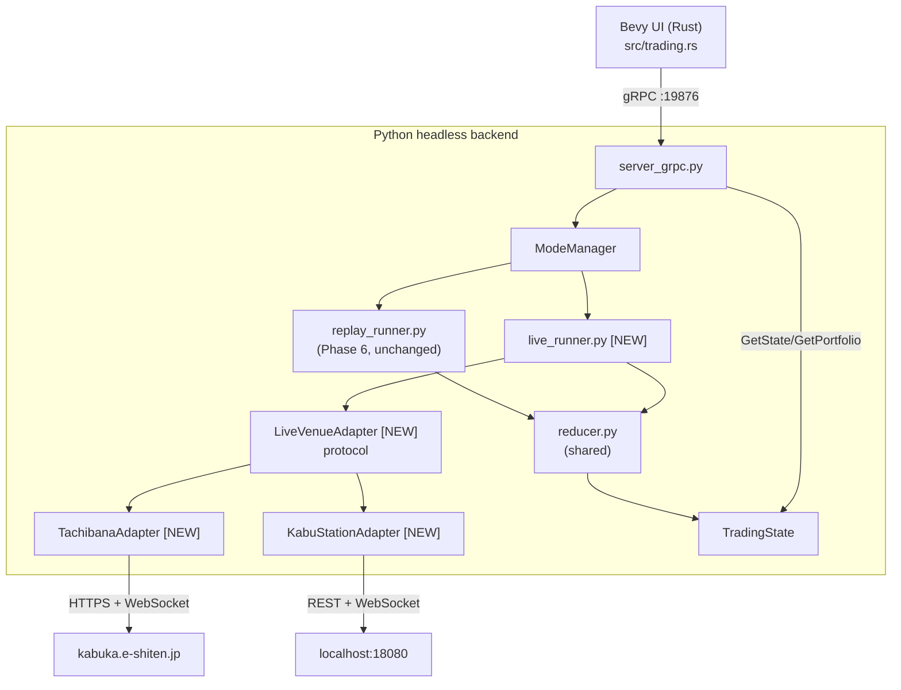

# Phase 8: Live Venue & Market Data — Implementation Plan

[Tranceparent Headless Replay](./Tranceparent%20Headless%20Replay.md) Phase 8 を具体化する。Phase 6/7 で完成した **Replay 系統**（`replay_runner.py` + Replay State Machine + Snapshot Reducer + Bevy UI）を一切壊さずに、その横に **Live 系統** を新設し、実取引会場（Tachibana e支店 / kabu ステーション）からの認証・銘柄メタデータ・マーケットデータ購読までを headless backend に取り込む。注文・口座同期は Phase 9、Replay→Live のストラテジー昇格は Phase 10 で扱う。

## Goals

1. **Venue Login**: Tachibana / kabu ステーション API への認証フローを headless backend に実装。Rust UI からは資格情報を直接持たせず、`.env` / OS Credential Store / 環境変数経由で backend が解決する。
2. **Mode Mutual Exclusion**: `ReplayState` と `VenueState` を排他に管理し、Replay 実行中の venue login と、Live 接続中の `LoadReplayData` を **構造的に拒否**する。
3. **Ticker Metadata Sync**: 認証後に銘柄マスタを取得し、Nautilus `Instrument` へ変換、`InstrumentId` を Replay 側と同じ `<code>.TSE` 形式に正規化。
4. **Live Market Data Subscription**: 選択銘柄の `price` / `trades` / `depth` (10 段板) を購読し、既存の Snapshot Reducer に流して `TradingState` を 60Hz で更新する。Replay と同じ DTO を再利用するため UI 側コードはほぼ無改修。
5. **UI フィードバック**: Footer / Sidebar に Venue 接続状態・銘柄ロード進捗・購読中シンボル数を表示。Bevy UI 側は新しい floating window を追加せず、既存パネル（Kline / Ladder）を Live モードでも描画する。

## Non-Goals

- 実発注・約定処理・口座残高同期は **Phase 9** で扱う。本フェーズはあくまで **read-only な市場接続** に留める。
- Replay で動いたストラテジーをそのまま Live で起動する仕組み（Promote to Live）は **Phase 10**。
- 複数 Venue の同時接続（Tachibana と kabu を並列に張る）は Non-Goal。一度に接続するのは 1 Venue のみ。
- Tick データの永続化・録画は Non-Goal。Live で流れたバーは UI が表示するだけで catalog には書き戻さない。
- TWS / IBKR / FX 業者など、Tachibana / kabu 以外のアダプタ実装は Non-Goal。ただし `LiveVenueAdapter` インターフェイスは拡張可能な形にする。

---

## 0. Feature Inventory / バックエンド機能一覧

Phase 8 で backend に追加される責務を網羅列挙する。各項目は §3 以降の詳細設計に対応する。

### 0.1 Venue 認証

- `VenueLogin(venue, credentials_source)` — `credentials_source` は `"env"` / `"keyring"` / `"file"` の 3 種。Rust UI からは平文資格情報を渡さない。
- `VenueLogout()` — セッションを閉じてキャッシュを破棄。
- `GetVenueState()` — 現在の `VenueState`（DISCONNECTED / AUTHENTICATING / CONNECTED / SUBSCRIBED / RECONNECTING / ERROR）。
- 自動再接続: ネットワーク切断時に最大 3 回の指数バックオフ（1s / 4s / 16s）でリトライ。失敗で `ERROR` 遷移。

### 0.2 銘柄メタデータ

- `ListInstruments(venue, filter)` — 取得済みの全銘柄を返す（コード・名称・呼値単位・売買単位・市場区分）。
- `GetInstrument(instrument_id)` — 1 銘柄の詳細。
- 認証直後にバックグラウンドで全銘柄をフェッチし、Nautilus `Instrument` に変換してメモリキャッシュ。永続化は `dirs::cache_dir()/the-trader-was-replaced/instruments/<venue>.parquet` に書き戻す（日次更新）。

### 0.3 マーケットデータ購読

- `SubscribeMarketData(instrument_id, channels)` — `channels` は `["price", "trades", "depth"]` のサブセット。
- `UnsubscribeMarketData(instrument_id)` — 個別 unsub。
- 上限: 同時購読 50 銘柄（kabu PUSH の制限に揃える）。超過時は明示的に `SUBSCRIPTION_LIMIT_EXCEEDED` で reject。
- 内部で venue 固有の WebSocket / PUSH を一本に集約し、`LiveEventBus`（asyncio Queue）で `nautilus_trader` の `DataEngine` に push。

### 0.4 状態同期

- 既存 `GetState` の `TradingState` に `mode: "REPLAY" | "LIVE" | "IDLE"` を追加。Live モード時は `replay_state` を `None` にし、代わりに `venue_state` を返す。
- 既存 `GetPortfolio` は Phase 8 では Live 側からは常に空ポートフォリオを返す（Phase 9 で口座連携）。

### 0.5 Mode Mutual Exclusion

- `ModeManager`（新規）が `ReplayStateMachine` と `VenueStateMachine` の両方を観測。
- Replay が `LOADED` 以上に上がっている間は `VenueLogin` を `MODE_CONFLICT_REPLAY_ACTIVE` で reject。
- Venue が `CONNECTED` 以上の間は `LoadReplayData` を `MODE_CONFLICT_LIVE_ACTIVE` で reject。
- 切替には明示的な `Unload` / `VenueLogout` が必要。UI は確認ダイアログで案内する。

---

## 1. Architecture / 構成

### 1.1 Process Layout



### 1.2 State Machines

```text
ReplayStateMachine (Phase 6)
   IDLE → LOADED → RUNNING ⇄ PAUSED → STOPPING → IDLE

VenueStateMachine (Phase 8 [NEW])
   DISCONNECTED → AUTHENTICATING → CONNECTED → SUBSCRIBED
                                       ↑           ↓
                                   RECONNECTING ←──┘
                                       ↓
                                     ERROR → (manual reset) → DISCONNECTED
```

`ModeManager` は両者を観測し、以下の不変条件を守る:

- `ReplayState ∈ {LOADED, RUNNING, PAUSED, STOPPING}` ⇒ `VenueState == DISCONNECTED`
- `VenueState ∈ {AUTHENTICATING, CONNECTED, SUBSCRIBED, RECONNECTING}` ⇒ `ReplayState == IDLE`
- 違反した RPC は `MODE_CONFLICT_*` エラーで reject する（state は変えない）。

### 1.3 LiveVenueAdapter Protocol

```python
class LiveVenueAdapter(Protocol):
    venue_id: str  # "TACHIBANA" / "KABU"

    async def login(self, creds: VenueCredentials) -> None: ...
    async def logout(self) -> None: ...
    async def fetch_instruments(self) -> list[InstrumentRaw]: ...
    async def subscribe(self, instrument_id: InstrumentId, channels: set[Channel]) -> None: ...
    async def unsubscribe(self, instrument_id: InstrumentId) -> None: ...
    def events(self) -> AsyncIterator[LiveEvent]: ...   # price / trade / depth
```

- 各アダプタは asyncio タスクとして実行し、`events()` から `KlineUpdate` / `Trades` / `Depth` イベントを yield。
- 共通 reducer がそれを `TradingState` に畳み込むため、Replay と同じ UI コードで描画できる。
- 認証エラー（HTTP 401 / kabu の `4001005` 等）はアダプタが `VenueAuthError` に正規化し、上位の `VenueStateMachine` が `ERROR` 遷移を決める。

---

## 2. Venue 固有の取り扱い

> 詳細プロトコルは `.claude/skills/tachibana/SKILL.md` / `.claude/skills/kabusapi/SKILL.md` を参照すること。本計画書ではアーキテクチャ上の差分のみ記載する。

### 2.1 Tachibana (e支店)

- ベース URL: `https://kabuka.e-shiten.jp` (本番) / `https://demo-kabuka.e-shiten.jp` (検証)。
- 認証: `CLMAuthLoginRequest` → `sUrlRequest` / `sUrlMaster` / `sUrlPrice` / `sUrlEvent` / `sUrlEventWebSocket` の 5 つの仮想 URL を受領。各 RPC は `{virtual_url}?{JSON文字列}` 形式。
- 必須パラメータ: `p_no`（連番）/ `p_sd_date`（YYYY.MM.DD-HH:mm:ss.fff）/ `sJsonOfmt`。
- エンコーディング: Shift-JIS。`p_errno` と `sResultCode` の二段判定。
- マーケットデータ: EventWebSocket（区切り `\x01\x02\x03`）。
- 第二暗証番号が必須化されているため、`credentials_source` に追加フィールドを持たせる。
- 検証フロー: 認証 → `CLMEventDownload` でマスタ取得 → EventWebSocket で板/歩み値を購読。

### 2.2 kabu ステーション

- ベース URL: `http://localhost:18080`（本番）/ `http://localhost:18081`（検証）。
- 前提: **kabu ステーション本体プロセス（GUI）が Windows 上で起動している必要がある**。`live_runner` 起動時にポートの LISTEN 状態を ping し、未起動なら `KABU_STATION_NOT_RUNNING` で拒否する。
- 認証: `POST /kabusapi/token` → `X-API-KEY` ヘッダで以降の全 API。
- マーケットデータ: WebSocket `ws://localhost:18080/kabusapi/websocket` で PUSH。
- 銘柄登録上限: **50 銘柄まで**。`SubscribeMarketData` の上限値はここから来る。
- 流量制限: 5 req/s 程度。`live_runner` 内で leaky-bucket レートリミッタを噛ます。

### 2.3 InstrumentId 正規化

- Replay 側は `<code>.TSE` 形式（例 `1301.TSE`）。Live でも同形式に揃える。
- Tachibana のマスタは 4 桁コード + 市場区分コード。市場区分 = 東証 のものを `.TSE` にマップ。他は `.OSE` / `.NSE` 等にする（MVP は TSE のみで OK、それ以外は warn ログを出して skip）。
- kabu のマスタも同様にマップ。両 venue で同じ `InstrumentId` が出るため、UI 側は venue を意識せずに表示できる。

---

## 3. Tasks

### 3.1 Backend: Mode 排他 & State 拡張

- `python/engine/mode_manager.py` を新設。`ReplayStateMachine` への参照と `VenueStateMachine` の owner を兼ねる。
- `TradingState` (`python/engine/models.py`) に以下を追加:
  - `mode: Literal["IDLE", "REPLAY", "LIVE"]`
  - `venue_state: Optional[str]` (`DISCONNECTED` 等)
  - `venue_id: Optional[str]`
  - `subscribed_instruments: list[str]`
- `core.py::get_current_state()` を更新。Replay 側の値は既存ロジックを維持し、Live 側は `live_runner` の状態を参照する。
- 既存の `LoadReplayData` / `StartEngine` に **Mode ガード** を追加。`VenueState != DISCONNECTED` なら `MODE_CONFLICT_LIVE_ACTIVE` で reject。

### 3.2 Backend: LiveVenueAdapter & 具象実装

venue 共通の抽象は `python/engine/live/` に置き、venue 固有のプロトコル実装は **`python/engine/exchanges/` 配下に venue 名で集約**する（tachibana skill `.claude/skills/tachibana/SKILL.md` の規約 R1 / F-L1 を踏襲。「立花プロトコル固有のヘルパーは Rust に書かない／Python は `exchanges/tachibana*.py` に集める」）。kabusapi も同方針で `exchanges/kabu*.py` に置き、Python に集約する。

```
python/engine/
├── live/                          # venue 非依存の枠組み
│   ├── __init__.py
│   ├── adapter.py                 # LiveVenueAdapter Protocol / LiveEvent
│   ├── state_machine.py           # VenueStateMachine
│   ├── event_bus.py               # adapter → reducer の asyncio Queue
│   ├── aggregator.py              # tick → bar 集約（Nautilus BarBuilder ラッパ）
│   ├── instrument_mapping.py      # venue 共通の InstrumentId 正規化（.TSE 等）
│   └── logging.py                 # secrets masking filter
└── exchanges/                     # venue 固有プロトコル（Rust 側に同等実装を作らない）
    ├── __init__.py
    ├── tachibana.py               # LiveVenueAdapter 実装（薄いラッパ）
    ├── tachibana_url.py           # build_request_url / build_event_url / func_replace_urlecnode (R2/R9)
    ├── tachibana_auth.py          # next_p_no / current_p_sd_date / check_response / 例外型 (R4/R6)
    ├── tachibana_codec.py         # Shift-JIS decode / ^A^B^C parse / 空配列 "" → [] (R7/R8)
    ├── tachibana_ws.py            # EventWebSocket クライアント (sUrlEventWebSocket)
    ├── tachibana_master.py        # CLMEventDownload マスタ取得
    ├── tachibana_file_store.py    # tachibana_session.json ファイルキャッシュ (R3 / S3)
    ├── tachibana_login_flow.py    # debug 専用 env 取込み + tkinter ダイアログ起動の橋渡し
    ├── kabu.py                    # LiveVenueAdapter 実装
    └── kabu_*.py                  # localhost:18080/18081 REST + WebSocket
```

認証情報の解決順（**いずれの経路も Rust → Python に資格情報を渡さない**。`VenueLogin` RPC は「ログイン開始」のトリガのみで、ペイロードに password を含めない）:

1. `credentials_source == "prompt"`（**既定**）⇒ Python プロセスが tkinter サブプロセスでログインウィンドウを開く（§3.2.1）
2. `credentials_source == "session_cache"` ⇒ Tachibana は `cache_dir/tachibana/tachibana_session.json` から仮想 URL 一式を復元（JST 当日付に限り有効、skill R3 / S3）。kabu は token 再取得が軽量なので session cache なし
3. `credentials_source == "env"` ⇒ **debug ビルドの Python のみ**が読む（release は無視）。
   - Tachibana: `DEV_TACHIBANA_USER_ID` / `DEV_TACHIBANA_PASSWORD` / `DEV_TACHIBANA_DEMO`（既定 `true`）
   - kabu: `KABU_API_PASSWORD` / `KABU_ENV`（`demo` 既定）
   - **第二暗証番号は env に置かない**（Tachibana skill F-H5）。後述 §3.2.1 参照
4. `credentials_source == "keyring"` / `"file"` は **採用しない**。Tachibana skill が `tachibana_session.json` ファイルキャッシュに集約しており、keyring も平文 file もこの方針と衝突する

本番接続のガード:
- Tachibana: `DEV_TACHIBANA_DEMO` 未設定 = demo 既定。本番 URL `https://kabuka.e-shiten.jp/e_api_v4r8/` への接続は **`TACHIBANA_ALLOW_PROD=1` env を併用したときのみ** Python URL builder が解禁する（Tachibana skill S2 / Q7）
- kabu: `KABU_ENV=production` を明示しない限り `localhost:18081` (demo) のみ接続

平文の資格情報は **絶対にログに出さない**。`logger` の `extra` フィルタで `password|token|api_key|p_pwd|sPassword|sSecondPassword|virtual_url|sUrl[A-Z]` を含むキーをマスクする helper を `live/logging.py` に置く（Tachibana skill R10）。仮想 URL もセッション秘密なのでマスク対象（`***` 化）。

### 3.2.1 Python 側のログインウィンドウ

- 実装: `tkinter`（Python 標準ライブラリ、追加依存ゼロ）の **サブプロセスヘルパー**として起動する。`python/engine/live/login_dialog_runner.py` がフロントエンドとなり、`python -m engine.live.login_dialog_runner --venue tachibana --env demo` で別プロセスを spawn、結果は stdout JSON で受け取る。
  - Tachibana の入力フィールド定義は **`python/engine/exchanges/tachibana_login_flow.py`** に集約（Rust 側に立花用ログイン UI を書かない方針、skill「Rust 側に置かないもの」を参照）。kabu の入力フィールド定義は `exchanges/kabu_login_flow.py` に置く
  - サブプロセス分離により Bevy/asyncio イベントループを `Tk.mainloop()` でブロックしない
- 表示タイミング: `VenueLogin(credentials_source="prompt")` 受信時、`server_grpc` ハンドラが `VenueState` を `AUTHENTICATING` に遷移させてから即座に "pending" を返す。サブプロセスの stdout JSON を asyncio で読み、完了時に `VenueState` を `CONNECTED` / `ERROR` に再遷移。UI は `GetVenueState` を polling して確認する（既存 60Hz polling パスを再利用）
- **入力フィールド**（venue 固有 / skill 準拠）:
  - **Tachibana**: ユーザー ID / パスワード / 環境（demo/prod 選択、prod 選択肢は `TACHIBANA_ALLOW_PROD=1` が立っていないとグレーアウト）。**第二暗証番号は収集しない**（skill F-H5: ログイン時には不要。発注時に Phase 9 の別 UI で取得しメモリ保持・idle forget タイマーで自動消去）
  - **kabu**: API パスワード / 環境（demo/prod 選択）。kabu ステーション本体プロセスの listening ポートを読み取り専用で表示。未起動なら `KABU_STATION_NOT_RUNNING` を表示して [再確認] ボタンを出す
- セッション内キャッシュ:
  - **Tachibana**: ログイン成功時に `tachibana_file_store` が `cache_dir/tachibana/tachibana_session.json` に**仮想 URL 一式のみ**を保存（JST 当日付）。ユーザー ID / パスワードはディスクに書かない。次回起動時はこの session JSON を session_cache 経路で復元（skill S3）
  - **kabu**: API token のみ `live_runner` メモリ内に保持。ディスクには書かない
- ウィンドウは Bevy UI / asyncio loop と **完全に独立したサブプロセス**。Bevy が落ちても認証フローに影響なし、逆も同様
- headless 環境（DISPLAY 無し / Win32 GUI 無し）では `tkinter` の `Tk()` インスタンス化が失敗する。サブプロセスはこれを検知して `{"error_code": "NO_DISPLAY_AVAILABLE"}` を JSON で返す。`server_grpc` ハンドラはそれを `env` への切替を促すエラーメッセージにマップして UI に返す
- CI 上で立花ライブログインが必要なテストは **`pytest -m demo_tachibana`** で隔離し、GitHub Actions では **`workflow_dispatch` 限定**のジョブで実行する（Tachibana skill 前提条件 §4 / open-questions Q21）。PR/push トリガには載せない（閉局帯ヒットによる偽陰性回避）

### 3.3 Backend: live_runner.py

- `python/engine/live_runner.py` を新設。`replay_runner.py` と同じ位置付け（独立した asyncio 駆動ループ）。
- 責務:
  - `LiveVenueAdapter` を 1 つ保持し、`events()` を fan-out
  - 受信した `LiveEvent` を Nautilus `DataEngine` に inject（Replay と同じ msgbus トポロジを使う）
  - 結果として `reducer.py` がこれまで通り `TradingState` を更新
- Live 側でも `nautilus_trader` の `DataEngine` をホストする。ただし `TradingNode` (live execution) は **使わない**。発注経路を握らないため、誤って実発注しないことを構造的に担保する。

### 3.4 Backend: gRPC RPC 追加

`python/engine/proto/engine.proto` への追加:

```protobuf
service Engine {
  // ... existing replay RPCs ...

  // Phase 8
  rpc VenueLogin (VenueLoginRequest) returns (VenueLoginResponse);
  rpc VenueLogout (VenueLogoutRequest) returns (VenueControlResponse);
  rpc ListInstruments (ListInstrumentsRequest) returns (ListInstrumentsResponse);
  rpc SubscribeMarketData (SubscribeRequest) returns (SubscribeResponse);
  rpc UnsubscribeMarketData (UnsubscribeRequest) returns (SubscribeResponse);
}

message VenueLoginRequest {
  string venue_id = 1;                     // "TACHIBANA" / "KABU"
  string credentials_source = 2;           // "prompt" (default) / "session_cache" / "env"
  string environment = 3;                  // "production" / "demo"
  // 注: password / api_key などの平文資格情報は本 RPC に含めない。
  //     "prompt" 指定時は Python 側が tkinter サブプロセスでログインウィンドウを開く。
  //     第二暗証番号 (Tachibana) は本フェーズで一切扱わない (Phase 9 で発注時に収集)。
}

message VenueLoginResponse {
  bool success = 1;
  string error_code = 2;
  string venue_state = 3;
  int32 instruments_loaded = 4;
}

message SubscribeRequest {
  string instrument_id = 1;
  repeated string channels = 2;            // "price"/"trades"/"depth"
}
```

- `server_grpc.py` に上記ハンドラを実装。各ハンドラは `ModeManager` 経由でガードを通す。
- proto 再生成: `uv run python -m grpc_tools.protoc ...`（既存スクリプト準拠）。

### 3.5 Rust UI: 接続フロー & 表示

- `src/trading.rs`:
  - `VenueState` enum（Python と同期）と `VenueStatusRes` Resource を追加
  - `BackendStatusUpdate::VenueChanged { state, venue_id, instruments_loaded }` を追加
  - `GetState` の戻り値から `venue_state` を吸い上げて Resource を更新
- `src/ui/menu_bar.rs`:
  - File メニューの下に **Venue メニュー** を追加（枠は Phase 7 で予約済み）
  - `Connect → Tachibana (Demo) / Tachibana (Prod) / kabu Station` のサブ項目
  - `Disconnect` 項目
  - クリックで `VenueConnectRequested(venue_id, env)` イベント発火 → backend へ `VenueLogin(credentials_source="prompt")` RPC を投げる。
  - **Rust 側にはログインフォームを実装しない**（資格情報を Rust プロセスに乗せないため）。クリック後は Python 側のログインウィンドウがフォーカスを取り、ユーザがそこで入力 → 結果が `VenueStateBadge` に反映されるのを待つだけ。
- `src/ui/footer.rs`:
  - 既存の `ReplayStateBadge` の右隣に `VenueStateBadge` を追加（DISCONNECTED=gray / CONNECTED=cyan / SUBSCRIBED=green / ERROR=red）
  - mode が `LIVE` のときは `ReplayStateBadge` を `—` 表示にする
- `src/ui/sidebar.rs`:
  - Tickers リストのソースを切替: `mode == REPLAY` ⇒ 従来の CSV scan / `mode == LIVE` ⇒ `ListInstruments` RPC 結果（数千銘柄になるので検索ボックス + 仮想スクロール必須）
  - 銘柄クリックで `SubscribeMarketData` を発行し `SelectedSymbol` を更新

### 3.6 UI: Mode 排他の UX

- Replay 実行中に Venue メニューから接続を試みた場合: 確認ダイアログ「Replay セッションを終了して Live に切り替えますか？ [切り替える] [キャンセル]」 → 切り替える時は `Unload` → `VenueLogin` を順に発火。
- 逆方向も同様。File→Open Strategy を Live 接続中に押した場合は `VenueLogout` 確認を挟む。
- 確認ダイアログは Phase 7 の `ModalLayer` 機構を流用。

### 3.7 Live Market Data → 既存パネル

- Snapshot Reducer は Replay と同じ実装を使うため、`KlineChartWindow` / `LadderWindow` は **無改修** で動くのが目標。
- 唯一の差: バー集約。Live は tick / quote を 1m / 5m / 1D に集約する必要があるため、`live/aggregator.py` で BarAggregator を一段挟む（Nautilus 標準 `BarBuilder` を流用）。
- Ladder は `depth` channel が無い venue 環境（例: Tachibana 検証）では 5 段に縮退し、空行をプレースホルダで埋める。

---

## 4. File Layout

```
python/engine/
├── mode_manager.py        [NEW]   # Replay/Live 排他制御
├── live_runner.py         [NEW]   # Live 系統のエントリポイント
├── live/                  [NEW]   # venue 非依存の枠組み
│   ├── __init__.py
│   ├── adapter.py                 # LiveVenueAdapter Protocol / LiveEvent
│   ├── state_machine.py           # VenueStateMachine
│   ├── event_bus.py               # adapter → reducer の asyncio Queue
│   ├── aggregator.py              # tick → bar (Nautilus BarBuilder ラッパ)
│   ├── instrument_mapping.py      # InstrumentId 正規化 (.TSE / .OSE)
│   ├── login_dialog_runner.py     # tkinter サブプロセスエントリ (python -m ...)
│   └── logging.py                 # secrets masking filter (sUrl* / password)
├── exchanges/             [NEW]   # venue 固有プロトコル (Rust に同等実装を作らない)
│   ├── __init__.py
│   ├── tachibana.py               # LiveVenueAdapter 実装
│   ├── tachibana_url.py           # build_request_url / func_replace_urlecnode (R2/R9)
│   ├── tachibana_auth.py          # next_p_no / current_p_sd_date / check_response (R4/R6)
│   ├── tachibana_codec.py         # Shift-JIS / ^A^B^C / "" → [] (R7/R8)
│   ├── tachibana_ws.py            # sUrlEventWebSocket クライアント
│   ├── tachibana_master.py        # CLMEventDownload マスタ
│   ├── tachibana_file_store.py    # tachibana_session.json (R3)
│   ├── tachibana_login_flow.py    # debug env 取込み + tkinter 橋渡し
│   ├── kabu.py                    # LiveVenueAdapter 実装
│   ├── kabu_auth.py               # /kabusapi/token / X-API-KEY
│   ├── kabu_ws.py                 # WebSocket PUSH
│   ├── kabu_master.py             # 銘柄マスタ
│   └── kabu_login_flow.py         # 入力フィールド定義 + 本体プロセス ping
├── models.py                      # TradingState に mode / venue_state 追加
├── core.py                        # get_current_state に venue 情報を含める
├── server_grpc.py                 # 5 つの新 RPC ハンドラ
└── proto/engine.proto             # RPC + message 追加

src/
├── trading.rs                     # VenueState / VenueStatusRes / RPC 呼び出し
└── ui/
    ├── menu_bar.rs                # Venue メニュー追加
    ├── footer.rs                  # VenueStateBadge
    └── sidebar.rs                 # mode に応じたティッカー切替

docs/plan/assets/
└── phase8-architecture.drawio.svg [TODO]   # §1.1 図の正本
```

---

## 5. Implementation Order

各ステップ完了時点で `cargo run` できる状態を維持する。Live API は本番接続せずとも **モックアダプタ**で UI → backend の往復を通せるよう、Step 1 で `MockVenueAdapter` を先に作る。

1. **Step 1 — Skeleton & MockVenueAdapter**:
   - `live_runner.py` / `live/adapter.py` / `live/state_machine.py` のスケルトン
   - `MockVenueAdapter`（固定銘柄 3 つ、ランダムウォーク価格を秒間 1 tick yield）
   - `ModeManager` の排他ロジックと unit test
2. **Step 2 — gRPC RPC & Mode 排他確認**:
   - 5 つの新 RPC を proto に追加 → stubs 再生成
   - Rust `trading.rs` から RPC を叩き、`MockVenueAdapter` 経由で `VenueState` が `SUBSCRIBED` まで進むことを確認
   - Replay 実行中の `VenueLogin` が `MODE_CONFLICT` で reject されることを確認
3. **Step 3 — UI 表示**:
   - `VenueStateBadge` を Footer に追加
   - `Venue → Connect (Mock)` メニュー項目
   - mock で `SUBSCRIBED` になると Footer バッジが緑になるところまで
4. **Step 4 — Snapshot Reducer 接続**:
   - `MockVenueAdapter` の tick を `reducer` 経由で `TradingState` に流す
   - `KlineChartWindow` が Live モードで mock データを描画できることを確認
5. **Step 4.5 — Python tkinter ログインサブプロセス**:
   - `live/login_dialog_runner.py` を実装（`python -m engine.live.login_dialog_runner --venue <id> --env demo` で起動可能）
   - venue 固有の入力フィールド定義は `exchanges/tachibana_login_flow.py` / `exchanges/kabu_login_flow.py` に置く
   - `credentials_source="prompt"` で Rust から RPC を叩くとサブプロセスが立ち上がり、stdout JSON が `VenueState` を遷移させるまでを mock adapter で確認
   - headless 環境（DISPLAY 無し）で `NO_DISPLAY_AVAILABLE` が返ることを確認
   - `TACHIBANA_ALLOW_PROD` 未設定時に prod 選択肢がグレーアウトされることを確認
6. **Step 5 — kabu ステーション実装**:
   - `kabu_adapter.py` を `.claude/skills/kabusapi/` の skill に従って実装
   - 検証環境（`localhost:18081`）で `VenueLogin` → `ListInstruments` → `SubscribeMarketData(3 銘柄)` → 板更新が Ladder に反映、までの E2E
   - 50 銘柄上限・流量制限のレートリミッタ unit test
6. **Step 6 — Tachibana 実装**:
   - `tachibana_adapter.py` を `.claude/skills/tachibana/` の skill に従って実装
   - 検証環境（`demo-kabuka.e-shiten.jp`）で同様の E2E
   - Shift-JIS / `p_errno` / 第二暗証番号の取り扱いを単体テスト
7. **Step 7 — Sidebar 銘柄検索**:
   - `ListInstruments` 結果を仮想スクロールで表示
   - インクリメンタル検索（コード前方一致 / 名称部分一致）
8. **Step 8 — Auto-Reconnect & Error Surfacing**:
   - 指数バックオフ再接続
   - `VenueState == ERROR` 時に Footer 右下にトースト表示
9. **Step 9 — Polish**:
   - Instruments parquet キャッシュの日次更新
   - secrets masking ログフィルタの統合テスト
   - drawio アーキ図 `phase8-architecture.drawio.svg` を作成

---

## 6. Success Criteria

- Replay 実行中に Venue メニューから接続を試みると、確認ダイアログを経由しない限り `MODE_CONFLICT_REPLAY_ACTIVE` が UI に表示され、Replay は中断されない。
- Venue メニュー → `kabu Station (Demo)` 接続 → 認証成功 → 銘柄マスタ取得（≥100 件）→ Sidebar に表示、までが手動 E2E で通る。
- Sidebar から 1 銘柄選択 → 数秒以内に Kline / Ladder が Live データで更新を開始する。
- 同様の手動 E2E が `Tachibana (Demo)` でも通る。
- 同時購読が 50 銘柄を超えるリクエストは `SUBSCRIPTION_LIMIT_EXCEEDED` で reject され、UI に明示される。
- 認証エラー時、`VenueState=ERROR` バッジが赤で表示され、エラーコード（`AUTH_FAILED` / `KABU_STATION_NOT_RUNNING` / `NETWORK_ERROR` 等）がトーストに出る。
- ログを全文 grep してもユーザ名・パスワード・API key・Tachibana の仮想 URL (`sUrlRequest` / `sUrlMaster` / `sUrlPrice` / `sUrlEvent` / `sUrlEventWebSocket`) が平文で出現しない（secrets masking テスト、Tachibana skill R10）。
- Tachibana の 2 回目以降の起動が `tachibana_session.json` のみで成立する（env 未設定でも JST 当日付なら復元できる、Tachibana skill S3）。
- `TACHIBANA_ALLOW_PROD` 未設定での本番接続試行が Python URL builder で拒否される（unit test）。
- Replay と Live で **同じ Snapshot Reducer / 同じ UI コード** が使われており、`src/ui/floating/kline.rs` / `ladder.rs` には Phase 8 起因の差分が無い（あっても mode 表示の 1 行のみ）。
- Rust 側に `exchange/src/adapter/tachibana.rs` / `src/connector/auth.rs` の立花拡張 / 立花用ログイン UI が存在しない（grep で確認、Tachibana skill 「Rust 側に置かないもの」）。

---

## 7. Open Questions & ADRs

### ADR: Live は別 runner として完全分離する
`replay_runner.py` に live モードのフラグを足す案を採らず、`live_runner.py` を独立させる。理由: (1) Replay は決定論的なシミュレータでデバッグの中心。Live コードが混ざると再現性が壊れる。(2) `TradingNode` 由来の live execution を将来取り込むときも、Replay 系統に影響を与えないため。(3) `ModeManager` で排他を構造的に保証できる。

### ADR: 資格情報を Rust UI 側に持たせない
平文の API key / パスワードを gRPC ペイロードに乗せないため、`VenueLoginRequest` には `credentials_source` だけを乗せる。Backend が prompt / session_cache / env から自前で resolve する。理由: gRPC ログ・コアダンプ・OS の swap 経由で漏れる経路を構造的に塞ぐ。Rust 側に資格情報 UI を作る必要も無くなる。

### ADR: keyring / 平文 file credentials を採用しない
Phase 8 初稿では `credentials_source` に `"keyring"` / `"file"` も含めたが、Tachibana skill が **`tachibana_session.json` ファイルキャッシュ一本**でセッション永続化する規約 (R3 / S3) を確立しているため、keyring も平文資格情報ファイルも採用しない。理由: (1) 永続化される資料は「ユーザー名/パスワード」ではなく「短命の仮想 URL」だけにし、漏洩時の被害範囲を 1 営業日に限定する。(2) Python 側に 2 種類の credential store 抽象（keyring vs file）を保つコストを払わない。kabu 側は token 再取得が軽量なため永続化自体を諦め、`exchanges/kabu*.py` のメモリ保持のみで足りる。

### ADR: 立花プロトコル固有コードは Python `exchanges/` にだけ置く
Tachibana skill が `python/engine/exchanges/tachibana*.py` 集約を規定しているため、これに完全準拠する。`exchange/src/adapter/tachibana.rs` / `src/connector/auth.rs` の立花拡張 / `src/screen/login.rs` の立花フォーム / Rust 側の立花 WebSocket クライアントは Phase 8 のスコープから明示的に除外する。理由: (1) URL ビルド・Shift-JIS・p_no 採番・`^A^B^C` パース等が Rust と Python に二重実装されると齟齬が必ず発生する。(2) 仮想 URL の取り扱いは「セッション秘密」のためマスク・寿命管理を 1 箇所に閉じたい。(3) skill の規範に逆らうとレビューが通らない。

### ADR: ログインウィンドウは Python 側で出す（プロジェクト唯一の UI 例外）
本プロジェクトは原則「UI は Bevy (Rust) に一本化」だが、**ログインフォームに限り Python のサブプロセスから tkinter で表示する**例外を設ける。

理由:
1. **資格情報を Rust → Python に受け渡したくない**。Rust 側で入力させると `VenueLoginRequest` に password を載せるか、別 RPC で平文を送る必要があり、gRPC 上の暗号化が無い localhost 通信ではコアダンプ / プロセスダンプ / メモリスキャンで漏れる経路が増える。Python プロセス内で完結させれば、資格情報はそのまま venue adapter のメモリにしか乗らない。
2. **headless 運用でもユーザー対話によるログインが必要**。Rust UI を起動しない CI 検証や、別マシンの backend にリモートで `python -m engine` だけ走らせる構成でも、その場でログインダイアログを出したい。Rust UI に依存させると headless ではログインできなくなる。
3. tkinter は Python 標準ライブラリで追加依存ゼロ。Bevy より遥かに小さなフォームウィンドウで十分なため、専用 UI フレームワークは不要。

結果として Rust UI は「Venue メニューでログイン開始トリガを発火 → Python 側のダイアログ完了を待つ → `VenueStateBadge` に結果が反映される」という一方向の責務だけを持つ。ログインフォーム描画責務は Rust から完全に切り離される。

実装上は **サブプロセス**として `python -m engine.live.login_dialog_runner` を起動する（`Tk.mainloop()` が server_grpc の asyncio loop / Bevy をブロックしないため）。venue 固有の入力フィールド定義は `exchanges/{tachibana,kabu}_login_flow.py` に置き、`login_dialog_runner` 側は venue 共通の枠だけを描画する。

### ADR: 第二暗証番号 (Tachibana) は Phase 8 で扱わない
Tachibana の発注時必須項目である第二暗証番号 (`sSecondPassword`) は **Phase 8 のログインダイアログに含めない**。Tachibana skill F-H5 に従い、Phase 9 の発注 UI 内で **iced modal** (Rust 側) で取得し、Python の venue adapter メモリにのみ保持・idle forget タイマーで自動消去する。理由: (1) Phase 8 は read-only 市場接続であり、第二暗証番号を必要としない。(2) ログイン時に集めて長時間保持すると漏洩窓が広がる。発注のたびに再入力させて寿命を短く保つ。(3) env / セッションキャッシュに書かない原則を Phase 8 で乱さない。

### ADR: debug ビルドのみ env 自動ログインを許可する
`DEV_TACHIBANA_USER_ID` / `DEV_TACHIBANA_PASSWORD` / `DEV_TACHIBANA_DEMO` / `KABU_API_PASSWORD` の自動ログインは **debug ビルドの Python のみ**が読む。release では env を完全に無視し、`credentials_source="env"` を `ENV_DISABLED_IN_RELEASE` で reject する。理由: (1) 配布バイナリにユーザー資格情報の env 取込みパスを残さない。(2) 本番ユーザーが誤って `.env` を作ってリポジトリへ commit する事故経路を塞ぐ。(3) Tachibana skill S1 と一致させる。

### ADR: 本番接続は `TACHIBANA_ALLOW_PROD=1` で明示解禁する
demo 既定 (`DEV_TACHIBANA_DEMO` 未設定 = demo) に加え、本番 URL `https://kabuka.e-shiten.jp/e_api_v4r8/` への接続は **Python URL builder が `TACHIBANA_ALLOW_PROD=1` env を検出したときに限り**許可する。理由: (1) Tachibana skill R1 が「本番接続で実弾が飛ぶ」「URL リテラルは `tachibana_url.py` の 1 箇所限定 (F-L1)」を明文化している。(2) demo/prod 切替を UI チェックボックス一つで誤爆させない。(3) prod 解禁は env で意図表明する形にし、CI 自動運転からは外す。

### ADR: 発注経路は Phase 8 で握らない
`nautilus_trader` の `TradingNode` を Live でホストすると ExecEngine が venue に注文を発射できてしまう。Phase 8 では `DataEngine` のみホストし、`ExecEngine` は **インスタンス化しない**。これにより「読み取り専用」を型レベルで担保する。Phase 9 で発注経路を追加する際は、別途明示的なフラグと確認 UX を入れる。

### ADR: kabu ステーション本体プロセスへの依存を許容する
kabu adapter は `localhost:18080` への HTTP 接続前提。アプリ側でプロセス起動まで自動化はしない（ユーザに手動起動を求める）。理由: kabu ステーション GUI のライセンス・自動操作の規約上、起動自動化はリスクが高い。代わりに「起動していない」ことを `KABU_STATION_NOT_RUNNING` で即時検出して UX 上明示する。

### ADR: Tachibana の `sJsonOfmt=4` 固定
Tachibana API の応答フォーマットは複数あるが、JSON5 互換でパーサが楽な `sJsonOfmt=4`（フィールド名 + JSON）に固定する。他フォーマットを許容するとアダプタが膨らむため。Skill `.claude/skills/tachibana/` の規約に従う。

### Open Question: Tick → Bar 集約の正本はどこに置くか
`live/aggregator.py` 内で Nautilus 標準の `BarBuilder` を直接呼ぶか、`engine_runner` 側に集約レイヤを置いて Live/Replay 両対応にするか未定。Step 4 着手時に決める。前者の方が Phase 8 内で完結するため初期実装としては前者を採用予定。

### Open Question: 複数 Venue の同時接続を将来許可するか
Phase 8 では 1 Venue のみ。`VenueStateMachine` を venue ごとに持つよう作っておけば将来拡張可能だが、`ModeManager` の排他ルールが複雑化する。Phase 10 以降で必要性が出てから再評価。

---

## 8. Verification & Decision Log

（実装着手後に追記する。Phase 7 と同じく日付ヘッダで commit / 検証結果 / 残課題を記録する。）
