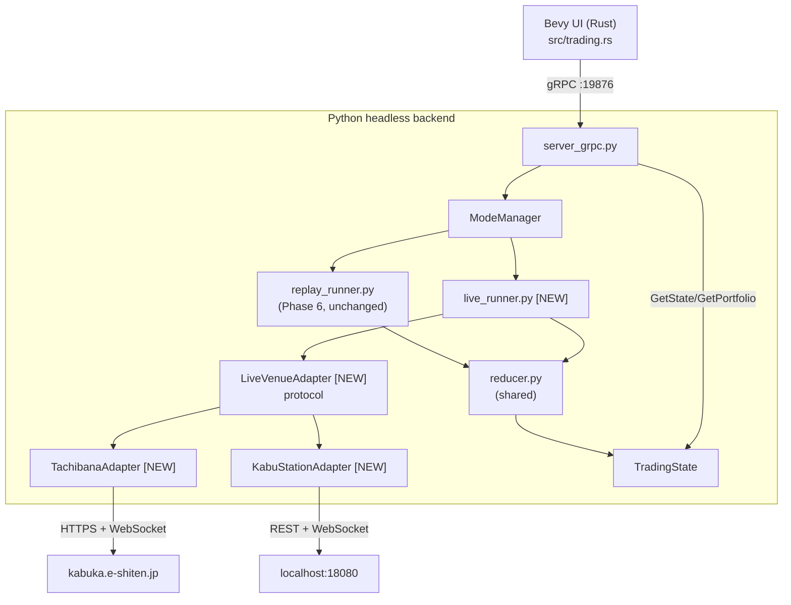

# Phase 8: Live Venue & Market Data — Implementation Plan

[Tranceparent Headless Replay](./Tranceparent%20Headless%20Replay.md) Phase 8 を具体化する。Phase 6/7 で完成した **Replay 系統**（`replay_runner.py` + Replay State Machine + Snapshot Reducer + Bevy UI）を一切壊さずに、その横に **Live 系統** を新設し、実取引会場（Tachibana e支店 / kabu ステーション）からの認証・銘柄メタデータ・マーケットデータ購読までを headless backend に取り込む。注文・口座同期は Phase 9、Replay→Live のストラテジー昇格は Phase 10 で扱う。

## Goals

1. **Venue Login**: Tachibana / kabu ステーション API への認証フローを headless backend に実装。Rust UI からは資格情報を直接持たせず、`.env` / OS Credential Store / 環境変数経由で backend が解決する。
2. **Execution Routing Guard**: `ReplayState` と `VenueState` は独立に動かし**排他しない**（Replay 稼働中の Login も、Venue 接続中の `LoadReplayData` も許可）。代わりに発注経路の宛先を `ExecutionMode` で 1 つに絞り、「未認証で Live 注文」「戦略未ロードで Replay 注文」を `EXECUTION_MODE_PRECONDITION` で**構造的に拒否**する。詳細は §0.5 / §7 ADR「認証と Execution は排他しない」参照。
3. **Ticker Metadata Sync**: 認証後に銘柄マスタを取得し、Nautilus `Instrument` へ変換、`InstrumentId` を Replay 側と同じ `<code>.TSE` 形式に正規化。
4. **Live Market Data Subscription**: 選択銘柄の `price` / `trades` / `depth` (10 段板) を購読し、既存の Snapshot Reducer に流して `TradingState` を 60Hz で更新する。Replay と同じ DTO を再利用するため UI 側コードはほぼ無改修。
5. **UI フィードバック**: Footer / Sidebar に Venue 接続状態・銘柄ロード進捗・購読中シンボル数を表示。Bevy UI 側は新しい floating window を追加せず、既存パネル（Kline / Ladder）を Live モードでも描画する。

## Non-Goals

- 実発注・約定処理・口座残高同期は **Phase 9** で扱う。本フェーズはあくまで **read-only な市場接続** に留める。
- Replay で動いたストラテジーをそのまま Live で起動する仕組み（Promote to Live）は **Phase 10**。
- 複数 Venue の同時接続（Tachibana と kabu を並列に張る）は Non-Goal。一度に接続するのは 1 Venue のみ。
- Tick データの永続化・録画は Non-Goal。Live で流れたバーは UI が表示するだけで catalog には書き戻さない。
- TWS / IBKR / FX 業者など、Tachibana / kabu 以外のアダプタ実装は Non-Goal。ただし `LiveVenueAdapter` インターフェイスは拡張可能な形にする。

---

## 0. Feature Inventory / バックエンド機能一覧

Phase 8 で backend に追加される責務を網羅列挙する。各項目は §3 以降の詳細設計に対応する。

### 0.1 Venue 認証

- `VenueLogin(venue, credentials_source)` — `credentials_source` は `"prompt"` / `"session_cache"` / `"env"` の 3 種。Rust UI からは平文資格情報を渡さない（詳細は §3.2 参照）。`"keyring"` / `"file"` は不採用（§7 ADR「keyring / 平文 file credentials を採用しない」）。
- `VenueLogout()` — セッションを閉じてキャッシュを破棄。
- `GetVenueState()` — 現在の `VenueState`（DISCONNECTED / AUTHENTICATING / CONNECTED / SUBSCRIBED / RECONNECTING / ERROR）。
- 自動再接続: ネットワーク切断時に最大 3 回の指数バックオフ（1s / 4s / 16s）でリトライ。失敗で `ERROR` 遷移。

### 0.2 銘柄メタデータ

- `ListInstruments(venue, filter)` — 取得済みの全銘柄を返す（コード・名称・呼値単位・売買単位・市場区分）。
- `GetInstrument(instrument_id)` — 1 銘柄の詳細。
- 認証直後にバックグラウンドで全銘柄をフェッチし、Nautilus `Instrument` に変換してメモリキャッシュ。**`VenueLogin` 成功をトリガーに、`dirs::cache_dir()/the-trader-was-replaced/instruments/<venue>.parquet` にあるローカル保存済み銘柄メタデータを Live universe で全置換（上書き）する**。「優先する」「マージする」ではなく、ログイン時点で venue 側を正として丸ごと書き換える挙動。
- 未ログイン時の `ListInstruments(source="local")` は、最後にログインしたときに上書きされた parquet（= 直近の Live universe スナップショット）を読む。一度もログインしたことがない場合は Replay catalog にフォールバック。

### 0.3 マーケットデータ購読

- `SubscribeMarketData(instrument_id, channels)` — `channels` は `["price", "trades", "depth"]` のサブセット。
- `UnsubscribeMarketData(instrument_id)` — 個別 unsub。
- 上限: 同時購読 50 銘柄（kabu PUSH の制限に揃える）。超過時は明示的に `SUBSCRIPTION_LIMIT_EXCEEDED` で reject。
- 内部で venue 固有の WebSocket / PUSH を一本に集約し、`LiveEventBus`（asyncio Queue）で `nautilus_trader` の `DataEngine` に push。

### 0.4 状態同期

- 既存 `GetState` の `TradingState` に `mode: "REPLAY" | "LIVE" | "IDLE"` を追加。Live モード時は `replay_state` を `None` にし、代わりに `venue_state` を返す。
- 既存 `GetPortfolio` は Phase 8 では Live 側からは常に空ポートフォリオを返す（Phase 9 で口座連携）。

### 0.5 ExecutionMode と並列稼働

「Replay engine の稼働」と「Venue 認証 / market data 購読」は **同時並行で動かせる** 設計に変更（旧計画の `ModeManager` 排他案は撤回）。理由は本フェーズ末尾「ADR: 認証と Execution は排他しない」参照。

- `ExecutionMode: Replay | LiveManual | LiveAuto` — 以下の **4 つ** を決める明示的なユーザ選択。UI トグルで切替（§3.5.1）:
  1. **発注経路の宛先** — Replay simulator / Live venue 手動発注 / Live venue 自動発注
  2. **画面の主時間軸** (`current_time = replay_time` / `current_time = wall_clock`) — Footer 時刻表示・チャート末尾位置
  3. **時系列ウィンドウの表示判定** — モードの時間軸に一致しない時系列データは表示しない（混在禁止、§0.5.1）
  4. **UI_LAYOUT の保存先** — モードによって保存先が異なる（§0.5.2 参照）
- `ReplayState` / `VenueState` は独立に遷移し、互いに **排他しない**。具体的には:
  - Replay `RUNNING` 中に Venue `Login` 可能 → Sidebar の Tickers リストが Live venue universe で更新される（要望: 「Phase 7 のローカル固定銘柄一覧をログインしたら更新する」）
  - Venue `CONNECTED` 中に `LoadStrategy` / Replay `Run` 可能 → 並行してバックテストを走らせられる
- `ModeManager` の責務は **発注経路の安全性のみ** に縮約:
  - `ExecutionMode == LiveManual` または `LiveAuto` を選ぶには `VenueState >= CONNECTED` が必須
  - `ExecutionMode == Replay` を選ぶには `ReplayState >= LOADED` が必須
  - 違反は `EXECUTION_MODE_PRECONDITION` エラーで reject
- 「Replay と Live の二重発注事故」は ExecutionMode が排他であることで構造的に防ぐ。データの読み取り（market data 購読）と認証は二重制約しない

### 0.5.2 UI_LAYOUT の保存先（ExecutionMode 別）

**基本方針**: 戦略 `.py` と **同名の `.json` ファイル（サイドカー）** に保存する。`.py` + `.json` を 1 組の入力ファイルとして扱う。`.py` 本体は一切改変しない（sentinel block 方式は不採用）。

| ExecutionMode | UI_LAYOUT の保存先 | 理由 |
|---|---|---|
| **Replay** | `{strategy_name}.json`（`.py` と同じディレクトリ） | 戦略ファイルと 1:1 対応。バックテスト文脈（SCENARIO・コード）と UI 状態を同じ場所に置く |
| **Live Auto** (Phase 10) | `{strategy_name}.json`（`.py` と同じディレクトリ） | Replay と同方式。Promote to Live でそのまま `.py` + `.json` ペアを引き継ぐ |
| **Live Manual** | `cache_dir/the-trader-was-replaced/live_manual_layout.json` | 対応する戦略 `.py` が存在しない。ウィンドウ位置のみを standalone ファイルで保持 |

- 保存タイミング: ウィンドウ移動・リサイズのたびに変更イベント駆動で自動保存（`response.changed()` 相当）。非同期 I/O で UI フレームをブロックしない。
- `UiLayoutCache` Resource の保存先選択は `ExecutionModeRes` を参照:
  ```rust
  match mode {
      ExecutionMode::Replay | ExecutionMode::LiveAuto => {
          // {original_path stem}.json
          save_to_sidecar_json(strategy_path.with_extension("json"))
      }
      ExecutionMode::LiveManual => {
          save_to_json(cache_dir.join("live_manual_layout.json"))
      }
  }
  ```
- Live Auto（Phase 10）は本フェーズではスタブのみ（`LiveAuto` enum バリアントを定義。保存先ロジックは `Replay` と共通パスを使う）。

### 0.5.1 時系列データの時間軸ルール（混在禁止）

Replay モードは独自の `replay_time`（例: 2024-04-15 09:30 JST）で進行し、Live モードは wall clock（例: 2026-05-14 15:42 JST）で進行する。**両者を同じ画面に並べると「この値はいつのもの？」というユーザ誤解を生む**ため、ExecutionMode に応じて時系列ウィンドウの可視性とデータソースを切り替える:

**原則**: 時系列データ (price / depth / trades / fills / 約定履歴) は `ExecutionMode` の時間軸と一致するソースのみ表示する。
- `ExecutionMode == Replay`: Replay engine 由来のデータのみ表示。Live tick は流れていても画面には出さない
- `ExecutionMode == Live`: Live venue 由来のデータのみ表示。Replay engine の進行は backend で続いていても画面には出さない

**例外**: 銘柄一覧（静的メタデータ：銘柄コード・名称・呼値単位・売買単位）は時系列ではないため、**両モード共通で Live venue (Tachibana / kabu) から取得**する。Replay モードでも Sidebar に最新の Live universe が並ぶ。理由: J-Quants catalog は historical 断面のスナップショットで、最新の上場/廃止情報を持たない。ユーザの利便性のため、銘柄リストは常に最新の取引可能 universe を見せる。
- Venue 未ログイン時は、最後にログインしたとき venue から取得して保存済みのローカル parquet（`ListInstruments(source="local")`）を読む。一度もログインしたことがない場合のみ Replay catalog にフォールバック
- **Venue ログイン成功時に、ローカル保存していた銘柄メタデータを Live universe で上書きする**（部分マージではなく丸ごと置換）。Replay モードで稼働中であっても同様に上書きされる。Phase 7 の「ローカル固定銘柄一覧」設計はこれにより廃止

**各ウィンドウの挙動**:

| ウィンドウ | Replay | LiveManual | LiveAuto |
|---|---|---|---|
| Footer 時刻 | `replay_time`（主） | wall clock（主） | wall clock（主） |
| KlineChartWindow | Replay engine の historical バー | Live aggregated バー | Live aggregated バー |
| **LadderWindow** | **強制非表示**（depth は Live のみ、時間軸混在禁止） | Live depth 表示 | Live depth 表示 |
| **OrderPanel** | **強制非表示**（発注経路は simulator、UI からの手動発注なし） | **表示**（手動発注の唯一の入口、§3.7.1） | **強制非表示**（戦略コードが発注、UI からの手動介入なし） |
| BuyingPower / Positions / Orders | Replay engine 由来（simulator のポジション） | Live venue 由来（実口座のポジション、Phase 9） | Live venue 由来（実口座のポジション、Phase 9） |
| Sidebar 銘柄一覧 | ローカル parquet（最後の Live スナップショット）/初回未ログイン時のみ Replay catalog | ローカル parquet（= ログイン時に上書き済み） | ローカル parquet（= ログイン時に上書き済み） |
| Sidebar の「最新価格」列 | Replay engine の最新バー close | Live tick の最新 mid | Live tick の最新 mid |

---

## 1. Architecture / 構成

### 1.1 Process Layout



### 1.2 State Machines

```text
ReplayStateMachine (Phase 6)
   IDLE → LOADED → RUNNING ⇄ PAUSED → STOPPING → IDLE

VenueStateMachine (Phase 8 [NEW])
   DISCONNECTED → AUTHENTICATING → CONNECTED → SUBSCRIBED
                                       ↑           ↓
                                   RECONNECTING ←──┘
                                       ↓
                                     ERROR → (manual reset) → DISCONNECTED
```

`ReplayStateMachine` と `VenueStateMachine` は **完全に独立** に動く。`ModeManager` は両者を観測しつつ、**ExecutionMode（発注経路）の前提条件だけ**を守る:

- `ExecutionMode == Live` ⇒ `VenueState >= CONNECTED` が必須（未ログインで Live モードに切替不可、`EXECUTION_MODE_PRECONDITION` で reject）
- `ExecutionMode == Replay` ⇒ `ReplayState >= LOADED` が必須（戦略未ロードで Replay モードに切替不可）
- ただし `Login` / `Logout` / `LoadStrategy` / `Unload` 自体は **どの ExecutionMode** でも、**どの相手側 state** でも実行可能。
- 発注 RPC（Phase 9 で追加予定）は ExecutionMode を見て宛先を決める。`Replay` モードなら必ず simulator、`Live` モードなら必ず venue、誤配は構造的に発生しない。

### 1.3 LiveVenueAdapter Protocol

```python
class LiveVenueAdapter(Protocol):
    venue_id: str  # "TACHIBANA" / "KABU"

    async def login(self, creds: VenueCredentials) -> None: ...
    async def logout(self) -> None: ...
    async def fetch_instruments(self) -> list[InstrumentRaw]: ...
    async def subscribe(self, instrument_id: InstrumentId, channels: set[Channel]) -> None: ...
    async def unsubscribe(self, instrument_id: InstrumentId) -> None: ...
    def events(self) -> AsyncIterator[LiveEvent]: ...   # price / trade / depth
```

- 各アダプタは asyncio タスクとして実行し、`events()` から `KlineUpdate` / `Trades` / `Depth` イベントを yield。
- 共通 reducer がそれを `TradingState` に畳み込むため、Replay と同じ UI コードで描画できる。
- 認証エラー（HTTP 401 / kabu の `4001005` 等）はアダプタが `VenueAuthError` に正規化し、上位の `VenueStateMachine` が `ERROR` 遷移を決める。

---

## 2. Venue 固有の取り扱い

> 詳細プロトコルは `.claude/skills/tachibana/SKILL.md` / `.claude/skills/kabusapi/SKILL.md` を参照すること。本計画書ではアーキテクチャ上の差分のみ記載する。

### 2.1 Tachibana (e支店)

- ベース URL: `https://kabuka.e-shiten.jp/e_api_v4r8/` (本番) / `https://demo-kabuka.e-shiten.jp/e_api_v4r8/` (検証)。バージョンパス `/e_api_v4r8/` を必ず含める（tachibana skill R1）。
- 認証: `CLMAuthLoginRequest` → `sUrlRequest` / `sUrlMaster` / `sUrlPrice` / `sUrlEvent` / `sUrlEventWebSocket` の 5 つの仮想 URL を受領。各 RPC は `{virtual_url}?{JSON文字列}` 形式。
- 必須パラメータ: `p_no`（連番）/ `p_sd_date`（YYYY.MM.DD-HH:mm:ss.fff）/ `sJsonOfmt`。
- エンコーディング: Shift-JIS。`p_errno` と `sResultCode` の二段判定。
- マーケットデータ: EventWebSocket（区切り `\x01\x02\x03`）。
- 第二暗証番号が必須化されているため、`credentials_source` に追加フィールドを持たせる。**第二暗証番号は Phase 8 では収集しない**（Phase 9 の発注 UI で iced modal により都度取得、§7 ADR 参照）。
- 検証フロー: 認証 → `CLMEventDownload` でマスタ取得 → EventWebSocket で板/歩み値を購読。

> **運用ファクト — セッションライフサイクル**:
> - **初回（JST 当日の最初の起動）**: `CLMAuthLoginRequest` でログイン。debug ビルド + `.env` に `DEV_TACHIBANA_USER_ID` / `DEV_TACHIBANA_PASSWORD` があれば無人ログイン（tachibana skill S2）。release では常に tkinter ダイアログ。
> - **JST 当日内の 2 回目以降の起動**: `tachibana_session.json` が JST 当日付であれば仮想 URL 5 本を自動復元し、**ユーザー操作なしで `CONNECTED` まで到達する**（tachibana skill S3）。`.env` も不要。
> - **翌日 / 夜間閉局越え**: 仮想 URL が失効しているため再ログインが必要。`p_errno=2` を検知したら session.json を破棄して env / prompt 経路にフォールバック（tachibana skill R6 / §3.8.8）。
> - **電話認証 (CLMAuthLoginAck 前提)**: 電話認証は最初の 1 回だけユーザーが手動で済ませる必要がある。一度通れば以降は ID/PW 入力のみ（skill 前提条件 §1）。
> - **第二暗証番号**: ログインに不要。発注時にのみ必要（Phase 9）。ファイル/env には書かない（skill F-H5）。

### 2.2 kabuステーション (kabusapi)

> 詳細は `.claude/skills/kabusapi/SKILL.md` を参照。以下は Phase 8 計画上の含意のみ。

- **OS 制約**: kabuステーション本体が Windows GUI アプリのため **Windows 限定**。Linux/Mac/WSL では動かない（Wine 非対応）。CI で本物 API を叩く運用は不可。`pytest -m demo_kabu` は **`httpx-mock` のみで構成**し、live ジョブは設けない（skill 前提条件 §5）
- **ベース URL（リテラルは `kabusapi_url.py` の 1 箇所のみ）**:
  - 本番 `http://localhost:18080/kabusapi/` — `KABU_ALLOW_PROD=1` env が立っているときのみ Python URL builder が解禁
  - 検証 `http://localhost:18081/kabusapi/` — 既定。`DEV_KABU_PROD` 未設定 / `false` ならこちら
- **本体プロセス前提**: kabuステーション本体（Win GUI）が起動 → 本体に手動ログイン → 設定で「APIを利用する」✅ → APIPassword 設定、までを **ユーザーが手動で済ませる**。`live_runner` 起動時に `:18080` / `:18081` の TCP LISTEN を確認し、未 LISTEN なら `KABU_STATION_NOT_RUNNING` で reject。本体は早朝に強制ログアウトされる仕様のため、深夜 E2E では落ちる前提（skill S1）

> **運用ファクト — セッションライフサイクルと毎日の手動操作**:
>
> **「API パスワードを入力する」≠「kabuステーション本体にログインする」** — これが立花と最も違う点。
>
> | 操作 | 誰が / いつ | 自動化できるか |
> |---|---|---|
> | kabuステーション本体への GUI ログイン | ユーザーが毎営業日朝に手動 | **できない**（本体は Windows GUI アプリ。早朝に強制ログアウトされる仕様） |
> | `/token` 発行（API パスワード入力） | flowsurface 起動のたびに自動 | debug + `.env` で無人化可（`DEV_KABU_API_PASSWORD`） |
> | `/token` の有効期間 | 本体終了 / ログアウト / 別トークン発行で即失効 | ファイルキャッシュ不要・毎起動取り直し（kabu skill S4） |
>
> - **JST 当日内の 2 回目以降の起動**: `/token` を再発行（数十 ms）するだけ。ダイアログは出ない（debug + env なら）。**ただし本体がログアウトしていると `/token` が `4001001` で失敗する**。
> - **翌朝 / 強制ログアウト後**: ユーザーは本体 GUI に手動でログインしてから flowsurface を起動する必要がある。これは kabuステーション本体の仕様上 **Phase 8 の制約として受け入れる**（§7 ADR「kabuStation 本体プロセスへの依存を許容する」参照）。
> - **本体ログアウト中の `/token` 失敗**（`4001001`）→ Phase 8 ではエラートースト「kabuStation 本体に再ログインしてください」を出すのみ。自動回復は Phase 9 へ（§7 ADR「kabu 本体早朝ログアウト後の自動回復は Phase 9 へ」参照）。
> - **取引パスワード**（`/cancelorder` の `Password` フィールド）: 取消発注時に必要。Phase 8 では発注経路を持たないため非対応（§7 ADR「取引パスワード (kabu) は Phase 8 で扱わない」参照）。
- **認証**: `POST /token {"APIPassword": "..."}` → トークン取得 → 以降の全リクエストに `X-API-KEY` ヘッダ。Bearer ではない（skill R3）
- **トークン寿命**: 本体終了/ログアウト/別トークン発行で失効。**ファイルキャッシュは作らない**（毎起動 `/token` を叩き直す、skill S4）。Tachibana の session_cache 経路は kabu には無い
- **マーケットデータ**: WebSocket `ws://localhost:1808X/kabusapi/websocket`。UTF-8 JSON、認証ヘッダ不要（本体ログイン状態が前提）。受信専用（クライアントから何も送らない）
- **keepalive ping は無効化**: kabuStation は RFC 6455 準拠の PONG を返さないため、`ping_interval=None` を必ず指定し、`asyncio.wait_for(ws.recv(), timeout=3600)` で無メッセージハングを検出して再接続する（skill R8 / Issue #40）
- **銘柄登録 50 銘柄上限**: REST と PUSH の合算で 50 銘柄（skill R6）。`GET /board` も内部的に自動登録を発火するため、明示登録 + GET の両方を `kabusapi_register.RegisterSet` で集計する。51 銘柄目は `4002001` で reject。`SubscribeMarketData` 上限はここから来る
- **流量制限（明示）**: 発注系 5 req/s / 余力系 10 req/s / 情報系 10 req/s。`kabusapi_ratelimit.OrderBucket/WalletBucket/InfoBucket` の **token-bucket** で事前抑制する（skill R5）。`4002006` がサーバから返ったらバックオフリトライ
- **Symbol キー**: `<SymbolCode>@<Exchange>` 複合（例 `5401@1`、`1`=東証 / `3`=名証 / `5`=福証 / `6`=札証）。組立ては `kabusapi_url.symbol_key(symbol, exchange)` に集約（skill R4）
- **エラーコード**: HTTP status と body の `Code` フィールドの 2 段判定。代表値は `4001001` 未認証 / `4001003` APIPassword 不一致 / `4001005` トークン期限切れ（自動 1 回 retry）/ `4002001` 登録上限 / `4002006` 流量制限 / `4002008` 銘柄未登録（skill R7）
- **訂正 API なし**: kabuステーションには訂正専用エンドポイントが無く、「取消 → 新規発注」で実現する。Phase 9 で発注経路を作る際の前提として記録（立花とは違うので注意）

### 2.3 InstrumentId 正規化

- Replay 側は `<code>.TSE` 形式（例 `1301.TSE`）。Live でも同形式に揃える。
- Tachibana のマスタは 4 桁コード + 市場区分コード。市場区分 = 東証 のものを `.TSE` にマップ。他は `.OSE` / `.NSE` 等にする（MVP は TSE のみで OK、それ以外は warn ログを出して skip）。
- kabu のマスタは `Symbol@Exchange` 複合キーで持つが、UI 表示用の `InstrumentId` は同じ `<code>.TSE` / `.OSE` に正規化する。逆変換テーブル（`<code>.TSE` ↔ `(symbol, exchange=1)`）を `kabusapi_url.symbol_key` 周辺に置く。両 venue で同じ `InstrumentId` が出るため、UI 側は venue を意識せずに表示できる。

---

## 3. Tasks

### 3.1 Backend: ExecutionMode & State 拡張

- `python/engine/mode_manager.py` を新設。`ReplayStateMachine` / `VenueStateMachine` の両 owner を保持し、**ExecutionMode** の遷移ガードのみを担う（排他制御は持たない）。
- `TradingState` (`python/engine/models.py`) に以下を追加:
  - `execution_mode: Literal["Replay", "LiveManual", "LiveAuto"]` — 発注経路の宛先（既定 `"Replay"`）。`"LiveAuto"` は Phase 10 用のスタブとして定義しておく
  - `replay_state: Optional[str]` — Replay engine の状態（既存）
  - `venue_state: Optional[str]` (`DISCONNECTED` 等) — Venue 接続状態（独立）
  - `venue_id: Optional[str]`
  - `subscribed_instruments: list[str]`
- `core.py::get_current_state()` を更新。Replay 側と Venue 側を**並列で**返す。どちらかが NULL ということは無い（IDLE 等は値を持つ）。
- `LoadReplayData` / `StartEngine` / `VenueLogin` 系の Mode ガードは **撤廃**。Replay 中の Login も、Live 接続中の Replay Load も許可する。
- **新 RPC `SetExecutionMode(mode)`** を追加。`Replay` / `Live` の切替を明示的に行い、前提条件不足なら `EXECUTION_MODE_PRECONDITION` で reject。
- `ListInstruments` を **Phase 7 で導入予定の `source="replay"` に `source="live"` を追加**（既存 RPC を拡張）。Phase 7 で先に skeleton が作られている前提。

### 3.2 Backend: LiveVenueAdapter & 具象実装

venue 共通の抽象は `python/engine/live/` に置き、venue 固有のプロトコル実装は **`python/engine/exchanges/` 配下に venue 名で集約**する（tachibana skill `.claude/skills/tachibana/SKILL.md` の規約 R1 / F-L1 を踏襲。「立花プロトコル固有のヘルパーは Rust に書かない／Python は `exchanges/tachibana*.py` に集める」）。kabusapi も同方針で `exchanges/kabusapi*.py` に置き、Python に集約する（kabu skill「Python 実装ヘルパー」の命名規約に準拠）。

```
python/engine/
├── live/                          # venue 非依存の枠組み
│   ├── __init__.py
│   ├── adapter.py                 # LiveVenueAdapter Protocol / LiveEvent
│   ├── state_machine.py           # VenueStateMachine
│   ├── event_bus.py               # adapter → reducer の asyncio Queue
│   ├── aggregator.py              # tick → bar 集約（Nautilus BarBuilder ラッパ）
│   ├── instrument_mapping.py      # venue 共通の InstrumentId 正規化（.TSE 等）
│   └── logging.py                 # secrets masking filter
└── exchanges/                     # venue 固有プロトコル（Rust 側に同等実装を作らない）
    ├── __init__.py
    ├── tachibana.py               # LiveVenueAdapter 実装（薄いラッパ）
    ├── tachibana_url.py           # build_request_url / build_event_url / func_replace_urlecnode (R2/R9)
    ├── tachibana_auth.py          # next_p_no / current_p_sd_date / check_response / 例外型 (R4/R6)
    ├── tachibana_codec.py         # Shift-JIS decode (errors="strict" 既定) / ^A^B^C parse / 空配列 "" → [] (R7/R8)。本番経路で errors="ignore" は禁止（銘柄名・エラーメッセージのサイレント破損を防ぐ、tachibana skill R7）。ログ経路のみ errors="replace" 許容
    ├── tachibana_ws.py            # EventWebSocket クライアント (sUrlEventWebSocket)
    ├── tachibana_master.py        # CLMEventDownload マスタ取得
    ├── tachibana_file_store.py    # tachibana_session.json ファイルキャッシュ (R3 / S3)
    ├── tachibana_login_flow.py    # debug 専用 env 取込み + tkinter ダイアログ起動の橋渡し
    ├── kabusapi.py                # LiveVenueAdapter 実装
    └── kabusapi_*.py              # localhost:18080/18081 REST + WebSocket
```

認証情報の解決順（**いずれの経路も Rust → Python に資格情報を渡さない**。`VenueLogin` RPC は「ログイン開始」のトリガのみで、ペイロードに password を含めない）:

1. `credentials_source == "prompt"`（**既定**）⇒ Python プロセスが tkinter サブプロセスでログインウィンドウを開く（§3.2.1）
2. `credentials_source == "session_cache"` ⇒ Tachibana は `cache_dir/tachibana/tachibana_session.json` から仮想 URL 一式を復元（JST 当日付に限り有効、skill R3 / S3）。kabu は token 再取得が軽量なので session cache なし
3. `credentials_source == "env"` ⇒ **debug ビルドの Python のみ**が読む（release は無視）。env 名は **venue prefix 付きで統一**:
   - Tachibana: `DEV_TACHIBANA_USER_ID` / `DEV_TACHIBANA_PASSWORD` / `DEV_TACHIBANA_DEMO`（既定 `true`）
   - kabu: `DEV_KABU_API_PASSWORD` / `DEV_KABU_PROD`（既定 `false` = 検証 18081 を叩く）
   - **第二暗証番号 / 取引パスワードは env に置かない**（Tachibana skill F-H5、kabu skill R10 / S4）。後述 §3.2.1 参照
4. `credentials_source == "keyring"` / `"file"` は **採用しない**。Tachibana skill が `tachibana_session.json` ファイルキャッシュに集約しており、keyring も平文 file もこの方針と衝突する

本番接続のガード:
- Tachibana: `DEV_TACHIBANA_DEMO` 未設定 = demo 既定。本番 URL `https://kabuka.e-shiten.jp/e_api_v4r8/` への接続は **`TACHIBANA_ALLOW_PROD=1` env を併用したときのみ** Python URL builder が解禁する（Tachibana skill S2 / Q7）
- kabu: `DEV_KABU_PROD` 未設定 / `false` = 検証 18081 既定。本番 18080 への接続は **`KABU_ALLOW_PROD=1` env を併用したときのみ** Python URL builder が解禁する（kabu skill R1 / S3）。`DEV_KABU_PROD=true` 単体では検証ポートに落とす二重ガード

#### 起動シナリオ別の認証挙動（運用マトリクス）

「毎回ログインが必要か」を起動ごとに整理した早見表。

| 起動シナリオ | Tachibana | kabu |
|---|---|---|
| **初回（JST 当日の最初の起動）** | ID/PW 入力が必要。debug + `.env` があれば自動。電話認証は過去に済んでいる前提 | (1) kabuStation 本体への**手動 GUI ログイン**が先に必要。(2) API パスワード入力（debug + `.env` で自動）。これで `/token` を取得 |
| **JST 当日内の 2 回目以降** | `tachibana_session.json` から仮想 URL を自動復元。**ダイアログ・env 不要** | `/token` を毎起動取り直し（数十 ms）。本体がログイン状態なら**ダイアログなし**（debug + env なら完全無人） |
| **翌営業日 / 夜間閉局越え** | 仮想 URL 失効 → 再ログイン必要。debug + env なら自動 | 本体が早朝強制ログアウト → **本体への手動 GUI 再ログインが先に必要**。その後 `/token` 再取得（自動） |
| **本体が落ちている（kabu のみ）** | — | `/token` が `KABU_STATION_NOT_RUNNING` or `4001001` で失敗。エラートーストを出して終了。自動回復は Phase 9 |
| **release ビルド** | env 無視 → tkinter ダイアログ毎回 | env 無視 → tkinter ダイアログ毎回（本体手動ログインは同様に必要） |
| **headless 環境** | `NO_DISPLAY_AVAILABLE` を返す（§3.2.1） | 同左 |

> **重要**: Tachibana は「2 回目以降の起動にユーザー操作は不要」だが、kabu は「毎営業日 1 回の本体 GUI ログインが不可避」。この非対称性は venue の設計差異（リモートサービス vs ローカル Windows アプリ）に起因する。

平文の資格情報は **絶対にログに出さない**。`logger` の `extra` フィルタで `password|token|api_key|p_pwd|sPassword|sSecondPassword|virtual_url|sUrl[A-Z]` を含むキーをマスクする helper を `live/logging.py` に置く（Tachibana skill R10）。仮想 URL もセッション秘密なのでマスク対象（`***` 化）。

### 3.2.1 Python 側のログインウィンドウ

- 実装: `tkinter`（Python 標準ライブラリ、追加依存ゼロ）の **サブプロセスヘルパー**として起動する。`python/engine/live/login_dialog_runner.py` がフロントエンドとなり、`python -m engine.live.login_dialog_runner --venue tachibana --env demo` で別プロセスを spawn、結果は stdout JSON で受け取る。
  - Tachibana の入力フィールド定義は **`python/engine/exchanges/tachibana_login_flow.py`** に集約（Rust 側に立花用ログイン UI を書かない方針、skill「Rust 側に置かないもの」を参照）。kabu の入力フィールド定義は `exchanges/kabusapi_login_flow.py` に置く
  - サブプロセス分離により Bevy/asyncio イベントループを `Tk.mainloop()` でブロックしない
- 表示タイミング: `VenueLogin(credentials_source="prompt")` 受信時、`server_grpc` ハンドラが `VenueState` を `AUTHENTICATING` に遷移させてから即座に "pending" を返す。サブプロセスの stdout JSON を asyncio で読み、完了時に `VenueState` を `CONNECTED` / `ERROR` に再遷移。UI は `GetVenueState` を polling して確認する（既存 60Hz polling パスを再利用）
- **入力フィールド**（venue 固有 / skill 準拠）:
  - **Tachibana**: ユーザー ID / パスワード / 環境（demo/prod 選択、prod 選択肢は `TACHIBANA_ALLOW_PROD=1` が立っていないとグレーアウト）。**第二暗証番号は収集しない**（skill F-H5: ログイン時には不要。発注時に Phase 9 の別 UI で取得しメモリ保持・idle forget タイマーで自動消去）
  - **kabu**: API パスワード / 環境（検証/本番 選択、本番選択肢は `KABU_ALLOW_PROD=1` が立っていないとグレーアウト）。kabuステーション本体プロセスの listening ポート（18080 / 18081）を読み取り専用で表示。未起動なら `KABU_STATION_NOT_RUNNING` を表示して [再確認] ボタンを出す。本体側で「APIを利用する」が OFF / 未ログインの場合は `4001001` / `4001003` を捕捉して原因別メッセージを表示
- セッション内キャッシュ:
  - **Tachibana**: ログイン成功時に `tachibana_file_store` が `cache_dir/tachibana/tachibana_session.json` に**仮想 URL 一式のみ**を保存（JST 当日付）。ユーザー ID / パスワードはディスクに書かない。次回起動時はこの session JSON を session_cache 経路で復元（skill S3）
  - **kabu**: `/token` で取得した X-API-KEY トークンのみ `live_runner` メモリ内に保持。**ディスクには一切書かない**（本体終了/ログアウトで失効するため永続化する価値が無い、kabu skill S4）。失効時 (`4001005`) は最大 1 回 retry で `/token` を再発行、それでも失敗なら `KabuTokenExpiredError` を上層に伝播してログイン UI を再表示
- ウィンドウは Bevy UI / asyncio loop と **完全に独立したサブプロセス**。Bevy が落ちても認証フローに影響なし、逆も同様
- headless 環境（DISPLAY 無し / Win32 GUI 無し）では `tkinter` の `Tk()` インスタンス化が失敗する。サブプロセスはこれを検知して `{"error_code": "NO_DISPLAY_AVAILABLE"}` を JSON で返す。`server_grpc` ハンドラはそれを `env` への切替を促すエラーメッセージにマップして UI に返す
- CI 上で立花ライブログインが必要なテストは **`pytest -m demo_tachibana`** で隔離し、GitHub Actions では **`workflow_dispatch` 限定**のジョブで実行する（Tachibana skill 前提条件 §4 / open-questions Q21）。PR/push トリガには載せない（閉局帯ヒットによる偽陰性回避）

### 3.3 Backend: live_runner.py

- `python/engine/live_runner.py` を新設。`replay_runner.py` と同じ位置付け（独立した asyncio 駆動ループ）。
- 責務:
  - `LiveVenueAdapter` を 1 つ保持し、`events()` を fan-out
  - 受信した `LiveEvent` を Nautilus `DataEngine` に inject（Replay と同じ msgbus トポロジを使う）
  - 結果として `reducer.py` がこれまで通り `TradingState` を更新
- Live 側でも `nautilus_trader` の `DataEngine` をホストする。ただし `TradingNode` (live execution) は **使わない**。発注経路を握らないため、誤って実発注しないことを構造的に担保する。

### 3.4 Backend: gRPC RPC 追加

`python/engine/proto/engine.proto` への追加:

```protobuf
service Engine {
  // ... existing replay RPCs ...
  // Phase 7 で追加済み: ListInstruments(source="replay")

  // Phase 8
  rpc VenueLogin (VenueLoginRequest) returns (VenueLoginResponse);
  rpc VenueLogout (VenueLogoutRequest) returns (VenueControlResponse);
  // ListInstruments は Phase 7 のものを拡張 (source="live" を受け付ける)
  rpc SubscribeMarketData (SubscribeRequest) returns (SubscribeResponse);
  rpc UnsubscribeMarketData (UnsubscribeRequest) returns (SubscribeResponse);
  rpc SetExecutionMode (SetExecutionModeRequest) returns (SetExecutionModeResponse);
}

message SetExecutionModeRequest {
  string mode = 1;   // "Replay" / "LiveManual" / "LiveAuto"
}

message SetExecutionModeResponse {
  bool success = 1;
  string error_code = 2;  // "EXECUTION_MODE_PRECONDITION" 等
  string execution_mode = 3;  // 切替後の実際の値
}

message VenueLoginRequest {
  string venue_id = 1;                     // "TACHIBANA" / "KABU"
  string credentials_source = 2;           // "prompt" (default) / "session_cache" / "env"
  string environment_hint = 3;             // "production" / "demo" / "" (任意ヒント、最終決定は Python 側)
  // 注: password / api_key などの平文資格情報は本 RPC に含めない。
  //     "prompt" 指定時は Python 側が tkinter サブプロセスでログインウィンドウを開く。
  //     environment_hint は Rust メニュー「Tachibana (Demo) / (Prod)」のヒント送信のみ。
  //     prod の最終解禁判定は TACHIBANA_ALLOW_PROD / KABU_ALLOW_PROD env を見る
  //     Python URL builder 側に閉じる（ヒントだけで prod に飛ぶことはない）。
  //     第二暗証番号 (Tachibana) は本フェーズで一切扱わない (Phase 9 で発注時に収集)。
}

message VenueLoginResponse {
  bool success = 1;
  string error_code = 2;
  string venue_state = 3;
  int32 instruments_loaded = 4;
}

message SubscribeRequest {
  string instrument_id = 1;
  repeated string channels = 2;            // "price"/"trades"/"depth"
}
```

- `server_grpc.py` に上記ハンドラを実装。各ハンドラは `ModeManager` 経由でガードを通す。
- proto 再生成: `uv run python -m grpc_tools.protoc ...`（既存スクリプト準拠）。

### 3.5 Rust UI: 接続フロー & 表示

- `engine-client/src/capabilities.rs` [NEW]:
  - `Ready.capabilities.venue_capabilities[<venue>][<key>]` の型付き抽出 API を骨格定義。Phase 8 では skeleton のみで、Phase 9 の発注 RPC 設計時に値を埋める
  - 想定キー（venue 差異の表現）: `supports_order_correction: bool`（Tachibana=true / kabu=false、kabu skill「取消→再発注」R7 注釈 / 立花 ADR との分岐に使う）、`max_subscribed_instruments: u32`（kabu=50 / Tachibana=未明示）、`requires_second_password: bool`（Tachibana=true / kabu=false）、`token_persists_across_restart: bool`（Tachibana=true / kabu=false、kabu skill ADR S4）
  - Phase 8 では値はハードコード可。Phase 9 以降に Python 側 `Ready` メッセージから抽出する経路へ移行
- `src/trading.rs`:
  - `VenueState` enum（Python と同期）と `VenueStatusRes` Resource を追加
  - `ExecutionMode` enum (`Replay` / `LiveManual` / `LiveAuto`) と `ExecutionModeRes` Resource を追加。`LiveAuto` は Phase 10 用スタブで Phase 8 では選択不可（`EXECUTION_MODE_PRECONDITION` で reject）
  - `engine-client::capabilities::venue_capabilities` を経由して venue 差異を吸収する読み出しヘルパーを置く（venue ごとの分岐を Rust UI 全域に散らさない）
  - `BackendStatusUpdate::VenueChanged { state, venue_id, instruments_loaded }` を追加
  - `BackendStatusUpdate::ExecutionModeChanged { mode }` を追加
  - `GetState` の戻り値から `venue_state` / `execution_mode` を吸い上げて Resource を更新
- `src/ui/menu_bar.rs`:
  - File メニューの下に **Venue メニュー** を追加（枠は Phase 7 で予約済み）
  - `Connect → Tachibana (Demo) / Tachibana (Prod) / kabuStation (Verify) / kabuStation (Prod)` のサブ項目
  - `Disconnect` 項目
  - クリックで `VenueConnectRequested(venue_id, env_hint)` イベント発火 → backend へ `VenueLogin(credentials_source="prompt", environment_hint=...)` RPC を投げる。`env_hint` は **ヒントに過ぎず**、prod の最終解禁は Python 側の `TACHIBANA_ALLOW_PROD` / `KABU_ALLOW_PROD` env を見て URL builder が決定する（ヒントだけで本番に飛ぶことはない）。
  - **Rust 側にはログインフォームを実装しない**（資格情報を Rust プロセスに乗せないため）。クリック後は Python 側のログインウィンドウがフォーカスを取り、ユーザがそこで入力 → 結果が `VenueStateBadge` に反映されるのを待つだけ。
  - **重要**: Venue → Connect は **mode 切替を伴わない**。Replay 稼働中でも実行可能で、成功すると Sidebar Tickers が Live universe で更新される
  - **File → New の挙動変更**: Phase 7 の「IDLE 遷移」を廃止し、`SetExecutionMode(LiveManual)` を発行して **Live Manual モードへ遷移**する。ロード中の戦略は破棄（未保存なら確認ダイアログ）。サイドカー `.json` の自動保存を済ませてから遷移する
  - **File → Open Strategy... の挙動は ExecutionMode 依存**（§3.6.1 参照）:
    - **Live モード（Manual / Auto）のとき** → `.py` をロードして `SetExecutionMode(LiveAuto)` を発行 → Live Auto モードへ遷移
    - **Replay モードのとき** → Phase 7 と同じ Replay バックテストロード（`LoadStrategy` + Replay State Machine）
- `src/ui/footer.rs`:
  - 既存の `ReplayStateBadge` の左に **`ExecutionModeToggle`** (§3.5.1) を追加
  - 既存の `ReplayStateBadge` の右隣に `VenueStateBadge` を追加（DISCONNECTED=gray / CONNECTED=cyan / SUBSCRIBED=green / ERROR=red）
  - **両バッジ常時表示**: Replay と Venue は独立に遷移するため、どちらの状態も常に見えるようにする
  - **時刻表示は ExecutionMode に従う**（§0.5.1）:
    - `ExecutionMode == Replay`: `ReplayTimeLabel` を主表示 (monospace 16px)。例 `2024-04-15 09:30:00 JST (replay)`
    - `ExecutionMode == Live`: wall clock を主表示。例 `2026-05-14 15:42:31 JST (live)`
    - 副表示として「相手側時刻」を小さく表示する案もあるが、混同を避けるため MVP は **主時刻のみ表示**
- `src/ui/sidebar.rs`:
  - **銘柄リストは「ログイン時に Live universe でローカル保存を上書き」する**（§0.2 / §0.5.1 例外規定）:
    - Venue ログイン成功時 → backend がローカル parquet を Live universe で全置換 → `ListInstruments(source="local")` の結果で Tickers Resource を上書き。Replay モードでもこちらが見える
    - Venue 未ログイン時 → ローカル parquet（最後にログインしたときの venue スナップショット）を表示。一度もログインしたことがなければ Replay catalog にフォールバック
    - 数千銘柄になる Live 側のために検索ボックス + 仮想スクロールを必須
    - `venue_hint` でタブ / セクション分けはせず単一リスト（**和集合ではなく上書き**、§0.5.1 にあるとおり最新の取引可能 universe を見せるのが目的）
  - **「最新価格」列の振る舞い** は ExecutionMode に従う（§0.5.1）:
    - `Replay` mode: Replay engine の最新バー close を表示。Live tick が流れていても無視
    - `Live` mode: Live tick の最新 mid を表示
  - 銘柄クリック動作:
    - `Replay` mode: `SelectedSymbol` 更新のみ。Replay engine が該当銘柄のバーを引いていれば Kline に反映。引いていなければ Kline は空（バー履歴の遡及ロードは Phase 8 のスコープ外）
    - `Live` mode: `SelectedSymbol` 更新 + `SubscribeMarketData` 発行

### 3.5.1 ExecutionModeToggle (Footer)

Footer 左端に明示的なモード切替トグルを置く。「いま自分はどちらモードか」「切替操作の入口」を 1 箇所に集約する。

```
[ Replay  |  Manual  |  Auto ]   ReplayState: RUNNING   VenueState: SUBSCRIBED (Tachibana)
```

- **3 値セグメントコントロール**。ラベル: `Replay` / `Manual`（Live Manual）/ `Auto`（Live Auto）
- 現モードがハイライト。**`Auto` は現在モードの表示として常に見える**（Live Auto 中はハイライトされる）
- **Live Auto への入り口は `File → Open Strategy`**（Live モードのとき）であり、Toggle の `Auto` 直接クリックは補助手段:
  - `Auto` クリック時に `.py` がロード済みなら: `SetExecutionMode(LiveAuto)` を発行
  - `Auto` クリック時に `.py` 未ロードなら: 「Live Auto モードに切り替えるには戦略ファイルを開いてください。[開く] [キャンセル]」 → 承認で File → Open Strategy のフローへ（Live Auto は Phase 10 で実発注。Phase 8/9 ではデータ表示・戦略ロードまで有効）
- クリックで対象モードへ切替試行 → `SetExecutionMode(target_mode)` RPC を発行
- 前提条件不足時の挙動:
  - `Replay` → `Manual` クリック時に未ログインなら: 確認ダイアログ「Live モードに切り替えるには venue ログインが必要です。今すぐログインしますか？ [ログイン] [キャンセル]」 → 承認で `VenueLogin` を起動、成功後に `SetExecutionMode(LiveManual)` を再試行
  - `Manual` / `Auto` → `Replay` クリック時に戦略未ロードなら: 確認ダイアログ「Replay モードに切り替えるには戦略ファイルを開く必要があります。[開く] [キャンセル]」 → 承認で File → Open Strategy のフローへ（Replay コンテキストで開く）
- **mode 切替は Replay/Venue いずれの稼働も止めない**。「Manual → Replay」切替後も Venue 接続は継続して market data 購読され、Sidebar の Live 銘柄欄も表示され続ける。発注経路の宛先だけが Replay simulator に切り替わる
- 確認ダイアログ（特に Live → Replay）に「**注意**: Live 注文の発射経路が無効になります。既存の Live ポジションは venue 側にそのまま残ります」の警告を出す（Phase 9 で発注経路を実装したら活きる）

### 3.6 UI: モード関連の UX フロー

「Replay と Live は並列稼働可能。発注経路の宛先だけが ExecutionMode で決まる」を踏まえた UX。

#### 起動・New の挙動
- **アプリ起動時** → `ExecutionMode = LiveManual`。Venue 未ログイン状態でも Live Manual として起動する（Venue ログインは任意、Sidebar は `source="replay"` フォールバック）
- **File → New** → `SetExecutionMode(LiveManual)` を発行してロード中の戦略を破棄。Live Manual モードに戻る。未保存のサイドカー `.json` があれば先に自動保存してから遷移。Replay engine が稼働中なら `StopReplay` を発行してから遷移

#### 3.6.1 File → Open Strategy の文脈依存挙動

**「.py を開く」操作の意味は現在の ExecutionMode で決まる**:

| 現在の ExecutionMode | Open Strategy (.py) の結果 | UI 状態変化 |
|---|---|---|
| **Live Manual** | → **Live Auto** モードへ遷移 | `StrategyEditorWindow` を開く。`SetExecutionMode(LiveAuto)` を発行。サイドカー `.json` が存在すればウィンドウ配置を復元 |
| **Live Auto** | → 別の `.py` を開いて Live Auto を続行 | 既存の Live Auto セッションを置き換える（未保存なら確認ダイアログ） |
| **Replay** | → Replay バックテストとしてロード | Phase 7 と同じ `LoadStrategy` + Replay State Machine フロー |

- **Replay モードに切替えて `.py` を開く** には: ①Footer トグルで `Replay` を選択 → ② File → Open Strategy の順で操作
- **Live Auto に戻るには**: File → Open Strategy（Live コンテキスト）または Toggle → Auto（`.py` ロード済みの場合）

#### その他のモード遷移フロー
- **Replay 中の Venue → Connect**: 確認ダイアログ無しで即座に `VenueLogin` を発火。成功時に Sidebar Tickers が Live universe で更新される。Replay engine は **止めない**
- **ExecutionMode の切替（Toggle 直接）** は §3.5.1 を参照。File → Open による暗黙切替と、Toggle による明示切替の 2 経路が存在する
- **Venue → Disconnect 時に ExecutionMode=LiveManual または LiveAuto なら**: 確認ダイアログ「Venue を切断すると Live モードを維持できません。Replay モードに切り替えますか？ [切替えて切断] [キャンセル]」（Replay も戦略未ロードなら Live Manual に戻る）
- **File → New / Unload 時に ExecutionMode=Replay なら**: 確認不要で Live Manual へ遷移（Replay context では `.py` を閉じることが New と同義）。Venue 接続は **切らない**
- 確認ダイアログは Phase 7 の `ModalLayer` 機構を流用

### 3.7 Live Market Data → 既存パネル + LadderWindow 新設

- **既存パネル (KlineChartWindow / BuyingPowerPanel / PositionsPanel / OrdersPanel)** — Snapshot Reducer は Replay と同じ実装を使うため、これらは **無改修** で Live モードでも動くのが目標。
- **バー集約** — Live は tick / quote を 1m / 5m / 1D に集約する必要があるため、`live/aggregator.py` で BarAggregator を一段挟む（Nautilus 標準 `BarBuilder` を流用）。
- **LadderWindow (新設、Phase 7 から延期分)** — Phase 8 で初めて板情報 (depth) のデータソースが手に入るため、ここで実装する。
  - 実装位置: `src/ui/floating/ladder.rs` (Phase 7 で予約していたファイル名をそのまま使う)
  - MVP: bid/ask × 10 行 + LAST 行 (read-only、クリック発注なし)
  - `e-station` の `src/screen/dashboard/panel/ladder.rs` (1382 行) からの移植
  - データ源:
    - **kabu**: WebSocket PUSH の `Sell1..Sell10` / `Buy1..Buy10` フィールド (kabu skill §「PUSH メッセージ形式」参照)。10 段固定で揃う
    - **Tachibana**: EventWebSocket の板気配。venue/環境によっては 5 段までしか出ないため、不足行はプレースホルダで埋めて 10 行のレイアウトを維持
  - `TradingState` に新フィールド `depth: Option<DepthSnapshot>` を追加（Live venue 由来、Replay engine は埋めない）
  - **可視性は `ExecutionMode` で決まる**（§0.5.1 時間軸ルール）:
    - `ExecutionMode == Replay`: **強制非表示**。Live venue にログイン中で depth が流れていても画面には出さない（replay_time と wall clock の混在禁止）。ユーザの手動 ON は不可
    - `ExecutionMode == Live`: 表示。`VenueState < SUBSCRIBED` のときは「Venue 未購読」プレースホルダ
  - UI_LAYOUT には Live モード時の位置・サイズだけを保存。Replay 切替時は entity を despawn し、Live 復帰時に保存位置で再 spawn

### 3.7.1 OrderPanel (新設、LiveManual 専用)

- 実装位置: `src/ui/floating/order_panel.rs`
- 用途: **LiveManual モードで人間が venue に注文を出す唯一の入口**。Replay は simulator が自動処理、LiveAuto は戦略コードが発注するため、どちらでも UI からの手動発注経路は不要。
- 可視性: §0.5.1 のテーブルに従い、`ExecutionMode == LiveManual` のときだけ表示。他モードでは entity を despawn（ユーザの手動 ON は不可）。
  ```rust
  match exec_mode {
      ExecutionMode::LiveManual => spawn_or_show(),
      ExecutionMode::Replay | ExecutionMode::LiveAuto => despawn(),
  }
  ```
- MVP 入力フィールド:
  - 銘柄（`SelectedSymbol` Resource から自動入力、編集可）
  - 売買区分（買 / 売）
  - 数量（売買単位の倍数。`Instrument.lot_size` でバリデーション）
  - 注文種別（成行 / 指値）
  - 指値価格（指値時のみ。`Instrument.tick_size` にスナップ）
  - 執行条件（寄付 / 引け / ザラバ / IOC — venue 共通項のみ MVP に乗せる）
- 発注ボタンは **2 段階確認**: クリック後にモーダルで「銘柄・数量・価格・推定約定額」を再表示し、`Confirm` で初めて `PlaceOrder` RPC を発射。誤発注防止。
- **Phase 8 ではボタンを disabled に固定**（`ExecEngine` を未インスタンス化のため、§ ADR「ExecEngine は Phase 9 まで持たない」）。Panel 自体は spawn して入力 UI は触れるが、`PlaceOrder` RPC は Phase 9 で初めて生える。UI を Phase 8 で先に作っておく理由は、レイアウト・サイドカー `.json` の保存先確認・LiveManual モード切替の動線を Phase 8 のうちに固めるため。
- UI_LAYOUT には LiveManual モード時の位置・サイズのみを保存（`live_manual_layout.json` サイドカーに含める）。

### 3.8 Process Lifecycle & Crash Resilience

Phase 8 は Bevy UI / Python `server_grpc` / tkinter `login_dialog_runner` の 3 プロセスが協調する初の構成となるため、**プロセス境界の運用** をここで仕様化する。**通常終了 (graceful shutdown)** と **異常終了 (crash)** を別問題として扱う:

- graceful shutdown は親が子に停止指示を送る順序の問題で、設計しやすい
- crash は親が予告なく消える問題で、OS が後始末する範囲（port bind 解放、file handle close）と OS が後始末しない範囲（venue サーバ側の銘柄登録、書きかけのセッション JSON、孤児化した子プロセス）を区別して設計する

#### 3.8.1 プロセストポロジと境界

- 親子関係: `Bevy UI (Rust)` → spawn → `python -m engine` (`server_grpc`) → spawn → `python -m engine.live.login_dialog_runner` (tkinter)
- 各プロセスが保持する後始末対象:
  - **Bevy UI**: Named Mutex ハンドル / Job Object ハンドル / gRPC client connection
  - **server_grpc**: `:19876` bind / `engine.pid` / asyncio タスク群（auto-reconnect / WebSocket / aggregator）/ `tachibana_session.json` 書込み中の tmp ファイル / login_dialog subprocess ハンドル
  - **login_dialog_runner**: tkinter `Tk()` ハンドル / 入力中のメモリ上資格情報（ディスクに書かない）
- OS が後始末するもの: TCP port bind、open file descriptor、子プロセスの kill（Job Object 経由のとき）
- OS が後始末しないもの: kabu venue 側に残る `PUT /register` の登録、Tachibana の `p_no` カウンタ位置、書きかけの `tachibana_session.json`、Job Object 外の孤児プロセス、venue サーバ側 WebSocket セッション

#### 3.8.2 二重起動防止 (singleton)

- **Python backend**: `server_grpc` 起動時に `:19876` を `socket.SO_EXCLUSIVEADDRUSE`（Windows）で bind し、失敗時は `BACKEND_ALREADY_RUNNING` で即 exit。補助として `cache_dir/engine.pid` に PID を `os.replace()` で atomic write し、起動時に既存ファイルがあれば `tasklist /FI "PID eq <pid>"` で生存を確認（stale PID は破棄して続行）。port 自体が共有資源なので bind 失敗を一次根拠にし、PID ファイルは診断補助のみとする。
- **Rust UI**: Windows Named Mutex `Global\TheTraderWasReplaced-UI` を `CreateMutexW` + `ERROR_ALREADY_EXISTS` 判定で取得し、既存インスタンスがあれば自身は exit。前面化は既存ウィンドウに `WM_USER` 系の自前メッセージを `FindWindow` 経由で送って実現する（MVP は前面化失敗時に何もせず exit でも可）。`winit` のウィンドウ作成より前に判定。
- 二重起動経路は §6 で `netstat -ano | findstr :19876` と `tasklist` により検証する。

#### 3.8.3 子プロセス所有権 (Windows Job Object)

- Bevy が `server_grpc` を spawn するとき、`CreateJobObjectW` → `SetInformationJobObject` で `JOB_OBJECT_LIMIT_KILL_ON_JOB_CLOSE` をセットした Job Object に attach する。Bevy プロセス終了時（**graceful も crash も含む**）に OS が Job Object を閉じ、子プロセス全体が連鎖 kill される。これにより Rust UI クラッシュ時の backend 孤児化（リスク #11）を OS レベルで構造的に塞ぐ。
- `server_grpc` が `login_dialog_runner` を spawn するときも同 Job Object に attach する（または server_grpc 専用 Job Object を作る）。`server_grpc` 死亡時に tkinter ダイアログが孤児化する経路（リスク #3）を OS が刈り取る。
- 採用クレート: `windows` crate（`Win32::System::JobObjects`）。`job-object` crate でも可（実装時に評価）。Bevy 側は spawn ロジックを `src/backend_supervisor.rs` に集約する。
- POSIX 環境はサポート対象外（OS 制約 §2.2）。Linux/Mac で開発するときは Job Object 化を `#[cfg(windows)]` でスキップし、`atexit` + `Drop::drop` で best-effort terminate に落とす。

#### 3.8.4 Graceful Shutdown

- **Rust 側終了シーケンス**: (1) `VenueLogout` RPC（kabu は内部で `PUT /unregister/all` を best-effort、Tachibana は `tachibana_session.json` に仮想 URL のみフラッシュ）→ (2) `Engine.Shutdown` RPC で server_grpc に停止要求 → (3) 3 秒のタイムアウト経過後は Job Object を `CloseHandle` し OS に強制終了させる
- **Python 側 signal ハンドラ**: `signal.signal(SIGINT, _handler)` + Windows では `signal.signal(SIGBREAK, _handler)`（asyncio `loop.add_signal_handler` は Windows では `SIGBREAK` のみ対応、SIGTERM は届かない）。ハンドラは `engine.stop()` → `adapter.logout()` → `asyncio.all_tasks()` を `cancel()` → `loop.stop()` の順
- **auto-reconnect / WebSocket task のキャンセル**: §0.1 の指数バックオフ task および `kabusapi_ws` / `tachibana_ws` の receive ループは shutdown 時に必ず cancel される。各 task は `asyncio.CancelledError` を伝播させて握りつぶさない（リスク #4 / #7 対策）。
- **kabu の `PUT /unregister/all` は best-effort**: shutdown フックは `httpx.AsyncClient` の 1 秒タイムアウトで叩き、失敗してもログのみで進行（venue 側は次セッションで `unregister/all` を再実行するため重複は害なし、§3.8.8 参照）。
- **Tachibana session flush**: `tachibana_file_store.write()` は `tempfile.NamedTemporaryFile` → `os.replace()` の atomic write 経路のみ採用（`run_buffer.py:70-104` の既存パターンを踏襲、tachibana skill R3 / S3）。

#### 3.8.5 Crash 検知 (Rust → Python の watchdog)

- Rust gRPC client は `GetState` を 60Hz polling する既存パスに **連続デッドライン検知** を入れる: 200ms のリクエストデッドラインで 3 回連続 timeout したら **CRASHED** と判定。健全な切断は tonic が `Status::unavailable` / HTTP/2 GOAWAY で先に検知するため、デッドライン経路は SIGSEGV / OOM kill / `taskkill /F` のような無応答クラッシュ専用。
- 検知後の挙動: Footer に `BACKEND_CRASHED` トーストを表示し、gRPC client connection を drop。VenueState / ReplayState の表示は **stale** マーカーを付けて凍結（古い値で誤判断させないため）。
- 5 秒以内検知を §6 で検証可能化（`taskkill /F /PID <server_grpc-pid>` から Footer トースト出現まで）。

#### 3.8.6 Crash 後の自動再起動 (watchdog policy)

- Phase 8 では **手動再起動を採用** する（§7 ADR「Crash 後の backend 再起動は Phase 8 では手動とする」参照）。`BACKEND_CRASHED` トースト内に `[Restart Backend]` ボタンを置き、クリックで `src/backend_supervisor.rs` が server_grpc を再 spawn。
- **クラッシュループ防止カウンタ**: `backend_supervisor` は直近 60 秒以内のクラッシュ回数を保持し、3 回以上で `CRASH_LOOP_DETECTED` 内部状態に入り、`[Restart Backend]` を **disabled に固定**してユーザー観察を促す。将来 Phase 9 以降で watchdog 自動再起動に切り替える際にそのまま再利用できるよう、ロジック自体は Phase 8 で仕込む。
- 自動再起動を採用しない理由は §7 ADR を参照。

#### 3.8.7 Crash 後のポート / ファイルハンドル解放ラグ

- **`:19876` の `TIME_WAIT` 残存**: backend 再 spawn 時、Python 側で `SO_EXCLUSIVEADDRUSE` + `SO_REUSEADDR` を併用し、bind 失敗時は 500ms × 5 回まで retry。`SO_EXCLUSIVEADDRUSE` は別プロセスからの hijack を防ぎつつ、自プロセスの `TIME_WAIT` socket を再利用可能にする（Windows 固有の挙動）。実用上の OS 側ラグは数秒以内で、retry で吸収できる。
- **`tachibana_session.json` の半端書込み**: §3.8.4 の atomic write 経路のみ採用するため、crash で本番ファイルが半端になる経路は構造的に存在しない。crash 時に残るのは tmp ファイル（`.tmp.<pid>` 名）で、起動時に同名 tmp を見つけたら破棄するクリーンアップを `tachibana_file_store.load()` 冒頭に置く。
- **`engine.pid` の stale**: 起動時に `tasklist /FI "PID eq <pid>"` で生存確認し、不在なら静かに破棄して続行（§3.8.2）。
- **flock / lock ファイルは採用しない**: tachibana skill / kabu skill ともに明示的 flock を規定しておらず、port bind と atomic write で代替できる。`portalocker` / `msvcrt.locking` を増やすと crash 時の stale lock 解放という別問題を増やすため、避ける。

#### 3.8.8 Crash 後の venue 側残存状態のリセット

- 再起動時のポリシー: **「古いセッション状態を信用しない」** を採用（§7 ADR「Crash 後の venue 側残存状態は信用せず破棄する」参照）。
- **kabu**: 再起動直後の `VenueLogin` 成功フックで **`PUT /unregister/all`** を一度叩いてから新規 register を始める（kabu skill R6）。残存登録が 50 銘柄枠を食い潰す経路（リスク #8）と、`4002001` を踏む経路を一気に塞ぐ。`unregister/all` 失敗時はログのみで続行（既に 0 件の可能性）。
- **Tachibana**: 仮想 URL は `tachibana_session.json` から JST 当日付に限り復元するが、復元直後に `CLMEventDownload`（マスタ取得）を 1 回叩いて健全性を確認。`p_errno=2`（仮想 URL 無効）が返ったら session を破棄して env / prompt 再ログインにフォールバック（tachibana skill R6）。
- **`tachibana_session.json` のパース失敗**: `json.JSONDecodeError` を捕捉して警告ログ + ファイル削除 + `credentials_source` を `env`（debug ビルド）または `prompt`（release ビルド）に自動切替。起動を止めない。
- **`p_no` 採番位置の信用**: tachibana skill S6 の既知バグ（起動時の p_no 競合）対策として、crash 復帰時は `next_p_no()` 起点を `tachibana_session.json` 内の最後の値 + 1000 にジャンプさせ、サーバ側の `引数（p_no:[N] <= 前要求.p_no:[N+1]）エラー` を回避（軽微バグの予防的対処、機能影響は無視できる範囲）。

#### 3.8.9 Bevy UI クラッシュ時の Python backend 始末

- Job Object 親子で spawn された backend は OS が連鎖 kill するため、通常経路ではこの問題は発生しない（§3.8.3）。
- ただしユーザーが Python backend を `python -m engine` で **独立起動** していた場合は Job Object 外なので OS による reap が効かない。この経路では backend 側の **idle gRPC timeout**（直近 60 秒間どの client からも RPC が来ない → `unregister/all` を best-effort で叩いた後に自己 shutdown）でセルフクリーンアップする。idle 判定は `server_grpc` 内の RPC interceptor で last_request_ts を更新するだけで実現できる。
- 独立起動経路は開発時のみのため、idle timeout のしきい値（60 秒）は開発体験を壊さない範囲で設定。

#### 3.8.10 tkinter subprocess の固有 crash 経路

- **stdout JSON の中途半端 EOF**: `login_dialog_runner` の stdout を parent (`server_grpc`) が asyncio で行単位読みするとき、改行なしで EOF を踏んだら `LOGIN_DIALOG_CRASHED` を発火し `VenueState=ERROR` に遷移（リスク #12 対策）。`AUTHENTICATING` での無限 hang を防ぐ。
- **追加タイムアウト**: ダイアログ起動から完了までに **45 秒タイムアウト** を併設。ユーザーが入力中ならダイアログ側から `{"type":"alive"}` を 10 秒ごとに stdout に流し、parent はそれを受けて idle カウンタをリセット（実装は §3.2.1 の login_dialog_runner プロトコルに追記）。
- **親 (server_grpc) が死んだとき**: login_dialog_runner も同 Job Object に属するため、OS がダイアログを kill。tkinter 単独で残ることはない（§3.8.3）。
- **headless 環境との区別**: `NO_DISPLAY_AVAILABLE`（§3.2.1）は subprocess が正常に exit code 0 で JSON を出した上での失敗、`LOGIN_DIALOG_CRASHED` は subprocess が異常終了 / EOF 切れた場合の失敗、と error_code を分けて UI で別メッセージにマップする。

---

## 4. File Layout

```
python/engine/
├── mode_manager.py        [NEW]   # ExecutionMode 遷移ガード (排他は持たない、§3.1)
├── live_runner.py         [NEW]   # Live 系統のエントリポイント
├── live/                  [NEW]   # venue 非依存の枠組み
│   ├── __init__.py
│   ├── adapter.py                 # LiveVenueAdapter Protocol / LiveEvent
│   ├── state_machine.py           # VenueStateMachine
│   ├── event_bus.py               # adapter → reducer の asyncio Queue
│   ├── aggregator.py              # tick → bar (Nautilus BarBuilder ラッパ)
│   ├── instrument_mapping.py      # InstrumentId 正規化 (.TSE / .OSE)
│   ├── login_dialog_runner.py     # tkinter サブプロセスエントリ (python -m ...)
│   ├── logging.py                 # secrets masking filter (sUrl* / password)
│   └── job_object.py     [NEW]   # Windows Job Object 親子 reap (ctypes ラッパ、§3.8.3)
├── exchanges/             [NEW]   # venue 固有プロトコル (Rust に同等実装を作らない)
│   ├── __init__.py
│   ├── tachibana.py               # LiveVenueAdapter 実装
│   ├── tachibana_url.py           # build_request_url / func_replace_urlecnode (R2/R9)
│   ├── tachibana_auth.py          # next_p_no / current_p_sd_date / check_response (R4/R6)
│   ├── tachibana_codec.py         # Shift-JIS / ^A^B^C / "" → [] (R7/R8)
│   ├── tachibana_ws.py            # sUrlEventWebSocket クライアント
│   ├── tachibana_master.py        # CLMEventDownload マスタ
│   ├── tachibana_file_store.py    # tachibana_session.json (R3)
│   ├── tachibana_login_flow.py    # debug env 取込み + tkinter 橋渡し
│   ├── kabusapi.py                # LiveVenueAdapter 実装
│   ├── kabusapi_url.py            # BASE_URL_PROD/VERIFY (1 箇所限定, R1) / symbol_key (R4)
│   ├── kabusapi_auth.py           # POST /token / X-API-KEY / check_response (R3/R7)
│   ├── kabusapi_ratelimit.py      # OrderBucket / WalletBucket / InfoBucket (R5)
│   ├── kabusapi_register.py       # 50 銘柄 RegisterSet (R6)
│   ├── kabusapi_ws.py             # WebSocket (ping_interval=None, R8)
│   └── kabusapi_login_flow.py     # 入力フィールド定義 + 本体プロセス LISTEN ping
├── process_lifecycle.py  [NEW]   # SO_EXCLUSIVEADDRUSE bind / engine.pid / SIGBREAK ハンドラ / idle gRPC timeout / restart 時の unregister-all フック (§3.8.2 / §3.8.4 / §3.8.8 / §3.8.9)
├── models.py                      # TradingState に mode / venue_state 追加
├── core.py                        # get_current_state に venue 情報を含める
├── server_grpc.py                 # 5 つの新 RPC ハンドラ
└── proto/engine.proto             # RPC + message 追加

engine-client/src/
└── capabilities.rs       [NEW]    # venue_capabilities[<venue>][<key>] 型付き抽出 (§3.5)

src/
├── trading.rs                     # VenueState / VenueStatusRes / ExecutionMode / RPC 呼び出し
├── backend_supervisor.rs [NEW]   # Python `server_grpc` spawn + Job Object attach + crash 検知 (GetState deadline 3 連続) + 手動 Restart + クラッシュループ防止カウンタ (§3.8.3 / §3.8.5 / §3.8.6)
├── singleton.rs          [NEW]   # Named Mutex (`Global\TheTraderWasReplaced-UI`) による UI 二重起動防止 (§3.8.2)
└── ui/
    ├── menu_bar.rs                # Venue メニュー追加
    ├── footer.rs                  # VenueStateBadge
    └── sidebar.rs                 # mode に応じたティッカー切替

docs/plan/assets/
└── phase8-architecture.drawio.svg [TODO]   # §1.1 図の正本

src/ui/floating/
├── ladder.rs              [NEW]    # Phase 7 から延期分、bid/ask × 10 行 + LAST
└── order_panel.rs         [NEW]    # LiveManual 専用、手動発注 UI（§3.7.1）。Phase 8 ではボタン disabled、Phase 9 で PlaceOrder 接続
```

---

## 5. Implementation Order

各ステップ完了時点で `cargo run` できる状態を維持する。Live API は本番接続せずとも **モックアダプタ**で UI → backend の往復を通せるよう、Step 1 で `MockVenueAdapter` を先に作る。

1. **Step 1 — Skeleton & MockVenueAdapter**:
   - `live_runner.py` / `live/adapter.py` / `live/state_machine.py` のスケルトン
   - `MockVenueAdapter`（固定銘柄 3 つ、ランダムウォーク価格を秒間 1 tick yield）
   - `ModeManager` の ExecutionMode 前提条件ロジック（`Live` 切替に `VenueState >= CONNECTED`、`Replay` 切替に `ReplayState >= LOADED` を要求）と unit test。**排他制御は持たない**（Replay 稼働中の Login / Venue 接続中の LoadStrategy は両方とも許可）
2. **Step 2 — gRPC RPC & 並列稼働確認**:
   - 新 RPC を proto に追加 (`VenueLogin` / `VenueLogout` / `SubscribeMarketData` / `UnsubscribeMarketData` / `SetExecutionMode`) → stubs 再生成
   - `ListInstruments` に `source="live"` 対応を追加（`source="replay"` は Phase 7 で実装済みの想定）
   - Rust `trading.rs` から RPC を叩き、`MockVenueAdapter` 経由で `VenueState` が `SUBSCRIBED` まで進むことを確認
   - **Replay 実行中でも `VenueLogin` が成功する** ことを確認（旧 `MODE_CONFLICT` 仕様は撤回されているため、reject されないことが正）
   - `SetExecutionMode("Live")` を未ログイン状態で叩くと `EXECUTION_MODE_PRECONDITION` で reject されることを確認
3. **Step 3 — UI 表示 (ExecutionModeToggle + バッジ) & File→New 挙動移行**:
   - `VenueStateBadge` を Footer に追加
   - **`ExecutionModeToggle` を Footer 左端に追加**（`Replay ⇄ Live` セグメントコントロール）
   - `Venue → Connect (Mock)` メニュー項目
   - **Phase 7 で「IDLE 遷移」として暫定実装した `File → New` を、`SetExecutionMode(LiveManual)` 発火 + 戦略アンロードに書き換える**（§3.5 / §3.6 「起動・New の挙動」に従う）。Replay engine が稼働中なら `StopReplay` を先に発行
   - 起動時の既定 `ExecutionMode = LiveManual` を `core.py::get_current_state()` に反映（§ ADR「起動時の既定モードは Live Manual」）
   - mock で `SUBSCRIBED` になると Footer バッジが緑になり、トグルで `Live` 側に切替可能になる挙動を確認
   - Replay 中（`ReplayState=RUNNING`）でも Venue → Connect が受理されること、両バッジが並列に正しく表示されることを目視確認
4. **Step 4 — Snapshot Reducer 接続 + LadderWindow 新設**:
   - `MockVenueAdapter` の tick を `reducer` 経由で `TradingState` に流す
   - `KlineChartWindow` が Live モードで mock データを描画できることを確認
   - **`src/ui/floating/ladder.rs` を新設** (Phase 7 から延期分)。`TradingState.depth` の bid/ask × 10 行 + LAST 行を描画。`depth == None` 時は「板情報なし (Replay モード)」プレースホルダ
   - `MockVenueAdapter` に固定の 10 段 depth 生成を加えて、Ladder が更新されることを確認
5. **Step 4.5 — Python tkinter ログインサブプロセス**:
   - `live/login_dialog_runner.py` を実装（`python -m engine.live.login_dialog_runner --venue <id> --env demo` で起動可能）
   - venue 固有の入力フィールド定義は `exchanges/tachibana_login_flow.py` / `exchanges/kabusapi_login_flow.py` に置く
   - `credentials_source="prompt"` で Rust から RPC を叩くとサブプロセスが立ち上がり、stdout JSON が `VenueState` を遷移させるまでを mock adapter で確認
   - headless 環境（DISPLAY 無し）で `NO_DISPLAY_AVAILABLE` が返ることを確認
   - `TACHIBANA_ALLOW_PROD` / `KABU_ALLOW_PROD` 未設定時に各 prod 選択肢がグレーアウトされることを確認
6. **Step 4.6 — Process Lifecycle & Crash Resilience**:
   - `python/engine/process_lifecycle.py` を実装。`server_grpc` 起動時に `SO_EXCLUSIVEADDRUSE` で `:19876` を bind、bind 失敗時は `BACKEND_ALREADY_RUNNING` で即 exit。`cache_dir/engine.pid` の atomic write + stale 検知（`tasklist`）も同モジュールに置く（§3.8.2）
   - `signal.SIGINT` / `signal.SIGBREAK`（Windows のみ）ハンドラを `process_lifecycle.install_signal_handlers()` に集約。`engine.stop()` → `adapter.logout()` → asyncio task cancel の順を保証（§3.8.4）
   - `python/engine/live/job_object.py` を新設（ctypes で `CreateJobObjectW` / `SetInformationJobObject` / `AssignProcessToJobObject` をラップ）。`server_grpc` が `login_dialog_runner` を spawn する経路に組み込み、親死亡時に tkinter が連鎖 kill されることを `taskkill /F /PID <server_grpc-pid>` で確認（§3.8.3 / §3.8.10）
   - `src/singleton.rs` を新設。`winapi`（または `windows` crate）の `CreateMutexW` で Named Mutex を取得、`ERROR_ALREADY_EXISTS` 時は exit。Bevy `App::run()` 直前に呼び、二重起動が新ウィンドウを開かないことを目視確認（§3.8.2）
   - `src/backend_supervisor.rs` を新設。Bevy が `python -m engine` を spawn する経路（Phase 7 まで存在しなかった）を実装。spawn 直後に Job Object へ attach。`GetState` 60Hz polling に 200ms × 3 連続 deadline 判定を追加、`BACKEND_CRASHED` トーストと `[Restart Backend]` ボタンを Footer に表示（§3.8.3 / §3.8.5 / §3.8.6）
   - クラッシュループ防止カウンタ（直近 60 秒以内 3 回で `CRASH_LOOP_DETECTED`、`[Restart Backend]` を disabled）を `backend_supervisor` 内に実装し unit test（§3.8.6）
   - `tachibana_file_store.py` の atomic write 経路（`tempfile` + `os.replace`）と、起動時 `.tmp.<pid>` の自動破棄 + `JSONDecodeError` 時の削除フォールバックを unit test（§3.8.7 / §3.8.8）
   - `kabusapi.py` の `connect()` 直後に `PUT /unregister/all` を best-effort で叩く restart フックを実装し、httpx-mock で `4002001` を踏まない経路を unit test（§3.8.8）
   - `taskkill /F /PID` で server_grpc を強制終了 → 5 秒以内に Rust 側で `BACKEND_CRASHED` 発火、直後の手動 Restart で `:19876` bind が 500ms × 5 回 retry 内に成功することを確認（§3.8.5 / §3.8.7）
   - 各段階で `cargo run` できる状態を維持（singleton ガードは default-off の env flag で段階的に enable 可能にしておく）
6. **Step 5 — kabuステーション実装**:
   - `exchanges/kabusapi*.py` を `.claude/skills/kabusapi/SKILL.md` に従って実装（`kabusapi_url` / `kabusapi_auth` / `kabusapi_ratelimit` / `kabusapi_register` / `kabusapi_ws` / `kabusapi.py` の順）
   - 検証環境（`http://localhost:18081/kabusapi/`）で本体起動 → `VenueLogin` → `/token` 取得 → `ListInstruments` → `PUT /register(3 銘柄)` → WebSocket で板更新が Ladder に反映、までの E2E（Windows 上で手動実行、CI は httpx-mock のみ）
   - `kabusapi_register.RegisterSet` の 50 銘柄上限 / `GET /board` の自動登録も合算する挙動 を unit test
   - `kabusapi_ratelimit` の 5 / 10 / 10 req/s token-bucket を unit test
   - `kabusapi_ws` で `ping_interval=None` + `asyncio.wait_for(ws.recv(), 3600)` のハング検出パスを unit test
   - `KABU_ALLOW_PROD` 未設定で本番 18080 への接続が Python URL builder で拒否されることを unit test
6. **Step 6 — Tachibana 実装**:
   - `exchanges/tachibana*.py` を `.claude/skills/tachibana/SKILL.md` に従って実装
   - 検証環境（`demo-kabuka.e-shiten.jp`）で `VenueLogin` → `ListInstruments` → 板情報購読 → Ladder 反映までの E2E
   - Shift-JIS / `p_errno` / 仮想 URL / `^A^B^C` 区切りの取り扱いを単体テスト
   - 第二暗証番号は **Phase 8 では収集しない** (Phase 9 で発注時に iced modal、skill F-H5)
7. **Step 7 — Sidebar 銘柄検索**:
   - `ListInstruments` 結果を仮想スクロールで表示
   - インクリメンタル検索（コード前方一致 / 名称部分一致）
8. **Step 8 — Auto-Reconnect & Error Surfacing**:
   - 指数バックオフ再接続
   - `VenueState == ERROR` 時に Footer 右下にトースト表示
9. **Step 9 — Polish**:
   - Instruments parquet キャッシュの日次更新
   - secrets masking ログフィルタの統合テスト
   - drawio アーキ図 `phase8-architecture.drawio.svg` を作成

---

## 6. Success Criteria

- Replay 実行中に Venue メニューから接続すると、Replay engine は **中断されずに継続し**、ログイン成功時点で Sidebar Tickers が Live universe で上書きされる（銘柄一覧は時間軸ルールの例外、§0.5.1）。
- Replay モード中は LadderWindow が **強制非表示** で、Footer の時刻表示は `replay_time` のみ、Sidebar の「最新価格」列は Replay engine 由来の値のみが表示される（時間軸混在チェック、ExecutionMode トグル切替後も維持される）。
- Live モードに切替えると LadderWindow が表示され、Footer 時刻が wall clock に切替わり、Sidebar の「最新価格」が Live tick で更新される。同一画面に Replay 時刻と Live 時刻が同時に並ぶことが無い（grep 検証および目視確認）。
- Footer の `ExecutionModeToggle` で `Replay ⇄ Live` を切替できる。前提条件不足時は確認ダイアログ経由で前段操作（Login / Open Strategy）へ誘導される。
- Venue メニュー → `kabuStation (Verify)` 接続（kabuステーション本体 18081 起動済み前提）→ `/token` 取得 → 銘柄登録 3 件 → Sidebar に表示、までが手動 E2E で通る（**Windows 上で実施**、CI では同等を httpx-mock で再現）。
- Sidebar から 1 銘柄選択 → 数秒以内に Kline / Ladder が Live データで更新を開始する（kabu の場合は `PUT /register` → WebSocket PUSH 経由）。
- kabuステーション本体が未起動 / API オプション無効 / 本体ログアウト状態の各ケースで原因別エラー (`KABU_STATION_NOT_RUNNING` / `KABU_API_DISABLED` / `4001001`) が分離されてトーストに出る。
- 同様の手動 E2E が `Tachibana (Demo)` でも通る。
- 同時購読が 50 銘柄を超えるリクエスト（REST + PUSH の合算、`GET /board` 自動登録も含む）は `kabusapi_register.RegisterSet` で事前検出され、`SUBSCRIPTION_LIMIT_EXCEEDED` で reject され UI に明示される。サーバ側の `4002001` への依存ではなく事前抑制で達成すること。
- kabu の発注系 5 req/s / 余力系 10 req/s / 情報系 10 req/s 流量制限が `kabusapi_ratelimit` の token-bucket で事前抑制され、`4002006` を踏まない（unit test + 連打 E2E で確認）。
- 認証エラー時、`VenueState=ERROR` バッジが赤で表示され、エラーコード（`AUTH_FAILED` / `KABU_STATION_NOT_RUNNING` / `KABU_TOKEN_EXPIRED` / `KABU_API_DISABLED` / `NETWORK_ERROR` 等）がトーストに出る。kabu トークン失効 (`4001005`) は 1 回 retry 後にダイアログ再表示される。
- `KABU_ALLOW_PROD` / `TACHIBANA_ALLOW_PROD` 未設定での本番接続試行が **Python URL builder で拒否**される（Rust 側で防がない、unit test で確認）。
- ログを全文 grep してもユーザ名・パスワード・API key・Tachibana の仮想 URL (`sUrlRequest` / `sUrlMaster` / `sUrlPrice` / `sUrlEvent` / `sUrlEventWebSocket`) が平文で出現しない（secrets masking テスト、Tachibana skill R10）。
- Tachibana の 2 回目以降の起動が `tachibana_session.json` のみで成立する（env 未設定でも JST 当日付なら復元できる、Tachibana skill S3）。
- `TACHIBANA_ALLOW_PROD` 未設定での本番接続試行が Python URL builder で拒否される（unit test）。
- Replay と Live で **同じ Snapshot Reducer / 同じ UI コード** が使われており、`src/ui/floating/kline.rs` / `ladder.rs` には Phase 8 起因の差分が無い（あっても mode 表示の 1 行のみ）。
- Rust 側に `exchange/src/adapter/tachibana.rs` / `src/connector/auth.rs` の立花拡張 / 立花用ログイン UI が存在しない（grep で確認、Tachibana skill 「Rust 側に置かないもの」）。

**プロセスライフサイクル — 二重起動防止**:
- Python backend を `python -m engine` で 2 個立ち上げると 2 個目が `BACKEND_ALREADY_RUNNING` で即 exit する（`netstat -ano | findstr :19876` で LISTEN PID が 1 つのみ、§3.8.2）。
- Bevy UI を 2 回ダブルクリックすると 2 つ目は新ウィンドウを開かず exit する（Named Mutex 確認、`tasklist /FI "IMAGENAME eq <ui-binary>"` で 1 プロセスのみ、§3.8.2）。

**プロセスライフサイクル — Graceful shutdown**:
- Bevy UI を [×] で閉じると 3 秒以内に Python `server_grpc` と（開いていれば）`login_dialog_runner` が消える（`tasklist /FI "IMAGENAME eq python.exe"` で 0 件、§3.8.3 / §3.8.4）。
- kabu 50 銘柄登録中に正常終了すると `PUT /unregister/all` が発火する（httpx-mock で確認、§3.8.4）。
- shutdown 時に `kabusapi_ws` / `tachibana_ws` の receive ループと auto-reconnect task が `asyncio.CancelledError` 経由でキャンセルされ、プロセスが 3 秒以内に exit する（§3.8.4、リスク #4 / #7）。

**プロセスライフサイクル — Crash 耐性**:
- Python `server_grpc` を `taskkill /F /PID <pid>` で強制終了すると、5 秒以内に Rust UI Footer に `BACKEND_CRASHED` トーストが出る（§3.8.5）。
- 強制終了直後に `[Restart Backend]` を押すと `:19876` の bind が 500ms × 5 回 retry 内に成功し backend が復旧する（OS 側 `TIME_WAIT` ラグへの対処確認、§3.8.7）。
- 強制終了の前に kabu 50 銘柄登録済み状態 → 再起動時に `PUT /unregister/all` が走り、新セッションが `4002001` を踏まずに新規 register に成功する（§3.8.8）。
- `tachibana_session.json` を手動で破損 JSON にしてから起動 → 警告ログ + ファイル削除 + env / prompt 再ログイン経路にフォールバックし、起動が止まらない（§3.8.7 / §3.8.8）。
- `tachibana_session.json` の書込み中（`.tmp.<pid>` が残っている状態）でクラッシュ → 次回起動時に tmp ファイルが自動破棄され、本番ファイルは半端にならない（§3.8.7）。
- `login_dialog_runner` を `taskkill /F` で殺すと parent が `LOGIN_DIALOG_CRASHED` を検知し `VenueState=ERROR` に遷移、`AUTHENTICATING` で hang しない（§3.8.10、リスク #12）。
- Bevy UI を `taskkill /F` → Job Object により Python `server_grpc` も自動消滅する（`tasklist` で python.exe が 0 件、§3.8.3、リスク #11）。
- Bevy UI クラッシュ後、独立起動の backend は 60 秒の idle gRPC timeout で `unregister/all` + 自己 shutdown する（§3.8.9）。

**プロセスライフサイクル — クラッシュループ防止（将来用、Phase 8 では UI に出さない）**:
- `backend_supervisor` のクラッシュループカウンタが直近 60 秒以内 3 回クラッシュを検知して `CRASH_LOOP_DETECTED` 内部状態に入り、`[Restart Backend]` ボタンが disabled になることを unit test で確認（§3.8.6）。

---

## 7. Open Questions & ADRs

### ADR: ExecutionMode は 3 値（Replay / LiveManual / LiveAuto）
当初の `Replay | Live` の 2 値設計を撤廃し、3 値に変更する。理由:
1. **発注操作の有無で Live の意味が全く異なる** — 手動発注（LiveManual）ではユーザが判断してボタンを押す。自動発注（LiveAuto）では戦略コードが注文を出す。UI の責務・安全確認の重みが根本的に違うため、同一 mode に束ねるべきでない。
2. **UI_LAYOUT の保存先が異なる** — LiveManual は戦略 `.py` を持たないため standalone JSON に保存。LiveAuto は戦略 `.py` が設定ファイルを兼ねるため Replay と同じ sentinel block に保存。2 値では保存先を判定できない。
3. **Phase 10 との整合** — Replay-to-Live 昇格（Phase 10）は `Replay → LiveAuto` のプロモーションとして自然に表現できる。`Replay → Live` という曖昧な昇格より意図が明確。

Phase 8 では `LiveAuto` は grayed-out スタブとして定義のみ行い（Phase 10 で実装）、実質的に `Replay ⇄ LiveManual` の 2 値切替として動作する。

### ADR: UI_LAYOUT は `.py` 同名の `.json` サイドカーに保存する（sentinel block 方式不採用）
Phase 7 設計段階では「`.py` 末尾に sentinel block を埋め込む」案があったが、**不採用**とし、`.py` と同名の `.json` ファイル（サイドカー）に保存する方式を採用する。

理由:
1. **`.py` を汚さない** — UI レイアウトは Python 実行と無関係。コードレビュー / git diff にノイズが入る。sentinel block を後から追加するパースロジックも不要になる。
2. **`.py` + `.json` を 1 組の入力ファイルとして扱える** — `test_strategy_daily.py` と `test_strategy_daily.json` がセットであることがファイル名で自明。IDE / OS のファイラでも一緒に並ぶ。
3. **JSON は既存ツールで読み書きできる** — `serde_json` で直接 serialize/deserialize。JSON5 パーサや Python literal 正規化ロジックが不要。
4. **LiveManual 例外の扱いが自然に決まる** — Replay / LiveAuto は対応する `.py` があるのでサイドカーが成立。LiveManual は `.py` が存在しないため、`cache_dir` の standalone `live_manual_layout.json` で別処理する。この場合でも保存形式（JSON）は統一。
5. **Promote to Live (Phase 10) との親和性** — `replay_strategy.py` + `replay_strategy.json` のペアをそのまま LiveAuto に昇格できる。sentinel block を除去する変換ステップが不要。

### ADR: Live は別 runner として完全分離する
`replay_runner.py` に live モードのフラグを足す案を採らず、`live_runner.py` を独立させる。理由: (1) Replay は決定論的なシミュレータでデバッグの中心。Live コードが混ざると再現性が壊れる。(2) `TradingNode` 由来の live execution を将来取り込むときも、Replay 系統に影響を与えないため。(3) Replay engine と Live venue を並列稼働させても、互いのコードパスが独立しているため副作用が漏れない。

### ADR: 認証と Execution は排他しない（旧 ModeManager 排他案の撤回）
初稿では `ReplayState >= LOADED` と `VenueState >= CONNECTED` を相互排他にし、片方が稼働中はもう片方を `MODE_CONFLICT_*` で reject する設計だった。これを **撤回** し、両 state machine を完全独立に動かす。代わりに `ExecutionMode: Replay | LiveManual | LiveAuto`（§ ADR「ExecutionMode は 3 値」参照）という新しい明示的フラグを導入し、**発注経路の宛先だけ**を排他する。

理由:
1. **ユーザ要望**: 「Phase 7 のローカル固定銘柄一覧をログインしたら更新する」という UX を成立させるには、Replay 稼働中の venue ログインを許可する必要がある。排他制約を残したままだとログイン操作のたびに Replay セッションを破棄する確認ダイアログが出てしまい、流れが断たれる。
2. **データ読取と発注は別問題**: market data 購読は read-only なので Replay と並行しても整合性に影響しない。誤発注事故は「発注 RPC が Replay simulator と Live venue のどちらに飛ぶか」だけが問題で、それは ExecutionMode で十分に守れる。
3. **将来の Promote to Live (Phase 10) との親和性**: Phase 10 は「Replay で動いた戦略をそのまま Live に昇格」する。これは本質的に Replay と Live が同時に立ち上がっている瞬間を必要とする（昇格のためのウォームアップ）。排他制約があると Phase 10 でその制約を解く再設計が必要になる。今から撤廃しておくほうが整合的。
4. **ExecutionMode の前提条件チェックで十分**: `Live` への切替は `VenueState >= CONNECTED` 必須、`Replay` への切替は `ReplayState >= LOADED` 必須、というガードを ModeManager に残せば「未認証で Live 注文」「戦略未ロードで Replay 注文」は構造的に発生しない。

### ADR: 時系列データはモードの時間軸と一致するもののみ表示する (混在禁止)
Replay モードは `replay_time`（過去のシミュレーション時刻）、Live モードは wall clock（現在の実時刻）で進行する。両者の時系列データ（price / depth / trades / fills）を同じ画面に並べると **「この値はいつのもの？」というユーザ誤解** を生み、戦略判断を誤らせる致命的なバグ源になる。

そのため Phase 8 では「Live venue にログインして depth が流れている＝Replay モードでも Ladder を見せる」案を **採用せず**、ExecutionMode に厳密に従わせる。具体的には:
- LadderWindow は `ExecutionMode == Replay` のとき強制非表示（手動 ON 不可）
- KlineChartWindow は ExecutionMode 側のバーソースのみを描画（Replay 時に Live aggregated バーを混ぜない）
- Sidebar の「最新価格」列も ExecutionMode 側の値だけを出す
- Footer 時刻は ExecutionMode の主時間軸のみ表示

これにより「ある時点で画面に出ている全ての時系列数値は同じ time domain」という不変条件が常に成立する。

### ADR: 銘柄一覧は時間軸ルールの例外として Live venue から取得する
§0.5.1 の時間軸ルールの **唯一の例外** が銘柄一覧。理由:
1. **銘柄一覧は静的メタデータで時系列ではない** — 銘柄コード・名称・呼値単位・売買単位は「いつの時刻のものか」という問いが本質的に意味を持たない
2. **J-Quants catalog は historical 断面で最新情報を持たない** — Replay 用の catalog は過去日付のスナップショットなので、最新の上場/廃止情報を欠く。Replay モードのままでも「いま取引可能な銘柄は何か」を知りたいユーザ要望は妥当
3. **Replay と Live でセッションが分断されない UX** — Replay で見つけた銘柄を Live で発注へ進める導線が、Sidebar の銘柄リストを一貫させることで自然に成立する

そのため Venue ログイン成功時、ExecutionMode に関わらず Sidebar Tickers は Live universe（Tachibana / kabu のマスタ）で上書きされる。未ログイン時のみ Replay catalog (`source="replay"`) にフォールバック。なお、「最新価格」列は時系列なので例外の対象外で、ExecutionMode に従う。

### ADR: 起動時の既定モードは Live Manual
アプリ起動時の ExecutionMode を `LiveManual` とする（旧設計の `IDLE` / Replay 待機は廃止）。理由:
1. **トレーダーの主要ユースケースは Live trading** — Replay はバックテスト目的の補助機能。毎回 Replay モードからスタートして Live に切り替える操作は逆順。
2. **Venue 未ログインでも Live Manual として起動できる** — ログイン前でも UI が機能し、「まず銘柄を眺める → ログイン → 発注」の自然な導線が成立する。
3. **New = Live Manual に戻る** という統一ルールが成立する — どの ExecutionMode からも `New` で同じ起点に戻れる。

### ADR: File → Open Strategy (.py) は ExecutionMode の文脈でモードを決める
`.py` を開く操作が「Replay か Live Auto か」を、その時点の ExecutionMode コンテキストによって自動決定する。理由:
1. **同じ `.py` ファイルが両方の目的で使える** — Replay でバックテストした戦略をそのまま Live Auto に昇格できる（Phase 10 の Promote to Live）。ファイルを分ける必要がない。
2. **明示的な操作シーケンスで意図を表明する** — Live 文脈で開けば Live Auto、Replay 文脈で開けばバックテスト。ファイル選択前にモードを決めることで「誤ってライブ発注」事故を防ぐ。
3. **New → Live Manual の起動点と対称** — `New` で Live Manual に戻り、`Open Strategy` で Live Auto へ進む。ファイル操作だけでモードが決まる直感的な UX。

### ADR: ExecutionMode は明示的な UI トグルで切替える
ExecutionMode 切替は Venue → Connect や File → Open Strategy などの **副作用として暗黙に**起こさず、Footer の `ExecutionModeToggle` を経由する明示操作のみとする。理由: (1) ログインしただけで Live モードに切り替わると「ちょっと銘柄一覧を見たかっただけ」のユーザを驚かせる。(2) 発注経路の宛先という重要事項を暗黙切替にすると事故の温床になる。(3) UI 上「いま自分はどちらモードか」を Footer の 1 箇所で常に確認できる利点もある。

### ADR: 資格情報を Rust UI 側に持たせない
平文の API key / パスワードを gRPC ペイロードに乗せないため、`VenueLoginRequest` には `credentials_source` と `environment_hint`（任意のヒント）だけを乗せる。Backend が prompt / session_cache / env から自前で resolve する。理由: gRPC ログ・コアダンプ・OS の swap 経由で漏れる経路を構造的に塞ぐ。Rust 側に資格情報 UI を作る必要も無くなる。

**`environment_hint` の扱い**: Rust メニュー「Tachibana (Demo) / (Prod)」のクリック時に "demo"/"production" 文字列が乗るが、これはあくまでヒント。prod の最終解禁は Python URL builder が `TACHIBANA_ALLOW_PROD=1` / `KABU_ALLOW_PROD=1` env を見て決定する（Rust から "production" を渡されても env が未設定なら demo / verify に落ちる二重ガード）。これにより「Rust UI のクリックだけで本番に実弾が飛ぶ」経路を構造的に閉じる。

### ADR: keyring / 平文 file credentials を採用しない
Phase 8 初稿では `credentials_source` に `"keyring"` / `"file"` も含めたが、Tachibana skill が **`tachibana_session.json` ファイルキャッシュ一本**でセッション永続化する規約 (R3 / S3) を確立しているため、keyring も平文資格情報ファイルも採用しない。理由: (1) 永続化される資料は「ユーザー名/パスワード」ではなく「短命の仮想 URL」だけにし、漏洩時の被害範囲を 1 営業日に限定する。(2) Python 側に 2 種類の credential store 抽象（keyring vs file）を保つコストを払わない。kabu 側は token 再取得が軽量なため永続化自体を諦め、`exchanges/kabusapi*.py` のメモリ保持のみで足りる。

### ADR: 立花プロトコル固有コードは Python `exchanges/` にだけ置く
Tachibana skill が `python/engine/exchanges/tachibana*.py` 集約を規定しているため、これに完全準拠する。`exchange/src/adapter/tachibana.rs` / `src/connector/auth.rs` の立花拡張 / `src/screen/login.rs` の立花フォーム / Rust 側の立花 WebSocket クライアントは Phase 8 のスコープから明示的に除外する。理由: (1) URL ビルド・Shift-JIS・p_no 採番・`^A^B^C` パース等が Rust と Python に二重実装されると齟齬が必ず発生する。(2) 仮想 URL の取り扱いは「セッション秘密」のためマスク・寿命管理を 1 箇所に閉じたい。(3) skill の規範に逆らうとレビューが通らない。

### ADR: kabuStation プロトコル固有コードも Python `exchanges/kabusapi*.py` にだけ置く
kabusapi skill が **`python/engine/exchanges/kabusapi*.py` 集約**を規定しているため、立花と同じ方針を kabu にも適用する。Rust 側に新設するのは下記のみ:

- `engine-client/src/dto.rs` — `Venue::KabuStation` バリアント追加（既存 enum に追加するだけ）
- `exchange/src/adapter.rs` — `Venue::KabuStation` / `Exchange::KabuStation*` 列挙子

Rust 側に **置かない**もの: `exchange/src/adapter/kabu.rs` venue adapter / 立花とは別系統の kabu WebSocket クライアント / `/token` 認証コード / X-API-KEY ヘッダ組立て / `RegisterSet` の重複実装 / 流量制限の重複実装 / `Symbol@Exchange` 文字列の組立て。これらはすべて `kabusapi*.py` 側に閉じる。理由: 立花 ADR と同じ（二重実装の齟齬回避、トークン寿命管理の一元化、skill 規範遵守）。

### ADR: kabu のトークンはファイル永続化しない（session_cache 経路は持たない）
kabu の `/token` 発行トークンは本体終了/ログアウト/別トークン発行で失効する短命なものなので、Tachibana の `tachibana_session.json` のような session cache は **意図的に作らない**（kabu skill S4）。理由: (1) 永続化しても次回起動時に失効している確率が高く、復元判定コードを保守する価値が低い。(2) `/token` 再発行は数十 ms で完了するため、毎起動取り直しで体感速度に影響なし。(3) ファイルキャッシュを増やすと「漏洩経路を増やす」「stale token で謎エラーを踏む」の両方のリスクが上がる。`credentials_source` の `"session_cache"` は kabu では **`UNSUPPORTED_FOR_VENUE`** で reject する。

### ADR: kabu WebSocket は `ping_interval=None` を必須化する
kabusapi の WebSocket サーバは RFC 6455 準拠の PONG を返さない（PING payload と不一致の空 PONG）。`websockets` ライブラリの既定 `ping_interval=20s` のままだと **30 秒ごとに timeout 切断ループ**が発生する（kabu skill R8 / Issue #40）。Phase 8 では `kabusapi_ws.connect()` が **`ping_interval=None` を強制**し、代わりに `asyncio.wait_for(ws.recv(), timeout=3600)` で無メッセージハングを検出して再接続する。Tachibana の手動 pong 必須仕様とは正反対の挙動なので、`live/adapter.py` から共通 keepalive ヘルパーを引き出すのは避け、各 venue で個別に持つ。

### ADR: ログインウィンドウは Python 側で出す（プロジェクト唯一の UI 例外）
本プロジェクトは原則「UI は Bevy (Rust) に一本化」だが、**ログインフォームに限り Python のサブプロセスから tkinter で表示する**例外を設ける。

理由:
1. **資格情報を Rust → Python に受け渡したくない**。Rust 側で入力させると `VenueLoginRequest` に password を載せるか、別 RPC で平文を送る必要があり、gRPC 上の暗号化が無い localhost 通信ではコアダンプ / プロセスダンプ / メモリスキャンで漏れる経路が増える。Python プロセス内で完結させれば、資格情報はそのまま venue adapter のメモリにしか乗らない。
2. **headless 運用でもユーザー対話によるログインが必要**。Rust UI を起動しない CI 検証や、別マシンの backend にリモートで `python -m engine` だけ走らせる構成でも、その場でログインダイアログを出したい。Rust UI に依存させると headless ではログインできなくなる。
3. tkinter は Python 標準ライブラリで追加依存ゼロ。Bevy より遥かに小さなフォームウィンドウで十分なため、専用 UI フレームワークは不要。

結果として Rust UI は「Venue メニューでログイン開始トリガを発火 → Python 側のダイアログ完了を待つ → `VenueStateBadge` に結果が反映される」という一方向の責務だけを持つ。ログインフォーム描画責務は Rust から完全に切り離される。

実装上は **サブプロセス**として `python -m engine.live.login_dialog_runner` を起動する（`Tk.mainloop()` が server_grpc の asyncio loop / Bevy をブロックしないため）。venue 固有の入力フィールド定義は `exchanges/{tachibana,kabu}_login_flow.py` に置き、`login_dialog_runner` 側は venue 共通の枠だけを描画する。

### ADR: 第二暗証番号 (Tachibana) は Phase 8 で扱わない
Tachibana の発注時必須項目である第二暗証番号 (`sSecondPassword`) は **Phase 8 のログインダイアログに含めない**。Tachibana skill F-H5 に従い、Phase 9 の発注 UI 内で **iced modal** (Rust 側) で取得し、Python の venue adapter メモリにのみ保持・idle forget タイマーで自動消去する。理由: (1) Phase 8 は read-only 市場接続であり、第二暗証番号を必要としない。(2) ログイン時に集めて長時間保持すると漏洩窓が広がる。発注のたびに再入力させて寿命を短く保つ。(3) env / セッションキャッシュに書かない原則を Phase 8 で乱さない。

### ADR: 取引パスワード (kabu) は Phase 8 で扱わない
kabu の取消注文 (`PUT /cancelorder`) には `Password`（取引パスワード）フィールドが必要。これは `/token` 発行に使う **API パスワードとは別の概念**（kabu skill「注文パラメータの定石」参照）。Phase 8 は発注・取消経路を持たない（§7 ADR「発注経路は Phase 8 で握らない」）ため、取引パスワードの収集 UI も実装しない。Phase 9 で発注 / 取消 UI を作る際に、第二暗証番号 (Tachibana) と並べて設計する。

理由: (1) 取引パスワードを事前に収集・保持すると漏洩窓が広がり、かつ Phase 8 では使う場面が存在しない。(2) Tachibana の第二暗証番号と対称的に「発注時に都度入力、メモリのみ保持、idle forget」の同一ポリシーで実装する。(3) 両者を別々の Phase で実装すると設計が噛み合わないため、一括して Phase 9 へ持ち越す。

### ADR: kabu 本体早朝ログアウト後の自動回復は Phase 9 へ
kabuStation 本体は早朝に強制ログアウトする。ログアウト後に flowsurface が `/token` を叩くと `4001001`（未認証）が返る。この状態からの自動回復（本体再ログイン検出 → ユーザーへの再ログイン誘導 modal → `/token` 再発行 → 購読を自動的に再開）は **Phase 8 では実装しない**。

Phase 8 の挙動: `4001001` を受信したら `VenueState=ERROR` に遷移し、トーストで「kabuStation 本体に再ログインしてから [再接続] を押してください」を表示する。自動再接続はしない。

理由: (1) Phase 8 は read-only。深夜に落ちてもデータが消えるだけで発注リスクはなく、手動対処で足りる。(2) 本体ログアウト → 再ログイン → `/token` 再取得 → 購読再開という一連のフローは、Phase 9 で発注経路が入ったときに「in-flight 注文の再確認」と合わせて設計するほうが整合する。(3) Phase 8 で半端な自動回復を実装すると、Phase 9 の発注経路と競合するリスクが高い。

**Phase 9 への引き継ぎ事項**: 「Venue health watchdog」として `kabusapi_auth` の `/token` エラーを定期的に検知し、modal で本体再ログイン誘導 → 承認後に自動 `/token` 再発行 → 購読自動再開の一連フローを実装する。

### ADR: debug ビルドのみ env 自動ログインを許可する
`DEV_TACHIBANA_USER_ID` / `DEV_TACHIBANA_PASSWORD` / `DEV_TACHIBANA_DEMO` / `KABU_API_PASSWORD` の自動ログインは **debug ビルドの Python のみ**が読む。release では env を完全に無視し、`credentials_source="env"` を `ENV_DISABLED_IN_RELEASE` で reject する。理由: (1) 配布バイナリにユーザー資格情報の env 取込みパスを残さない。(2) 本番ユーザーが誤って `.env` を作ってリポジトリへ commit する事故経路を塞ぐ。(3) Tachibana skill S1 と一致させる。

### ADR: 本番接続は `TACHIBANA_ALLOW_PROD=1` で明示解禁する
demo 既定 (`DEV_TACHIBANA_DEMO` 未設定 = demo) に加え、本番 URL `https://kabuka.e-shiten.jp/e_api_v4r8/` への接続は **Python URL builder が `TACHIBANA_ALLOW_PROD=1` env を検出したときに限り**許可する。理由: (1) Tachibana skill R1 が「本番接続で実弾が飛ぶ」「URL リテラルは `tachibana_url.py` の 1 箇所限定 (F-L1)」を明文化している。(2) demo/prod 切替を UI チェックボックス一つで誤爆させない。(3) prod 解禁は env で意図表明する形にし、CI 自動運転からは外す。

### ADR: 発注経路は Phase 8 で握らない
`nautilus_trader` の `TradingNode` を Live でホストすると ExecEngine が venue に注文を発射できてしまう。Phase 8 では `DataEngine` のみホストし、`ExecEngine` は **インスタンス化しない**。これにより「読み取り専用」を型レベルで担保する。Phase 9 で発注経路を追加する際は、別途明示的なフラグと確認 UX を入れる。

### ADR: kabuStation 本体プロセスへの依存を許容する（毎営業日手動ログインも含む）
kabu adapter は `localhost:18080` / `localhost:18081` への HTTP 接続前提。アプリ側でプロセス起動まで自動化はしない（ユーザに手動起動を求める）。理由: kabuStation GUI のライセンス・自動操作の規約上、起動自動化はリスクが高い。代わりに「起動していない」ことを `KABU_STATION_NOT_RUNNING` で即時検出して UX 上明示する。

**毎営業日 1 回の手動 GUI ログインを Phase 8 の制約として受け入れる**: kabuStation 本体は証券会社のサービス仕様として早朝に強制ログアウトする（[ptal/howto.html](../.claude/skills/kabusapi/ptal/howto.html)）。この仕様を flowsurface 側で回避する手段は存在しない。Phase 8 では「本体ログアウトを検出したらトーストで再ログインを促す」に留め、自動回復は Phase 9 へ（下記 ADR 参照）。

**「API パスワード入力」と「本体 GUI ログイン」は別の操作であることを計画全体で区別する**: `/token` の自動発行は debug + env で無人化できる。しかし本体 GUI へのログインは自動化できない。この非対称性を見落とすと「env を設定したのに毎朝エラーが出る」という誤診断につながる。

### ADR: Replay と Live Auto のデータソース非対称性（Phase 10 への前提制約）

Replay モードと Live Auto モードはデータソースが根本的に異なるため、以下の**構造的非対称性**がある。Phase 10 (Replay-to-Live 昇格) の実現にはこの非対称性を埋める層が必要。

| | Replay モード | Live Auto モード |
|---|---|---|
| **価格データ形式** | J-Quants OHLCV バー（日足 / 分足） | Live tick + board depth |
| **分足バー** | J-Quants から既製品として取得 | **存在しない**。tick から自前で集約 |
| **板情報 (depth)** | **存在しない** | EventWebSocket / PUSH で取得 |
| **時間軸** | `replay_time`（過去） | wall clock（現在） |

この非対称性が意味すること:
- **分足戦略を Live Auto で動かすには bar aggregation が必須** — `live/aggregator.py` の `BarBuilder` が tick → 分足バーを生成し、Replay 側と同じ `KlineUpdate` イベント形式で戦略に渡す必要がある（§3.3 の `live_runner.py` が担う）。
- **板情報（depth）を Replay 戦略で参照しているコードは Live Auto でのみ有効** — `SCENARIO.granularity=Minute` で板情報を参照する戦略は、Replay 環境では板データが流れてこないため動作が変わる。この問題の責任は「戦略が環境依存になっている」ことにある（Phase 10 の Strategy Portability 設計で対処）。
- **Phase 8 での実装含意**: `live/aggregator.py` は tick → 分足バーの集約精度が Phase 10 の実用性を決める。Nautilus の `BarBuilder` を使い、bar close / partial bar push の両方に対応する実装にしておく。

→ この制約は Phase 10 の設計ドキュメントと `Tranceparent Headless Replay.md` に転記する。

### ADR: Tachibana の `sJsonOfmt` は通常 REQUEST `"5"` / マスタ `"4"` で固定
通常 REQUEST I/F は `sJsonOfmt="5"`（bit1 ON「ブラウザで見やすい形式」+ bit3 ON「引数項目名称での応答」）に固定。指定しないとレスポンスのキーが数値 ID になりデシリアライズできない。例外として `CLMEventDownload`（マスタダウンロード）のみ `sJsonOfmt="4"`（一行 1 データ、保存しやすい形式）を使う。根拠は tachibana skill R5 / `references/master_download.md`。他フォーマット（`"1"` / `"2"` / `"3"` 等）は採用しない（アダプタが膨らむため）。

### ADR: Tick → Bar 集約は `live/aggregator.py` 内で Nautilus `BarBuilder` を直接呼ぶ
当初 Open Question として「`live/aggregator.py` 内か、`engine_runner` 側に集約レイヤを置いて Live/Replay 両対応にするか」を残していたが、**前者で確定**する。理由:
1. **Phase 8 内で完結する** — Live 側だけが tick → bar 集約を必要とし、Replay は J-Quants から既製品の OHLCV バーが流れる。両対応の抽象を `engine_runner` 側に作る必然性が現時点で無い
2. **Nautilus `BarBuilder` を薄くラップする層に閉じれば、後から `engine_runner` 統合へ refactor できる** — `aggregator.py` のインターフェース（`on_tick(tick) -> Optional[BarEvent]` / `on_quote(quote)`）が安定していれば、Live/Replay 共通レイヤを後から導入しても呼び出し側の変更は最小
3. **bar close / partial bar push の両方対応** — `BarBuilder` の `build_now()` / `build_when_received()` を使い分け、戦略側に渡す `KlineUpdate` イベントは Replay と同形式に揃える（§ ADR「Replay と Live Auto のデータソース非対称性」）

### ADR: Backend singleton は OS の bind 排他 + PID ファイルで担保する
`server_grpc` の二重起動防止に、**flock / portalocker / msvcrt.locking を使わず**、`socket.SO_EXCLUSIVEADDRUSE`（Windows）による `:19876` の bind 排他を一次根拠とする。`cache_dir/engine.pid` はあくまで診断補助（stale 検知は `tasklist /FI "PID eq <pid>"` で行う）。理由:

1. **port そのものが共有資源**: 別系統の lock を作ると「port は bind できたが lock が取れない」「lock は取れたが port が他プロセスに奪われた」の **二つの真実** が生まれ、必ず齟齬が出る。port bind を一次にすれば不変条件が 1 つに集約される。
2. **`SO_EXCLUSIVEADDRUSE` が hijack を防ぐ**: 同一マシンの別ユーザー / 別プロセスが先に `:19876` を `SO_REUSEADDR` で奪う Windows 固有の hijack 攻撃を、Microsoft 推奨の `SO_EXCLUSIVEADDRUSE` がブロックする。
3. **crash 時の stale lock を増やさない**: flock 系は crash 時の解放保証が OS / FS によって挙動差があり、stale lock で起動拒否になる別バグ源を増やす。port bind は OS が確実に解放するため、その心配が無い。
4. **PID ファイルは観測性向上のみ**: 開発時のデバッグで「誰が `:19876` を握っているか」を `engine.pid` で即わかるようにする補助。lock ではないので失敗しても起動は続行する。

### ADR: Crash 後の backend 再起動は Phase 8 では手動とする（watchdog 自動再起動は採用しない）
`backend_supervisor` は crash 検知（`GetState` deadline 3 連続）後、`BACKEND_CRASHED` トーストと `[Restart Backend]` ボタンを Footer に出すのみで、**自動再 spawn は行わない**。理由:

1. **Phase 8 段階では crash の原因切り分けをユーザー観測下で行いたい** — 自動再起動するとログ収集前に再起動でき、Tachibana 仮想 URL の再発行 / kabu トークン再取得が反復し原因究明が困難になる。
2. **無限再起動の体感不良を避ける** — Phase 8 は read-only。即時復旧の必要性が低く、ユーザー介入を待つ方が安全。
3. **クラッシュループ防止カウンタは仕込んでおく** — 直近 60 秒以内 3 回クラッシュで `CRASH_LOOP_DETECTED` 状態に入り `[Restart Backend]` を disabled にするロジックは Phase 8 で実装する。Phase 9 で発注経路が入った後に「自動再起動 + クラッシュループ防止」へ移行する伏線とする。
4. **Phase 9 以降の発注 in-flight 状態との整合性** — 注文が in-flight の最中にクラッシュした場合、自動再起動は二重発注リスクを生む。発注経路を持たない Phase 8 では問題にならないが、その時点で「自動再起動が安全な状態か」を再判定する設計余地を残す。

### ADR: Crash 後の venue 側残存状態は信用せず破棄する
backend 再起動時、kabu venue 側の既存登録銘柄と Tachibana の `tachibana_session.json` を **無条件には信用しない**。kabu は `PUT /unregister/all` を最初に叩いてから新規 register を始め、Tachibana は session 復元直後に `CLMEventDownload` で健全性を確認し、`p_errno=2` / JSON パース失敗時は session を破棄して再ログイン経路へフォールバックする。理由:

1. **残存登録が新セッションで `4002001` を踏む経路を構造的に塞ぐ** — kabu の 50 銘柄上限は REST + PUSH 合算（kabu skill R6）。crash 前の登録枠が残っていると、新セッションで枠不足を踏みうる。
2. **crash 直前の `p_no` 値が信用できない** — tachibana skill S6 の既知バグ（`引数（p_no:[N] <= 前要求.p_no:[N+1]）エラー`）がそのまま発火する経路がある。crash 復帰時は `next_p_no()` 起点を保存値 + 1000 にジャンプさせ、サーバ側との逆転を確率的に回避する（軽微バグの予防的対処、§3.8.8）。
3. **ユーザー介入なしで起動を完走させる優先順位** — `tachibana_session.json` が破損していても起動が止まらないことを優先。env / prompt 再ログインへ自動フォールバックする。
4. **`unregister/all` の副作用は許容範囲** — 既に 0 件のときに叩いても害は無く、認可済みクライアントから kabuStation 本体への単発リクエストにすぎないため流量制限上の影響も小さい。

### ADR: 子プロセス reaping は Windows Job Object で OS に委ねる
親プロセスが crash したときの子プロセス reap を、**`atexit` / `subprocess.Popen.terminate()` / Bevy 側の `Drop` に依存しない**。Bevy → `server_grpc` と `server_grpc` → `login_dialog_runner` の両関係を Windows Job Object（`JOB_OBJECT_LIMIT_KILL_ON_JOB_CLOSE`）で結び、親終了時に OS が連鎖 kill する。理由:

1. **`atexit` / `Drop` は crash 時に走らない** — SIGSEGV / `taskkill /F` / OOM kill の経路では Python の atexit ハンドラも Rust の `Drop::drop` も呼ばれない。それを前提にした reap 設計は穴がある。
2. **Job Object は OS レベルの保証** — 親プロセスのハンドルが閉じる（正常終了でも crash でも）と OS が Job 内全プロセスを kill する。プログラム側の協力を必要としない。
3. **連鎖 reap が 1 つの API でカバーできる** — Bevy → server_grpc → login_dialog_runner の 3 階層を 1 つの Job Object（または親子分離の 2 つの Job Object）に集約することで、tkinter ダイアログ孤児化（リスク #3）と server_grpc 孤児化（リスク #11）を同じ仕組みで塞ぐ。
4. **POSIX サポートを今は持たない** — `#[cfg(windows)]` で囲み、Linux/Mac は best-effort `terminate()` に落とす。本プロジェクトの OS 制約（§2.2、kabu が Windows GUI 専用）と整合する。

### Open Question: 複数 Venue の同時接続を将来許可するか
Phase 8 では 1 Venue のみ。`VenueStateMachine` を venue ごとに持つよう作っておけば将来拡張可能だが、`ExecutionMode` の前提条件チェックが venue ごとに分岐し複雑化する（どの venue が `CONNECTED` なら Live 切替を許すか等）。Phase 10 以降で必要性が出てから再評価。

---

### Phase 9 への持ち越し項目

Phase 8 で意図的に実装を後回しにした項目の一覧。Phase 9 計画書を起こす際にここから引き継ぐ。

#### 認証 / セッション管理

| 項目 | 対象 venue | Phase 8 での暫定挙動 | Phase 9 での期待実装 |
|---|---|---|---|
| **第二暗証番号の収集 UI** | Tachibana | 非実装。発注ボタン disabled | 発注ごとに iced modal で取得、メモリのみ保持、idle forget タイマー（§7 ADR「第二暗証番号 (Tachibana) は Phase 8 で扱わない」） |
| **取引パスワードの収集 UI** | kabu | 非実装。取消ボタン disabled | 第二暗証番号と同ポリシー（発注時都度入力、メモリのみ）（§7 ADR「取引パスワード (kabu) は Phase 8 で扱わない」） |
| **kabu 本体早朝ログアウト後の自動回復** | kabu | `4001001` でエラートーストを出して停止。手動再接続のみ | Venue health watchdog → modal で本体再ログイン誘導 → `/token` 再発行 → 購読自動再開（§7 ADR「kabu 本体早朝ログアウト後の自動回復は Phase 9 へ」） |
| **Tachibana 閉局越えセッション能動検出** | Tachibana | crash 復帰時のみ `p_errno=2` を検知（§3.8.8）。通常運用中の閉局越えは次回起動時に検出 | 通常運用中に定期的に仮想 URL の健全性を確認し（`CLMStatusRequest` など）、失効を能動検出して無人 re-login |

#### 発注 / 取消経路

| 項目 | 対象 venue | Phase 9 での期待実装 |
|---|---|---|
| **`PlaceOrder` RPC の実装** | 両 venue | `OrderPanel` の発注ボタンを有効化。`ExecEngine` を初めてインスタンス化 |
| **Tachibana `CLMKabuNewOrder`** | Tachibana | 現物 / 信用新規注文のパラメータ組立て（第二暗証番号 idle forget と同時実装） |
| **kabu `POST /sendorder`** | kabu | 現物 / 信用注文。取引パスワード収集と同時実装。`PUT /cancelorder` も含む |
| **kabu 「訂正なし」制約の UX 反映** | kabu | 訂正ボタンを「取消 → 再発注」フローに差し替え（立花との非対称性、§2.2 末尾参照） |

#### UX 補強

| 項目 | Phase 9 での期待実装 |
|---|---|
| **kabu本体 APIオプション OFF 検出** | `PUT /register` or `/token` で `4001003` が返ったとき、「kabuStation の設定で API を有効化してください」というガイド付きエラーを出す |
| **Tachibana JST 閉局タイマー UI 表示** | Footer に「Tachibana セッション残り HH:MM」を小さく表示し、閉局前にユーザーに通知 |
| **kabu 50 銘柄枠の残量表示** | Sidebar or Footer に「購読中 N / 50」を常時表示し、上限に近づいたら警告 |

---

## 8. Verification & Decision Log

（実装着手後に追記する。Phase 7 と同じく日付ヘッダで commit / 検証結果 / 残課題を記録する。）
