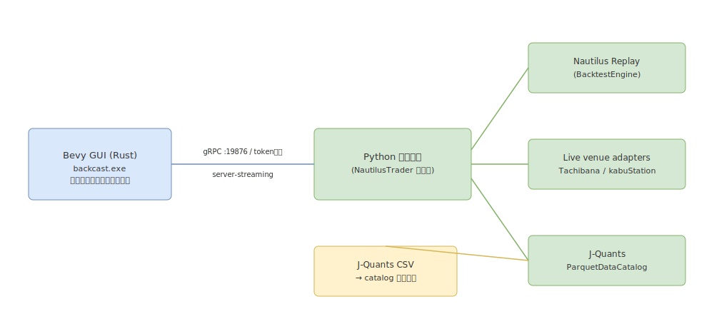

# The Trader Was Replaced

**The Trader Was Replaced** は、日本株を対象とした戦略リプレイ／バックテスト／ライブ閲覧のためのデスクトップアプリです。Bevy 0.15（Rust）製のフローティングウィンドウ GUI（バイナリ `backcast.exe`）に、NautilusTrader 1.226+ をベースとした Python エンジンを **PyO3 で同一プロセスに埋め込んで**（in-proc）動作する単一バイナリ構成です（旧 gRPC バックエンド＝別プロセスは #64 / #68 で撤去済み）。対応する証券会社は立花証券 e支店 と kabuステーション（三菱UFJ eスマート証券）です。

## 3本柱

| 柱 | 概要 | 詳細 |
|---|---|---|
| Replay 実行 | GUI 上で戦略 `.py` を読み込み、過去データ（ParquetDataCatalog）をリプレイしながら戦略を実行する。フッターの再生コントロールで開始・一時停止・ステップ・速度変更ができる。 | [Replay 実行](replay.md) |
| バックテスト（CLI） | GUI を使わず、`python -m engine.strategy_replay` または `scripts/run_replay.ps1` でヘッドレスにリプレイを実行し、run-buffer（`meta.json` / `fills.jsonl` / `equity.jsonl` / `summary.json`）を出力する。 | [バックテスト](backtest.md) |
| ライブ取引 | 立花証券 e支店 / kabuステーション に接続し、最新気配・口座情報を閲覧しつつ、Manual モードで手動発注（新規・訂正・取消、第二暗証番号、口座同期）、Auto モードで戦略の自動発注（Safety Rails 付き）を行う（※ issue #40 で UI からの Live Auto 起動入口は一旦撤去、フッター transport へ再配線予定。Live 実行エンジンと起動 RPC は温存）。 | [取引所接続](venues.md) / [注文](orders.md) |

Manual（手動発注）・Auto（戦略自動発注）の操作は [注文](orders.md) / [実行モード](modes.md) / [戦略](strategy.md)、venue 接続と第二暗証番号は [取引所接続](venues.md) を参照してください。

## 構成

本アプリは **単一プロセス** で構成されます。

- **GUI（Rust / Bevy）**: `backcast.exe`。画面表示・操作・チャート描画を担当。
- **エンジン（Python）**: NautilusTrader ベースのエンジン。Rust バイナリに **PyO3 で同一プロセスに埋め込まれて**（in-proc）動作し、データ供給・戦略実行を担当。旧 gRPC バックエンド（別プロセス + TCP/protobuf）は #64 / #68 で撤去済み。

GUI と埋め込みエンジンは in-proc で接続します。接続に成功するとフッター右下に `state: IDLE  backend: OK` と表示されます。

## ページ一覧

| ページ | 内容 |
|---|---|
| [はじめに](getting-started.md) | 前提環境、バックエンド／GUI の起動、最初の Replay 実行までの最短手順 |
| [画面構成](screen-layout.md) | メニューバー・サイドバー・フッター・フローティングウィンドウの全体マップ |
| [ウィンドウとパネル](windows-and-panels.md) | 各フローティングウィンドウ（パネル）の役割 |
| [チャート](chart.md) | チャートウィンドウの表示内容 |
| [実行モード](modes.md) | Replay / Manual / Auto モードの切り替え |
| [Replay 実行](replay.md) | GUI 上での戦略リプレイ手順 |
| [バックテスト](backtest.md) | CLI でのヘッドレス実行 |
| [戦略](strategy.md) | 戦略 `.py` と SCENARIO、Live Auto への昇格と Safety Rails |
| [取引所接続](venues.md) | 立花証券 / kabuステーション への接続 |
| [注文](orders.md) | Manual / Auto 発注、訂正・取消、第二暗証番号、口座同期 |
| [File メニュー](file-menu.md) | レイアウトの保存・読み込み・新規作成 |
| [設定](settings.md) | テーマ・バックエンド・レイアウト関連 |
| [トラブルシューティング](troubleshooting.md) | よくある症状と対処 |
