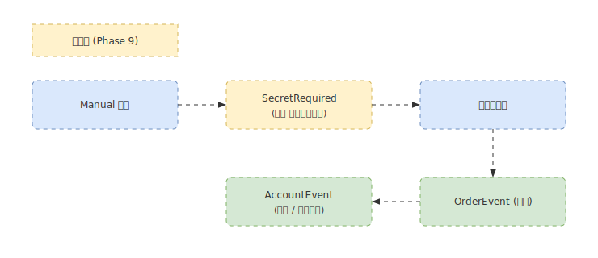

# 注文と口座

> 文中の `[B1]` などは、その挙動を保証する E2E flow の ID。一覧は [`tests/e2e/FLOWS.md`](../../tests/e2e/FLOWS.md) を参照。

関連ページ: [venues](venues.md) / [modes](modes.md) / [strategy](strategy.md) / [settings](settings.md) / [replay](replay.md) / [troubleshooting](troubleshooting.md)

注文・建玉・余力の表示は **2 つの文脈**で意味を持ちます。

- **Replay（仮想実行）**: 戦略を再生した結果として、仮想注文・仮想建玉・仮想ポートフォリオが**読み取り専用**で表示されます。実際の証券会社へは発注しません。
- **Live（Manual / Auto）**: ライブ venue に接続し、Manual モードでは**手動で発注**、Auto モードでは**戦略が自動で発注**します。約定・口座の更新はバックエンドから push され、同じパネルに反映されます。

Replay 完了後にポートフォリオ（positions / orders / equity）が反映されることは [B1]、サマリ（fills_count / total_pnl 等）の parse は [B2] で保証されます。

## Manual モードの発注

フッターのモードトグルを **Manual** にすると（Venue 接続が前提）、サイドバーに **Order** ボタンが現れ、これを押すと選択中の銘柄に対する **発注フォーム**（ワールド空間のスプライト製ウィンドウ、タイトル `ORDER`）が開きます。 [K10]

- **新規発注**: side（BUY / SELL）・order type・数量・価格を指定して `[発注]`。入力 validation を通すと **2 段階 confirm**（確認モーダル）が開き、`[Confirm]` で `PlaceOrder` が送られます。フォーム操作と validation は [K10]、submit→confirm→`PlaceOrder` の本番経路は [K7]、確認モーダルの `Escape` 優先順位は [K11]。
- **訂正 / 取消**: 注文行を右クリック（context menu）から訂正・取消を開始します。context menu の開閉は [K16]、訂正・取消の発火は [K9]、訂正モーダルの submit / cancel / validation は [K12]。
  - 訂正は「取消 → 新規」方式で、**未約定の残数量のみ**を再発注します（qty − already_filled）。全数量を再発注すると部分約定済みのぶんが二重発注になり実弾の over-fill になるため。
- **第二暗証番号モーダル（SecretModal）**: Tachibana で注文時に第二暗証番号を要求された場合に表示されます。入力値は短時間だけメモリ保持（SecretVault、TTL）し、永続化しません。submit / retry は [K8]、timeout zeroize / 空 submit ガードは [K15]。kabu は第二暗証番号を必要としません。 [F5]

### 注文 → 約定 → ポートフォリオ反映パイプライン

発注した注文の状態（受付・約定・拒否など）と約定結果が口座に反映されます。

- 発注成功時は full レコードが `LiveOrders` に seed され [H1]、以後のステータス/約定更新が `client_order_id` でマージされます [H2]/[F3]。
- 訂正は qty/price の差分のみ上書きされ [H3]、約定数量は単調増加でしか上書きしません（部分約定の取りこぼし防止）。
- 拒否は OrderPanel のエラー行に整形メッセージが出ます [H4]。構造化 reject ではない注文 notice（追跡不能な受付・transport error 等）も同じフィードバック行に verbatim 表示されます [H6]。
- 第二暗証番号の提出失敗は SecretModal 側の retry 可能 error として表示されます（注文エラー行には出しません） [H7]。
- 実行モードを切り替えると口座スナップショットは一旦リセットされ、Live/Replay のデータが混ざらないようになっています [H5]。
- `GetOrders` の応答は注文の静的属性（銘柄・売買・数量・価格）も含むため、稼働中注文を OrdersPanel に**完全な注文行**として seed できます。seed は merge-safe で、未知の注文は完全行として挿入し、既知の行は記録済みの約定量（単調増加）や既知の静的属性を壊さず空欄のみ補完します [H9]。
- 立花 venue に接続（`VenueState::Connected`）すると、Rust が `GetOrders` を自動発火し [H10]、`GetOrders` ハンドラが backend 内の facade 注文に加えて立花 `CLMOrderList`（`sOrderSyoukaiStatus=5`：未約定+一部約定）から venue 側の working-orders を取得してマージします。facade に存在しない `venue_order_id` を持つ注文が seed 対象で、facade 側（`client_order_id` 既知）が重複時は facade が勝ちます [H10]。
- venue 側の現金残高・建玉（AccountEvent）は Positions / Buying Power に反映されます [F4]。

### 注文フロー

### backend 再起動後の reconcile

backend が auto-restart した後、UI が working と信じている注文のうち**再起動後の backend が追跡していない**ものだけが ReconcileModal に表示されます（terminal orders は無視）。 [K6] 通知の dismiss / Escape 優先順位は [K14]。モーダルは通知のみで、再ログインと注文の再確認は venue 側で行います。同じ `GetOrders` 応答から、backend が追跡している注文は OrdersPanel に完全な注文行として seed されます（id-diff の reconcile と完全行の seed を同じ snapshot から行う） [H9]。

## Auto モードの発注（Live Auto 戦略実行）

**Auto** モードでは、Promote to Live で起動した戦略がライブ venue に**自動で発注**します。起動手順（Promote to Live）と Safety Rails の設定は [strategy.md](strategy.md) を、モード概要は [modes.md](modes.md) を参照してください。実行中の run の状態・PnL・ログは **Live Run Panel** に表示されます（[windows-and-panels.md](windows-and-panels.md) 参照）。

## バックエンドイベント（gRPC）

バックエンドから UI へ向けたサーバー送信ストリーム `SubscribeBackendEvents` を通じて `BackendEvent` が push されます（`python/proto/engine.proto` / `src/trading.rs`）。

| イベント種別 | 意味 | reducer → resource | E2E |
|---|---|---|---|
| SecretRequired | 第二暗証番号の入力要求（Tachibana のみ。kabu は送出しない） | `SecretPrompt` | [F5] |
| OrderEvent | 注文状態の更新（ステータス・約定数量・平均約定価格など） | `LiveOrders` | [F3] |
| AccountEvent | 口座更新（現金・買付余力・建玉一覧） | `PortfolioState` | [F4] |
| VenueLogoutDetected | venue 側でのログアウト検知 | `ReloginPrompt` | [D5] |
| LiveStrategyEvent | Live Auto run の lifecycle 変化（READY / RUNNING / PAUSED / STOPPING / STOPPED / ERROR） | `LiveRuns` | [N1] |
| LiveStrategyTelemetry | run-scoped の PnL / order / fill カウンタ（任意の頻度で届く） | `LiveRuns` | [N2] |
| SafetyRailViolation | pre/post-trade の Safety Rail 違反 | `SafetyToast` | [N3] |
| StrategyLogMessage | 戦略の `self.log.*` 行の中継（Live Run Panel のログ tail 用） | `StrategyLogs` | [N4] |

> Promote to Live の結果（成功 = 新 run id / 構造化拒否 = error_code）は `BackendEvent` ではなく unary RPC 応答に相当する status seam `LiveStrategyPromoteResult` で届き、`PromoteFeedback` に反映されます [N5]。成功は併せて `LiveStrategyEvent{status:"RUNNING"}` としても push されます。

ユーザー視点では、SecretRequired を受けると第二暗証番号モーダルが表示され、OrderEvent / AccountEvent によって Orders / Positions / Buying Power が更新され、VenueLogoutDetected を受けると ReloginModal が開いて再ログインを促します（モーダルは通知のみで、再ログイン自体は Venue メニューから行います）。Live Auto では LiveStrategyEvent / LiveStrategyTelemetry / StrategyLogMessage が Live Run Panel を駆動し、SafetyRailViolation は Footer トーストで通知されます。
